# GPU

GPU主机硬件拓扑

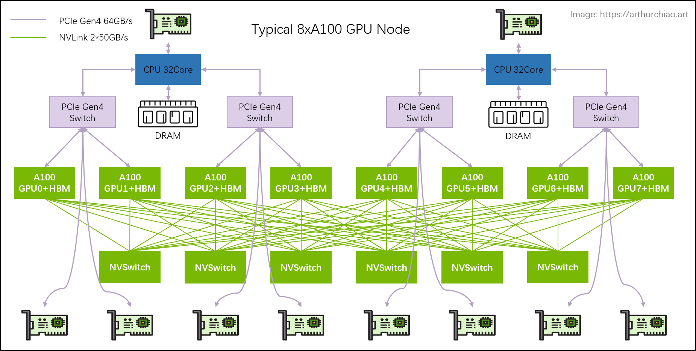

#### PCIE

CPU、内存、存储（NVME）、GPU、网卡等**支持 PICe 的设备**，都可以连接到 PCIe 总线或专门的 PCIe 交换芯片，实现互联互通。

PCIe 目前有 5 代产品，最新的是 **`Gen5`**

#### NVLink

简单总结：同主机内不同 GPU 之间的一种高速互联方式，

1. 是一种短距离**通信链路**，保证包的成功传输，更高性能，替代 PCIe，
2. 支持多 lane，link 带宽随 lane 数量线性增长，
3. 同一台 node 内的 GPU 通过 NVLink 以 **full-mesh** 方式（类似 spine-leaf）互联，
4. NVIDIA 专利技术

#### NVSwitch

NVSwitch 是 NVIDIA 的一款**交换芯片**，封装在 GPU module 上，并**不是主机外的独立交换机**。

### 拓扑结构

- 2 片 CPU（及两边的内存，NUMA）
- 2 张**存储网卡**（**访问分布式存储**，带内管理等）
- 4 个 PCIe Gen4 Switch 芯片
- 6 个 NVSwitch 芯片
- 8 个 GPU
- 8 个 **GPU 专属网卡**

### 存储网卡

通过 PCIe **直连 CPU**。用途：

1. 从分布式存储读写数据，例如**读训练数据**、**写 checkpoint** 等；
2. 正常的 node 管理，ssh，监控采集等等。

官方推荐用 BF3 DPU。但其实只要带宽达标，用什么都行。组网经济点的话用 RoCE，追求最好的性能用 IB

### NVSwitch fabric：intra-node full-mesh

8 个 GPU 通过 6 个 NVSwitch 芯片 full-mesh 连接，这个 full-mesh 也叫 **`NVSwitch fabric`**； full-mesh 里面的**每根线的带宽是 n \* bw-per-nvlink-lane**，

- A100 用的 NVLink3，**`50GB/s/lane`**，所以 full-mesh 里的每条线就是 **`12\*50GB/s=600GB/s`**，注意这个是双向带宽，单向只有 300GB/s。
- A800 是阉割版，**12 lane 变成 8 lane**，所以每条线 8*50GB/s=400GB/s，单向 200GB/s。

### GPU拓扑

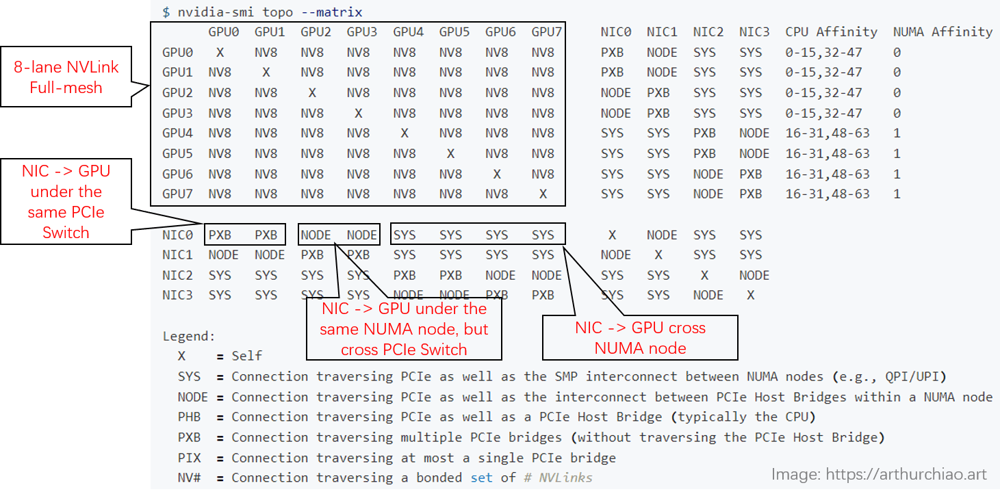

- GPU 之间（左上角区域）：都是 **`NV8`**，表示 **8 条 NVLink** 连接；
- NIC 之间：
  - 在同一片 CPU 上：**`NODE`**，表示**不需要跨 NUMA，但需要跨 PCIe 交换芯片**；
  - 不在同一片 CPU 上：**`SYS`**，表示**需要跨 NUMA**；
- GPU 和 NIC 之间：
  - 在同一片 CPU 上，且在同一个 PCIe Switch 芯片下面：**`PXB`**，表示**只需要跨 PCIe 交换芯片**；
  - 在同一片 CPU 上，且不在同一个 PCIe Switch 芯片下面：**`NODE`**，表示**需要跨 PCIe 交换芯片和 PCIe Host Bridge**；
  - 不在同一片 CPU 上：**`SYS`**，表示**需要跨 NUMA、PCIe 交换芯片，距离最远**；

## 集群组网

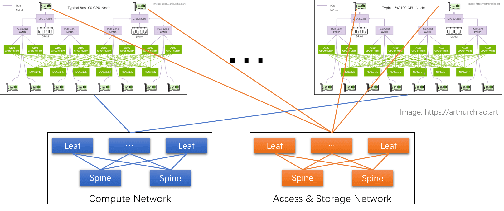

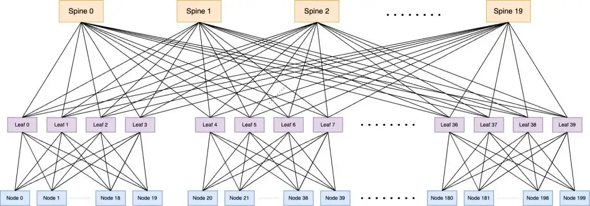

### 计算网络

GPU 网卡直连到置顶交换机（leaf），leaf 通过 full-mesh 连接到 spine，形成跨主机 GPU 计算网络。

- 这个网络的目的是 GPU 与其他 node 的 GPU **交换数据**；
- 每个 GPU 和自己的网卡之间通过 **PCIe 交换芯片连接**：`GPU <--> PCIe Switch <--> NIC`。

### 存储网络

直连 CPU 的两张网卡，连接到另一张网络里，主要作用是读写数据，以及 SSH 管理等等。

### RoCE vs. InfiniBand

不管是计算网络还是存储网络，都需要 RDMA 才能实现 AI 所需的高性能。RDMA 目前有两种选择：

- RoCEv2：公有云卖的 8 卡 GPU 主机基本都是这种网络，比如 CX6 **`8\*100Gbps`** 配置；在性能达标的前提下，（相对）便宜；
- InfiniBand (IB)：同等网卡带宽下，性能比 RoCEv2 好 20% 以上，但是价格贵一倍。

### GPU通信路径

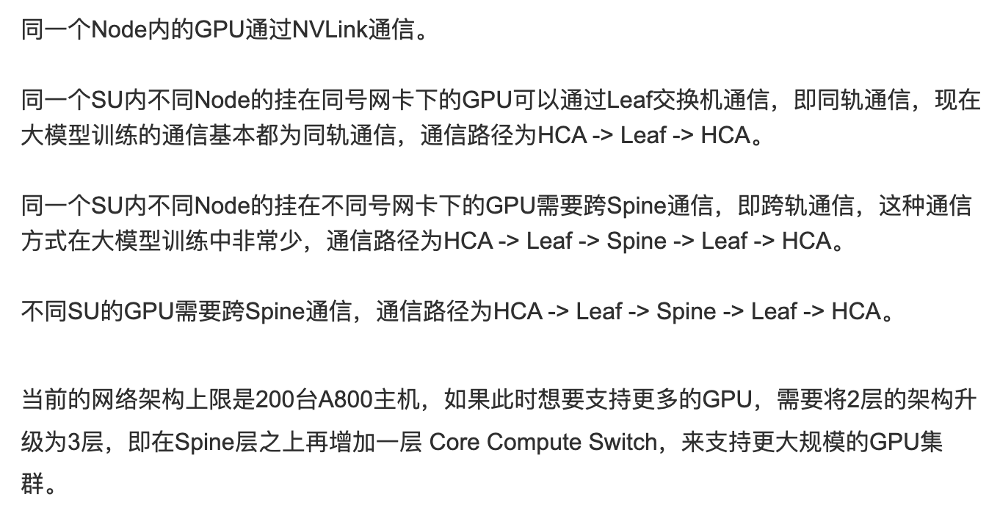

## 网络方案

在使用RDMA时，有两种模式，一般来需要一个一个device-plugin，来识别rdma资源，另外需要支持多网卡，可以使用multus方案，一般来说，rdma网卡与GPU数目存在映射关系，一对一或者一对多。

### RDMA Shared 模式

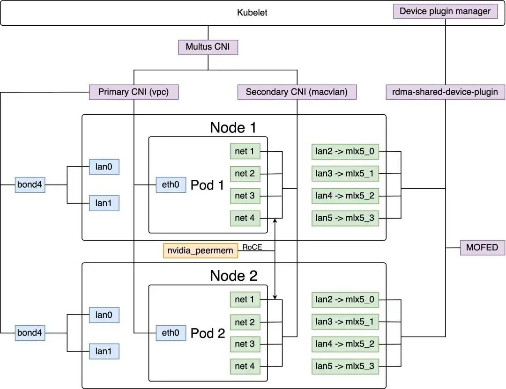

主网络插件VPC负责维护整个k8s集群管理平面的网络，对应每个pod中的ethO网络接口。第三方网络插件multus cni、macvlan等主要负责维护整个k8s集群数据平面的网络，对应每个pod中的net1~net4网络接口。

network-operator是NVIDIA推出的专门用来在k8s集群中启用RDMA网络的解决方案，包含以下核心组件：

#### mofed

Mellanox网卡驱动，推荐将网卡驱动直接部署到物理机上，不通过network-operator的容器化方式部署，这样可以提高整个系统的稳定性，否则当network-operator出现异常时，会导致宿主机失联，只能通过BMC方式连入主机。

#### rdma-shared-device-plugin

将服务器上的mlx网卡以k8s扩展资源的形式暴漏出来，供业务申请使用。

#### Secondary CNI

在k8s集群中建立第二个网络平面，以支持分布式训练多机多卡的网络通信。

#### Multus-cni

k8s环境中的容器多网络方案，能够attach多个网络接口到pod中，是meta类的cni

插件，能够和第三方插件搭配使用并且不会产生冲突。

#### container-networking-plugins

包含多个cni插件，主要利用macvlan插件，为pod中申请的mlx资源创建新的mac地址以便从新地址转发流量。

#### whereabouts

负责在集群范围内对挂载到pod中的mlx网卡分配对应的ip地址

### RDMA Exclusive 模式

对于支持SR-IOV网卡虚拟化来说，可以使用EXclusive模式

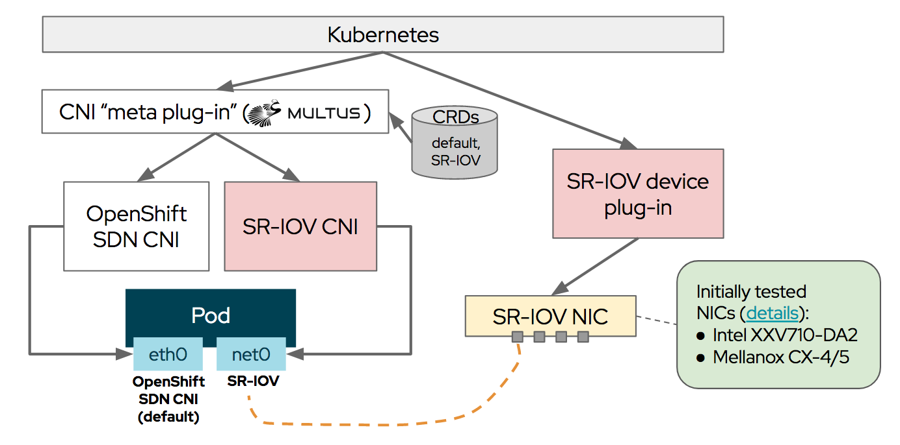

SR-IOV 和 RDMA 都是**独立**的技术，它们可以分别在不同的物理设备上实现。虽然 SR-IOV 可以提高网络性能，但它本身并不提供 RDMA 功能。因此，SR-IOV不一定具有RDMA功能，具体要看实现方式和物理设备的支持情况。一些物理设备（如InfiniBand适配器）可以同时支持 SR-IOV 和 RDMA，但这并不是必须的

# 虚拟化

### GPU虚拟化谱系

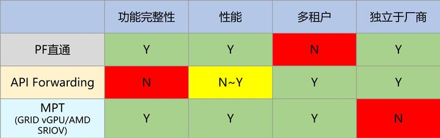

不考虑嵌入式平台的话，那么，GPU 首先是一个 PCIe 设备。GPU 的虚拟化，还是要首先从 PCIe 设备虚拟化角度来考虑。

### API Forwarding

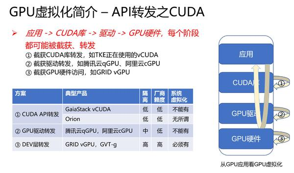

可以看出，**从 API 库开始，直到 GPU 硬件，Stack 中的每一个阶段，都有被截获、转发的可能性**。甚至，一概称之为「API 转发」是不合适的 —— 以 GRID vGPU、GVT-g 为例的 DEV 转发，事实上就是 MPT，和任何 API 都没有关系

### 容器GPU虚拟化

首先，我们这里谈到的，都是 nVidia 生产的 GPU、都只考虑 CUDA 计算场景。其次，这里的虚拟化指的是 OS 虚拟化的容器技术，不适用于 KATA 这样的、基于系统虚拟化的安全容器。

#### CUDA生态

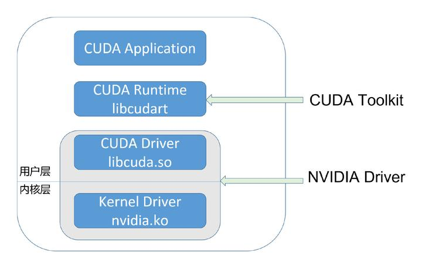

CUDA 开发者使用的，通常是 CUDA Runtime API，它是 high-level 的；而 CUDA Driver API 则是 low-level 的，它对程序和 GPU 硬件有更精细的控制。Runtime API 是对 Driver API 的封装。

CUDA Driver 即是 UMD，它直接和 KMD 打交道。两者都属于 NVIDIA Driver package，它们之间的 ABI，是 NVIDIA Driver package 内部的，不对外公开。

#### vcuda（cuda劫持）

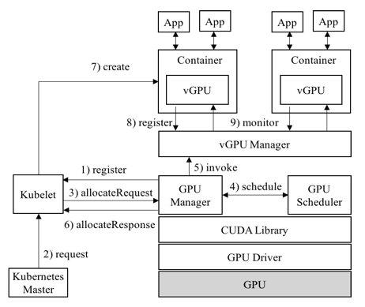

vcuda有腾讯开源方案https://github.com/tkestack/vcuda-controller

#### CGPU

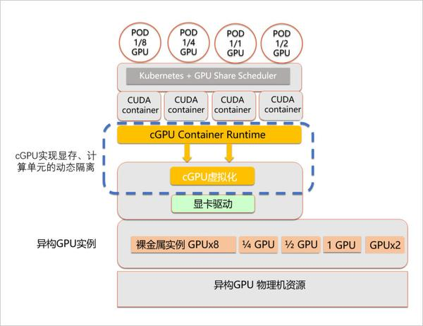

两者的实现策略不同，cGPU 比 vCUDA 更底层，从而实现了不侵入用户环境

### **算力隔离的本质**

从上述介绍中，我们可以看出：算力隔离、故障隔离都是 GPU 虚拟化、GPU 池化的关键，缺一不可。如果没有算力隔离，不管虚拟化损耗有多低，都会导致其方案价值变低；而如果缺少实例间的故障隔离，则基本无法在生产环境使用了。

事实上，英伟达 GPU 提供了丰富的硬件特性，支持 Hardware Partition，支持 Time Sharing。

**1. Hardware Partition，亦即: 空分**

Ampere 架构的 A100 GPU 所支持的 MIG，即是一种 Hardware Partition。硬件资源隔离、故障隔离都是硬件实现的 —— 这是无可争议的隔离性最好的方案。它的问题是不灵活: 只有高端 GPU 支持；只支持 CUDA 计算；A100 只支持 7 个 MIG 实例。

**2. nVidia MPS**

除了 MIG，算力隔离表现最优秀的，是 MPS —— 它通过将多个进程的 CUDA Context，合并到一个 CUDA Context 中，省去了 Context Switch 的开销，也在 Context 内部实现了算力隔离。如前所述，MPS 的致命缺陷，是把许多进程的 CUDA Context 合并成一个，从而导致了额外的故障传播。所以尽管它的算力隔离效果极好，但长期以来工业界使用不多，多租户场景尤其如此。

**3. Time Sharing，亦即: 时分**

nVidia GPU 支持基于 Engine 的 Context Switch。不管是哪一代的 GPU，其 Engine 都是支持多任务调度的。一个 OS 中同时运行多个 CUDA 任务，这些任务就是在以 Time Sharing 的方式共享 GPU。

鉴于 MIG 的高成本和不灵活、MPS 故障隔离方面的致命缺陷，事实上就只剩下一种可能：Time Sharing。唯一的问题是，如何在原厂不支持的情况下，利用 Time Sharing 支持好算力隔离、以保证 QoS。这也是学术界、工业界面临的最大难题。

### QGPU

qGPU == QoS GPU。它是目前业界唯一真正实现了故障隔离、显存隔离、算力隔离、且不入侵生态的容器 GPU 共享的技术

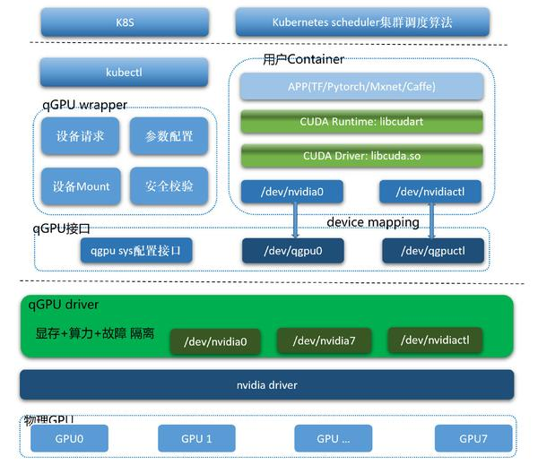

至于为什么说是唯一，需要后续具体分析。

# 总结

对gpu虚拟化又了基本大致的了解，细节和底层的东西还需要详细了解。

# Reference

https://www.cnblogs.com/lingr7/articles/16931589.html

