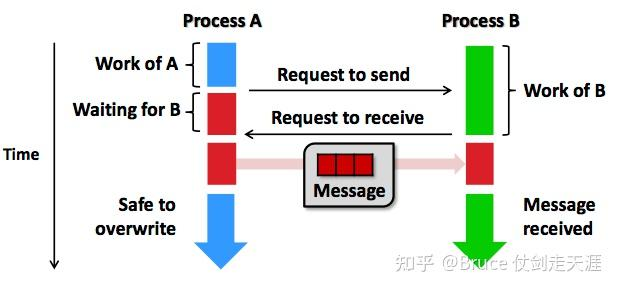
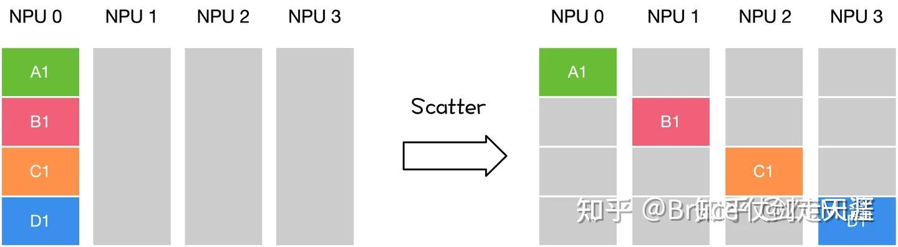

# 通信
## MPI
MPI是一个跨语言的通讯协议，支持高效方便的点对点、广播和组播

### 点对点通信
点对点通信指的是两个进程之间的通信，可用于控制同步或者数据传输，例如MPI_Send和MPI_Recv

### 集合通信
集合通信包括了一对多、多对一和多对多的通信方式，常用于一组进程之间的数据交换。MPI提供了如下的聚合通信接口

## 通信语义
分布式的通信一般有两大类：

集合通信（Collective communication，CC）：在一组节点内进行通信
点对点通信（Point to point communication，P2P）：在两个节点之间进行通信
深度学习训练过程中因为需要传输大量的网络模型权重参数和训练过程中产生的大量临时变量等，因此主要使用集合通信的方式。可以理解为，机器学习/深度学习的分布式训练，主要是采用在PS架构下的集合通讯模式；而在大模型的分布式训练中，因为减少跟单点参数服务器统一更新，更多直接采用纯集合通讯模式。
集合通讯中包含多个sender和多个receiver，一般的通信原语包括broadcast、gather、all-gather、scatter、reduce、all-reduce、reduce-scatter、all-to-all等通信操作进行数据传输，下面将会分别介绍其具体含义。

### Broadcast

在集合通信中，如果某个节点想把自身的数据发送到集群中的其他节点，那么就可以使用广播Broadcast的操作。
如图所示，圆圈表示分布式系统中的独立节点，一共4个节点，小方块则代表了数据，颜色相同表示数据一样。Broadcast代表广播行为，执行Broadcast时，数据从主节点0广播至其他各个指定的节点（0~3）。

Broadcast操作是将某节点的输入广播到其他节点上，分布式机器学习中常用于网络参数的初始化。如图中，从单个sender数据发送到其他节点上，将0卡大小为1xN的Tensor进行广播，最终每张卡输出均为[1xN]的矩阵。

## Scatter
Scatter操作表示一种散播行为，将主节点的数据进行划分并散布至其他指定的节点。

实际上，Scatter与Broadcast非常相似，都是一对多的通信方式，不同的是Broadcast的0号节点将相同的信息发送给所有的节点，而Scatter则是将数据的不同部分，按需发送给所有的节点。
如图所示，从单个sender数据发送到其他节点上。

## Reduce
Reduce称为规约运算，是一系列简单运算操作的统称，细分可以包括：SUM、MIN、MAX、PROD、LOR等类型的规约操作。Reduce意为减少/精简，因为其操作在每个节点上获取一个输入元素数组，通过执行操作后，将得到精简的更少的元素。下面以Reduce sum为例子。

在NCCL中的Reduce，从多个sender那里接收数据，最终combine到一个节点上。

## All Reduce
Reduce是一系列简单运算操作的统称，All Reduce则是在所有的节点上都应用同样的Reduce操作。以All Reduce Sum为例。

All Reduce操作可通过单节点上Reduce + Broadcast操作完成。在NCCL中的All Reduce中，则是从多个sender那里接收数据，最终合并和分发到每一个节点上。

## Gather
Gather操作将多个sender上的数据收集到单个节点上，Gather可以理解为反向的Scatter。

Gather操作会从多个节点里面收集数据到一个节点上面，而不是从一个节点分发数据到多个节点。这个机制对很多平行算法很有用，比如并行的排序和搜索。

## All Gather
很多时候发送多个元素到多个节点也很有用，即在多对多通信模式的场景。这个时候就需要 All Gather操作。

对于分发在所有节点上的一组数据来说，All Gather会收集所有数据到所有节点上。从最基础的角度来看，All Gather相当于一个Gather操作之后跟着一个Bcast操作。下面的示意图显示了All Gather调用之后数据是如何分布的

## All to All
All to All作为全交换操作，通过All to All通信，可以让每个节点都获取其他节点的值。
在使用 All to All 时，每一个节点都会向任意一个节点发送消息，每一个节点也都会接收到任意一个节点的消息。每个节点的接收缓冲区和发送缓冲区都是一个分为若干个数据块的数组。All to All 的具体操作是：将节点i的发送缓冲区中的第j块数据发送给节点j，节点j将接收到的来自节点i的数据块放在自身接收缓冲区的第i块位置。
All to All 与 All Gather 相比较，区别在于：All Gather 操作中，不同节点向某一节点收集到的数据是完全相同的，而在 All to All 中，不同的节点向某一节点收集到的数据是不同的。在每个节点的发送缓冲区中，为每个节点都单独准备了一块数据。

## 通信框架
由于本文主要是介绍分布式在大模型/mlsys的应用，所以我们主要介绍大模型/mlsys下的架构。目前机器学习中主要由两种分布式架构：PS 和 all-reduce

### PS
PS是李沐大佬率先提出的架构，由于对业界影响比较大，我们画一些篇幅介绍一下，比如字节2020年osdi的工作byteps就源于PS架构
[Parameter Server](https://zhuanlan.zhihu.com/p/21569493)

### All-Reduce

## 通信库
### OpenMPI
使用于CPU场景下的通信
### NCCL
nvida在mpi基础上基于GPU通信做的优化，适合于GPU场景的通信
### gool
Gloo是一个pytorch 内置的进行集合通信的库，它支持多种通信接口，如共享内存（SHM）和TCP/IP通信。Gloo可以在不同的机器或者不同品牌的硬件之间工作，但是相比NCCL，它的性能可能会较差。PyTorch的Gloo和NCCL都是用于加速分布式训练的通信库，但它们针对不同的硬件和使用场景。
如果你在使用NVIDIA的GPU并在多台机器上进行分布式训练，推荐使用NCCL。

# 训练
## 并行训练
### 数据并行
### 模型并行
### 混合并行
不太记得是不是叫这个名字了
## 训练框架
pyrotch：由Facebook的人工智能研究团队开发，设计理念侧重于灵活性和直观性。PyTorch采用动态计算图，允许即时修改和执行，非常适合于快速原型开发和研究工作
TensorFlow：由Google开发，设计时考虑了分布式计算、大规模数据处理和生产环境的需求。TensorFlow使用静态计算图，需要先定义后运行，适合于大型模型和复杂的神经网络。
horovod：Horovod是一个专注于分布式训练的深度学习框架，通过Horovod可以为Tensorflow、Keras、Pytorch和MXNet提供分布式训练的能力
## operator
在容器环境场景下，需要将训练框架operator化，容器状态下的分布式通信需要做怎样的适配
### kubeflow
pytorch-operator
mxnet-operator
已经不再维护，归档处理了
###

# 计算
## Ray
通用的分布式计算引擎，主要用于AI、ML方向

