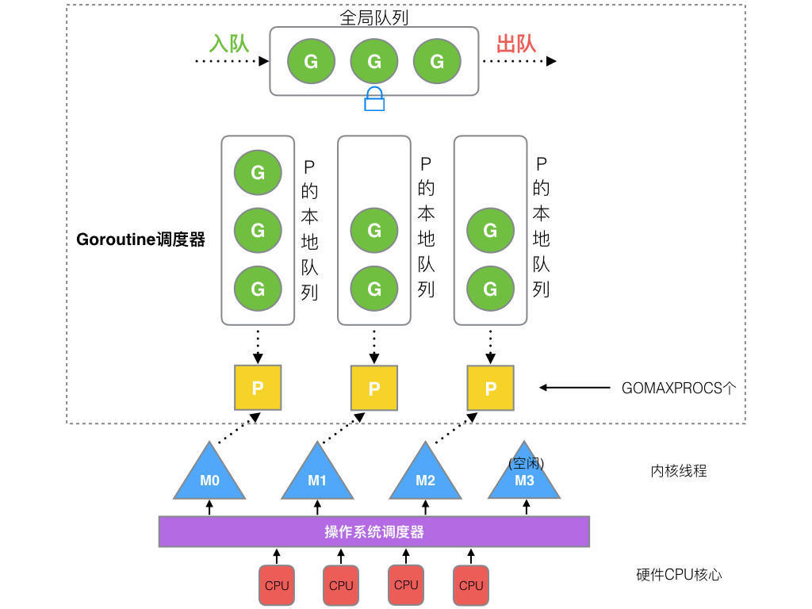

# Overview

G-M-P分别代表：
G - Goroutine，Go协程，是参与调度与执行的最小单位
M - Machine，指的是系统级线程
P - Processor，指的是逻辑处理器，P关联了的本地可运行G的队列(也称为LRQ)，最多可存放256个G。

## 运行流程：
线程M想运行任务就需得获取 P，即与P关联。
然从 P 的本地队列(LRQ)获取 G
若LRQ中没有可运行的G，M 会尝试从全局队列(GRQ)拿一批G放到P的本地队列，
若全局队列也未找到可运行的G时候，M会随机从其他 P 的本地队列偷一半放到自己 P 的本地队列。
拿到可运行的G之后，M 运行 G，G 执行之后，M 会从 P 获取下一个 G，不断重复下去。

## G-M-P的数量
G 的数量：
理论上没有数量上限限制的。查看当前G的数量可以使用runtime. NumGoroutine()

P 的数量：
由启动时环境变量 $GOMAXPROCS 或者是由runtime.GOMAXPROCS() 决定。这意味着在程序执行的任意时刻都只有 $GOMAXPROCS 个 goroutine 在同时运行。

M 的数量:
go 语言本身的限制：go 程序启动时，会设置 M 的最大数量，默认 10000. 但是内核很难支持这么多的线程数，所以这个限制可以忽略。 runtime/debug 中的 SetMaxThreads 函数，设置 M 的最大数量 一个 M 阻塞了，会创建新的 M。M 与 P 的数量没有绝对关系，一个 M 阻塞，P 就会去创建或者切换另一个 M，所以，即使 P 的默认数量是 1，也有可能会创建很多个 M 出来。

## 调度的流程状态

- 每个P有个局部队列，局部队列保存待执行的goroutine(流程2)，当M绑定的P的的局部队列已经满了之后就会把goroutine放到全局队列(流程2-1)
- 每个P和一个M绑定，M是真正的执行P中goroutine的实体(流程3)，M从绑定的P中的局部队列获取G来执行
- 当M绑定的P的局部队列为空时，M会从全局队列获取到本地队列来执行G(流程3.1)，当从全局队列中没有获取到可执行的G时候，M会从其他P的局部队列中偷取G来执行(流程3.2)，这种从其他P偷的方式称为work stealing
- 当G因系统调用(syscall)阻塞时会阻塞M，此时P会和M解绑即hand off，并寻找新的idle的M，若没有idle的M就会新建一个M(流程5.1)。
- 当G因channel或者network I/O阻塞时，不会阻塞M，M会寻找其他runnable的G；当阻塞的G恢复后会重新进入runnable进入P队列等待执行(流程5.3)

# 调度过程中阻塞
GMP模型的阻塞可能发生在下面几种情况：

I/O，select
block on syscall
channel
等待锁
runtime.Gosched()
## 用户态阻塞
当goroutine因为channel操作或者network I/O而阻塞时（实际上golang已经用netpoller实现了goroutine网络I/O阻塞不会导致M被阻塞，仅阻塞G），对应的G会被放置到某个wait队列(如channel的waitq)，该G的状态由_Gruning变为_Gwaitting，而M会跳过该G尝试获取并执行下一个G，如果此时没有runnable的G供M运行，那么M将解绑P，并进入sleep状态；当阻塞的G被另一端的2唤醒时（比如channel的可读/写通知），G被标记为runnable，尝试加入G2所在P的runnext，然后再是P的Local队列和Global队列。

## 系统调用阻塞
当G被阻塞在某个系统调用上时，此时G会阻塞在_Gsyscall状态，M也处于 block on syscall 状态，此时的M可被抢占调度：执行该G的M会与P解绑，而P则尝试与其它idle的M绑定，继续执行其它G。如果没有其它idle的M，但P的Local队列中仍然有G需要执行，则创建一个新的M；当系统调用完成后，G会重新尝试获取一个idle的P进入它的Local队列恢复执行，如果没有idle的P，G会被标记为runnable加入到Global队列。

# 抢占与协作
如果某个 G 执行时间过长，其他的 G 如何才能被正常的调度？ 这便涉及到有关调度的两个理念：协作式调度与抢占式调度
协作式调度依靠被调度方主动弃权；抢占式调度则依靠调度器强制将被调度方被动中断

## 协作式
应用程序主动退出
### 主动用户让权：Gosched
### 栈扩张与抢占标记

## 抢占式
用户配合协作式存在缺陷，一个没有主动放弃执行权、且不参与任何函数调用的函数，直到执行完毕之前， 是不会被抢占的。
### 基于协作的抢占式调度器
通过编译器在函数调用时插入抢占检查指令，在函数调用时检查当前 Goroutine 是否发起了抢占请求，实现基于协作的抢占式调度；
Goroutine 可能会因为垃圾回收和循环长时间占用资源导致程序暂停；
### 基于信号的抢占式调度器
实现基于信号的真抢占式调度；
垃圾回收在扫描栈时会触发抢占调度；
抢占的时间点不够多，还不能覆盖全部的边缘情况；

异步抢占式调度的一种方式就与运行时系统监控有关，监控循环会将发生阻塞的 Goroutine 抢占， 解绑 P 与 M，从而让其他的线程能够获得 P 继续执行其他的 Goroutine。 这得益于 sysmon 中调用的 retake 方法。这个方法处理了两种抢占情况， 一是抢占阻塞在系统调用上的 P，二是抢占运行时间过长的 G。 其中抢占运行时间过长的 G 这一方式还会出现在垃圾回收需要进入STW时