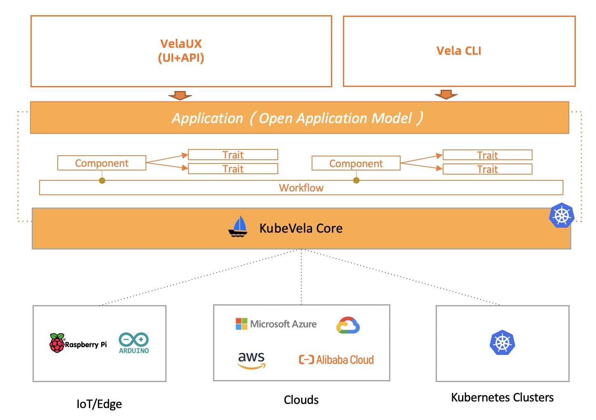

# 核心概念
KubeVela 围绕着云原生应用交付和管理场景展开，背后的应用交付模型是 Open Application Model，简称 OAM ，其核心是将应用部署所需的所有组件和各项运维动作，描述为一个统一的、与基础设施无关的“部署计划”，进而实现在混合环境中标准化和高效率的应用交付。KubeVela 包括以下核心概念：

### 应用（Application）
应用是定义了一个微服务业务单元所包括的制品（二进制、Docker 镜像、Helm Chart...）或云服务的交付和管理需求，它由组件、运维特征、工作流、应用策略四部分组成。

#### 组件（Component）
定义一个制品或云服务的交付和管理形式，一个应用中可以包括多个组件，最佳的实践方案是一个应用中包括一个主组件（核心业务）和附属组件（强依赖或独享的中间件，运维组件等）。组件的类型由 Component Definition 定义。

#### 运维特征（Trait）
运维特征是可以随时绑定给待部署组件的、模块化、可拔插的运维能力，比如：副本数调整（手动、自动）、数据持久化、 设置网关策略、自动设置 DNS 解析等。用户可以从社区获取成熟的能力，也可以自行定义。运维特征的类型由 Trait Definition 定义。

#### 工作流（Workflow）
工作流由多个步骤组成，允许用户自定义应用在某个环境的交付过程。典型的工作流步骤包括人工审核、数据传递、多集群发布、通知等。工作流步骤类型由 Workflow Step Definition 定义。

#### 应用策略（Policy）
应用策略（Policy）负责定义指定应用交付过程中的策略，比如质量保证策略、安全组策略、防火墙规则、SLO 目标、放置策略等。应用策略的类型由 Policy Definition 定义。

### 集群（Cluster)

Kubernetes 集群描述，它包括了集群通信密钥等信息，Kubernetes 集群目前是 KubeVela 应用交付的主要途径。

### 插件（Addon）
平台扩展插件描述，KubeVela 遵从微内核、高度可扩展的设计模式。KubeVela 在应用交付和管理的完整场景中基于 OAM 模型的概念，将应用组件类型、运维特征、工作流步骤、应用策略等功能均设计成可插拔可扩展的模式。这些可扩展的机制定义与第三方解决方案结合形成插件（ Addon）。每一个插件一般会包括模块定义 X-Definition ，代表它扩展的能力集合，以及第三方解决方案的安装包，如 Kubernetes CRD 及其控制器等。

# 系统架构
KubeVela 的整体架构如下所示：

## KubeVela 是一个控制平面系统
KubeVela 本身是一个的应用交付与管理控制平面，它架在 Kubernetes 集群、云平台等基础设施之上，通过开放应用模型来对组件、云服务、运维能力、交付工作流进行统一的编排和交付。KubeVela 这种与基础设施本身完全解耦的设计，很容易就能帮助你面向混合云/多云/多集群基础设施进行应用交付与管理。

而为了能够同任何 CI 流水线或者 GitOps 工具无缝集成，KubeVela 的 API（即开放应用模型）被设计为是声明式、完全以应用为中心的，它包括：

帮助用户定义应用交付计划的 Application 对象
帮助平台管理员通过 CUE 语言定义平台能力和抽象的 X-Definition 对象
比如 ComponentDefinition、TraitDefinition 等
在具体实现上，KubeVela 依赖一个独立的 Kubernetes 集群来运行。这其实是一个“有意为之”的设计：云原生社区中大量的实践已经证明“构建一个科学的、健壮的控制平面系统”，正是 Kubernetes 项目最擅长的工作。所以，依赖 Kubernetes 作为控制平面集群这个选择，虽然会增加一定的部署难度，却能够让我们以最原生的方式为大规模应用交付带来至关重要的“确定性”、“收敛性”和“自动化能力”。

具体来说，KubeVela 本身主要由如下几个部分组成:

- 核心控制器 为整个系统提供核心控制逻辑，完成诸如编排应用和工作流、修订版本快照、垃圾回收等等基础逻辑
- 模块化能力控制器 负责对 X-Definitions 对象进行注册和管理。
- 插件控制器 负责注册和管理 KubeVela 运行所需要的第三方插件，比如 VelaUX、 Flux、Terraform 组件等等。
- UI 控制台和 CLI UI 控制台服务于希望开箱即用的开发者用户，CLI 适用于集成 KubeVela 和终端管理的用户。

## 运行时基础设施

运行时基础设施是应用实际运行的地方。KubeVela 本身是完全与这些基础设施无关的，因此它允许你面向任何环境（包括 Kubernetes 环境，也包括非 Kubernetes 环境比如云平台和边缘设备等）去交付和管理任何类型的应用。

## KubeVela 是可编程的
现实世界中的应用交付，往往是一个比较复杂的过程。哪怕是一个比较通用的交付流程，也会因为场景、环境、用户甚至团队的不同而千差万别。所以 KubeVela 从第一天起就采用了一种“可编程”式的方法来实现它的交付模型，这使得 KubeVela 可以以前所未有的灵活度适配到你的应用交付场景中。

# 总结
基于工作流将各个阶段各种能力串起来
每种能力插件化，可以支持各种市场上主流的相关产品

