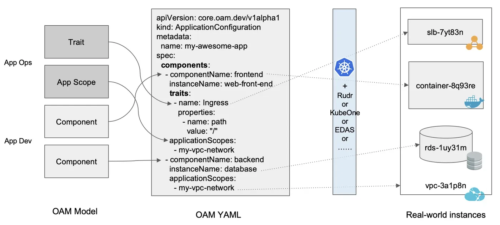
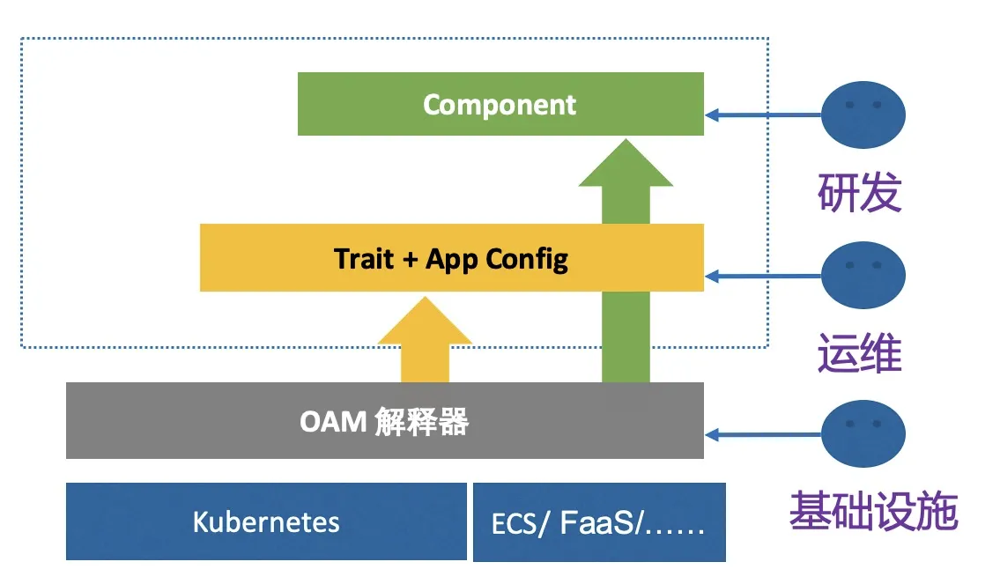
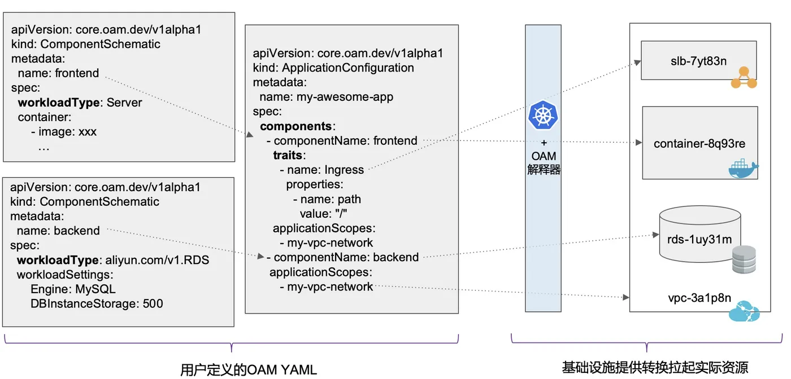
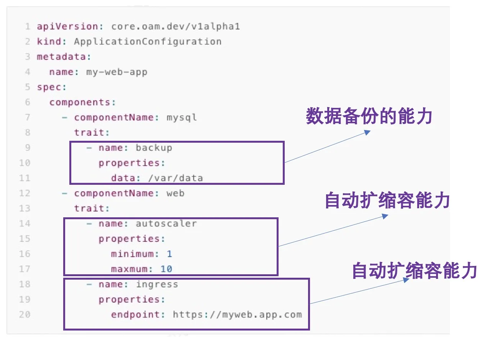
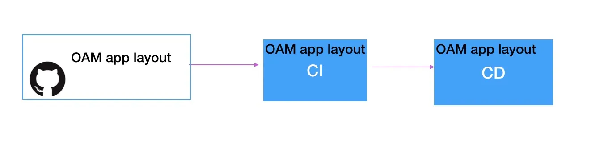
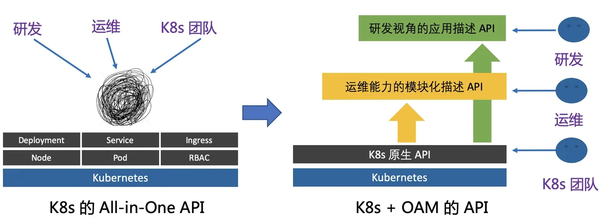
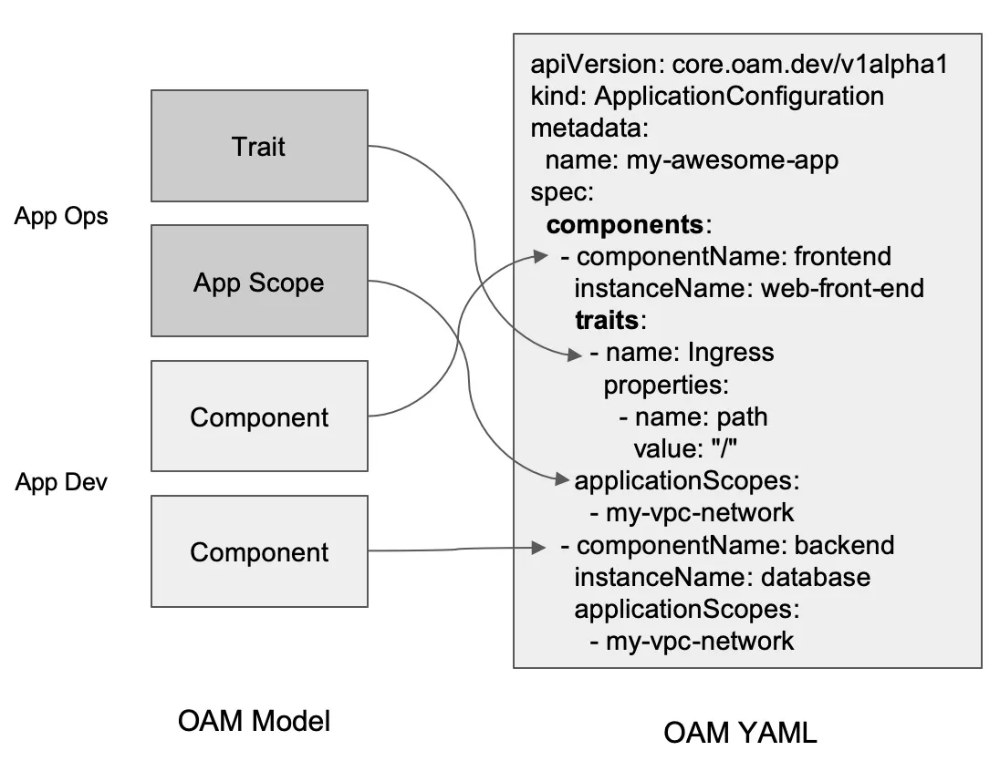

# 定义
是阿里巴巴联合微软在社区推出的一款用于构建和交付云原生应用的标准规范，旨在通过全新的应用定义、运维、分发与交付模型，推动应用管理技术向“轻运维”的方向迈进，全力开启下一代云原生 DevOps 的技术革命。

# 价值
## 云原生化
- OAM 应用定义是声明式的，即面向终态的，它的格式与 K8s 的 API 一致，可以与 K8s 的 CRD 无缝对接，直接作为 Custom Resource 的 Object 部署到 K8s；
- OAM 应用定义是自包含的，通过 OAM 定义的描述可以找到包含一个应用生命周期中方方面面所有的信息。

如下图所示，你可以看到运行 OAM 的一个应用配置，使用 K8s 的 API spec，完整包含了一个应用方方面面的资源。



## 平台无关、运行时无关
OAM 应用定义并不限定你底层的平台和实际运行时，你完全可以运行在 K8s 以外的平台，不管是 ECS、Docker、又或是 FaaS (Serverless)，自然也不存在厂商锁定的问题。如果你的应用满足 Serverless 的条件，那么针对该应用的 OAM 描述，天然就可以运行在支持 OAM 规范的 Serverless 运行时。



## 基础设施即代码
云原生的普及很大程度上推动了基础设施即代码的实现，K8s 作为一个基础设施平台，通过声明式 API，让用户习惯了 通过 Yaml 文件描述需要的资源，这其实就是基础设施即代码的实现。 而 OAM 更进一步，还将原生 K8s 中没有包含的基础设施资源也统一定义起来，通过配置 OAM 规范的 yaml（代码）来使用基础设施
```
apiVersion: core.oam.dev/v1alpha1
kind: ComponentSchematic
metadata:
  name: nasFileSystem
  annotations:
    version: v1.0.0
    description: >
      component schematic that describes the nas filesystem.
spec:
  workloadType: ros.aliyun.com/v1alpha1.NAS_FileSystem
  workloadSettings:
    ProtocolType: NFS
    StorageType: Performance
    Description: xxx
  expose:
    - name: fileSystemOut
---
apiVersion: core.oam.dev/v1alpha1
kind: ComponentSchematic
metadata:
  name: nasMountTarget
  annotations:
    version: v1.0.0
    description: >
      component schematic that describes the nas filesystem.
spec:
  workloadType: ros.aliyun.com/v1alpha1.NAS_MountTarget
  workloadSettings:
    NetworkType: VPC
    AccessGroupName: xxx
    FileSystemId: ${fileSystemOut.FileSystemId}
  consume:
    - name: fileSystemOut
  expose:
    - name: moutTargetOut 
---
apiVersion: core.oam.dev/v1alpha1
kind: ApplicationConfiguration
metadata:
  name: nas-demo
spec:
  components:
    - componentName: nasMountTarget
      traits:
        - name: DeletionPolicy
          properties: "Retain"
    - componentName: nasFileSystem
      traits:
        - name: DeletionPolicy
          properties: "Retain"
```

## 关心架构而不是基础设施
用户的诉求其实是应用的架构，而不是具体使用哪种基础设施资源。而 OAM 通过 "WorkloadType" 来解决这个诉求，通过描述一个应用的 WorkloadType 来定义应用的架构，这个 WorkloadType 可以是简单的无状态应用 "Server"，表示应用可复制、可访问、并作为守护进程长久运行；也可以是一个数据库类型的应用 "RDS"，对应启动一个云上的 RDS 实例。
用户的组件 "Component" 通过指定 "WorkloadType" 选择具体的架构模板，多个 Component 构成了完整的架构。
使用 OAM 应用定义让用户真正关心的是架构，而不是具体的基础设施。
如下图所示，OAM 的一个应用描述，用户指定它的应用需要一个外网访问能力，而不是指定一个 SLB，用户指定它的组件是数据库的



## 运维能力管理
用户希望运维能力也是应用生命周期的一部分，而 OAM 正是如此，通过绑定 Trait，来定义一个 Component 所使用到的运维能力，从而把运维能力也加入到应用描述中，方便底层基础设施统一管理。

如下图所示，一个应用包含两部分组件，一个 web 服务和一个数据库， 数据库组件应该具有数据备份的能力，而 web 服务则可以被访问、可以弹性扩缩容。这些能力由 OAM 的解释器（即 OAM 的实现层）统一管理，从此运维能力绑定出现冲突也不再是烦恼。



## 透明化的集成
就像 Docker 镜像解决了长久以来开发、测试、生产环境不一致一样，统一而标准化的 OAM 应用描述也让不同系统之间的集成变得透明而标准化。



## 不同的角色关注点分离
OAM 也将原先 K8s All-in-one 的复杂 API 做了一定层次的解耦，分为应用研发（管理 Component）、应用运维（将 Component 组合并绑定 Trait 变成 AppConfig）、以及基础设施提供方（提供 OAM 的解释能力映射到实际的基础设施）三大角色，不同角色分工协作，从而整体简化单个角色关注的内容。使得不同角色可以更聚焦更专业的做好本角色的工作。



## 弹性可扩展
OAM 应用定义是弹性、可扩展的，你可以通过扩展 Workload 来定义不同类型的工作负载，你也可以通过自定义的 Trait 来描述你的运维能力，而且都可以与现有的 K8s 体系里面 CRD+Operator 的扩展方式完美结合。


## 模块化协作

OAM 通过关注点分离的思想，将应用分为研发、运维和基础设施三个层次，同时又为研发的 Workload 和运维的 Trait 提供了模块化协作的能力，大大提高了复用能力。



当模块化的 Workload 和 Trait 越来越多，就会形成这些组件的市场，用户可以在 CRD Registry 这样的注册中心，快速找到适合自己的应用的架构（Workload），以及自己需要使用的运维能力（Trait）。构建应用将越来越简单。


# 总结

- 应用抽象，定义生命周期的全流程管理
- 关注架构，屏蔽底层基础设施，与底层平台、运行时无关
- 模块化，分为研发、运维、基础设施，关注点分离，关注自身角色部分就行
- 基础设置及代码，将k8s中没有包含的基础设置也考虑了进来