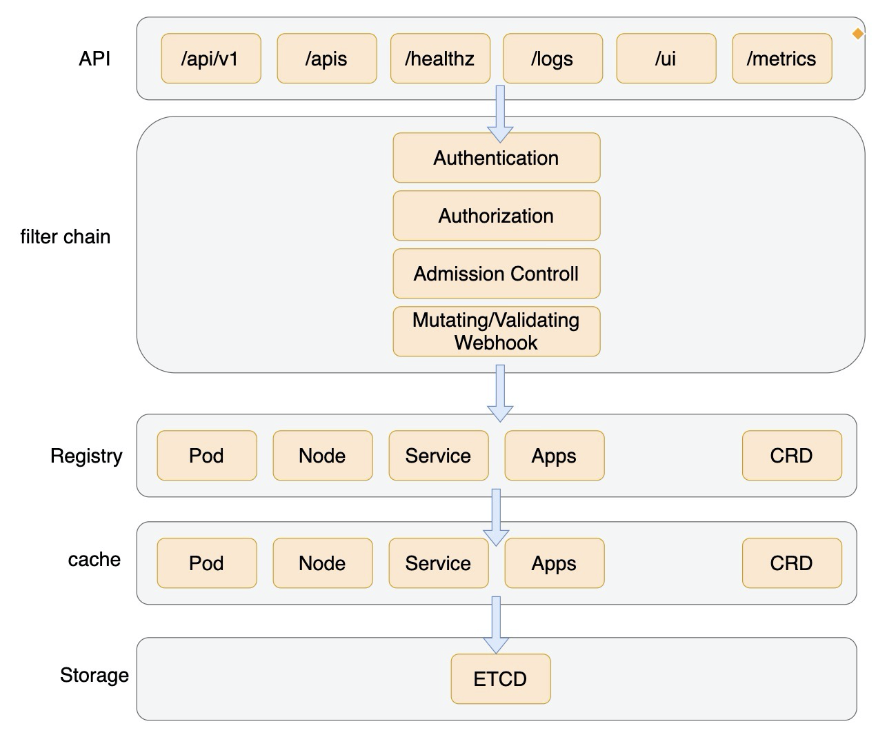
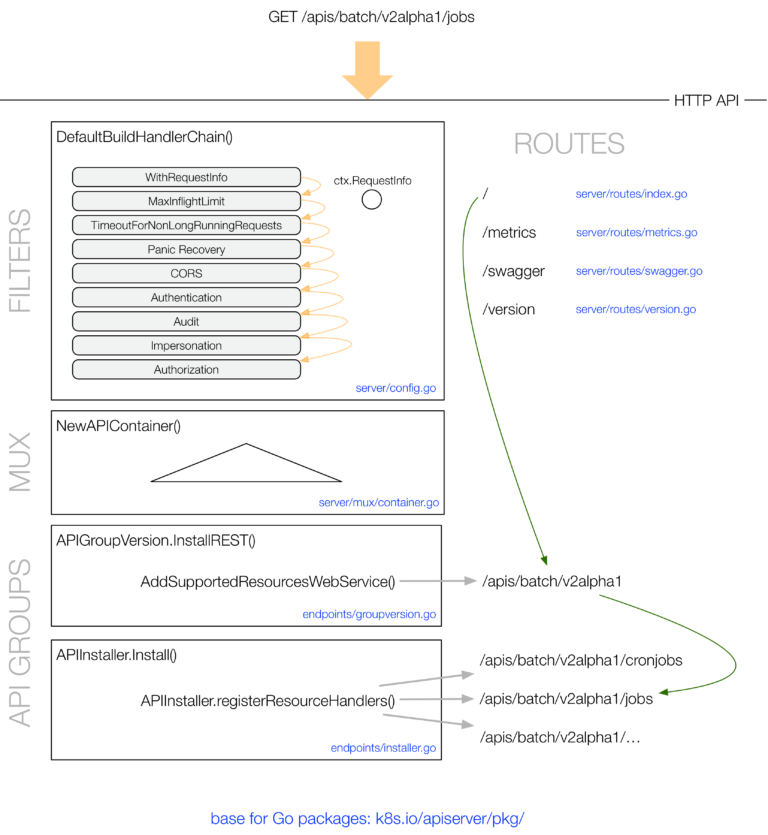

# 架构

kube-apiserver包含三种APIServer：

aggregatorServer：负责处理 apiregistration.k8s.io 组下的APIService资源请求，同时将来自用户的请求拦截转发给aggregated server(AA)
kubeAPIServer：负责对请求的一些通用处理，包括：认证、鉴权以及各个内建资源(pod, deployment，service and etc)的REST服务等
apiExtensionsServer：负责CustomResourceDefinition（CRD）apiResources以及apiVersions的注册，同时处理CRD以及相应CustomResource（CR）的REST请求(如果对应CR不能被处理的话则会返回404)，也是apiserver Delegation的最后一环

```
func CreateServerChain(completedOptions completedServerRunOptions) (*aggregatorapiserver.APIAggregator, error) {
	kubeAPIServerConfig, serviceResolver, pluginInitializer, err := CreateKubeAPIServerConfig(completedOptions)
	if err != nil {
		return nil, err
	}

	// If additional API servers are added, they should be gated.
	apiExtensionsConfig, err := createAPIExtensionsConfig(*kubeAPIServerConfig.GenericConfig, kubeAPIServerConfig.ExtraConfig.VersionedInformers, pluginInitializer, completedOptions.ServerRunOptions, completedOptions.MasterCount,
		serviceResolver, webhook.NewDefaultAuthenticationInfoResolverWrapper(kubeAPIServerConfig.ExtraConfig.ProxyTransport, kubeAPIServerConfig.GenericConfig.EgressSelector, kubeAPIServerConfig.GenericConfig.LoopbackClientConfig, kubeAPIServerConfig.GenericConfig.TracerProvider))
	if err != nil {
		return nil, err
	}

	notFoundHandler := notfoundhandler.New(kubeAPIServerConfig.GenericConfig.Serializer, genericapifilters.NoMuxAndDiscoveryIncompleteKey)
	// 创建 APIExtensionsServer
	apiExtensionsServer, err := createAPIExtensionsServer(apiExtensionsConfig, genericapiserver.NewEmptyDelegateWithCustomHandler(notFoundHandler))
	if err != nil {
		return nil, err
	}
    // 创建 KubeAPIServer
	kubeAPIServer, err := CreateKubeAPIServer(kubeAPIServerConfig, apiExtensionsServer.GenericAPIServer)
	if err != nil {
		return nil, err
	}

	// aggregator comes last in the chain
	aggregatorConfig, err := createAggregatorConfig(*kubeAPIServerConfig.GenericConfig, completedOptions.ServerRunOptions, kubeAPIServerConfig.ExtraConfig.VersionedInformers, serviceResolver, kubeAPIServerConfig.ExtraConfig.ProxyTransport, pluginInitializer)
	if err != nil {
		return nil, err
	}
	// 创建 AggregatorServer
	aggregatorServer, err := createAggregatorServer(aggregatorConfig, kubeAPIServer.GenericAPIServer, apiExtensionsServer.Informers)
	if err != nil {
		// we don't need special handling for innerStopCh because the aggregator server doesn't create any go routines
		return nil, err
	}

	return aggregatorServer, nil
}
```
# filter流程


## 限流APF

# 优化
蚂蚁apiserver优化，支撑更大规模
https://www.sofastack.tech/blog/climbing-to-the-top-of-scale-ant-groups-large-scale-sigma-cluster-apiserver-optimization-in-practice/

# kine
上面的背景中讲到，Kine 实际就是用对象存储实现了 etcd 的一些重要接口，如果我们从简单的 kv 存储角度来看，这个实现可能并不复杂。比如：我们只要实现 kv 就行了，使用 mysql 的一个索引作为 key，value 存在另一个字段，这个实现并不复杂。实际上 kine 的实现并不是这样，比这个要复杂很多。
- 原生支持 MVCC：当然基于 kv 或者 sql 实现 MVCC 并不困难，但是直接的支持总是更方便的【补充一点：etcd 支持获取指定版本的 kv，意味着所有的历史版本 kv 都要被存储，直到到 compact（compact 是另一个问题，即历史版本不断增加会消耗大量的存储，所以需要一种机制把一些很老的历史版本删掉，最保留最近的比如几百个版本）
- 支持事务：这对于 sql 存储很常见，但是对于 kv 存储来说就不一定了，etcd 通过一个 txn 函数来支持事务，实际大部分时候是配合 MVCC 使用的。举个例子, 通过 etcd 常见的一种事务操作是 if (k's version == 1) do update value = new_value
- ChangeNotification：即 Watch 机制，这点对于 k8s 来说很重要，k8s 是一个描述性的应用系统（区别于命令式，即我们需求一个 pod，k8s 得到了这个需求，会尽快的满足这个需求，达到和需求的状态一致），通知系统让 k8s 的状态应用变得快速方便。这点在 zk 或者 consul 等类似的（用于 coordination）存储中很常见，但是在 sql 存储中则不太方便，需要借助 trigger 或者 binlog 来实现。
了解了这些特点之后，我们的目标就比较明确：基于关系数据库实现支持 MVCC 的一个 kv 系统，这个 kv 需要保留所有的 版本，并且 还能支持 watch change notification。

```
CREATE TABLE IF NOT EXISTS kine
(
       id INTEGER PRIMARY KEY AUTOINCREMENT,
       name INTEGER,
       created INTEGER,
       deleted INTEGER,
       create_revision INTEGER,
       prev_revision INTEGER,
       lease INTEGER,
       value BLOB,
       old_value BLOB
)`,
`CREATE INDEX IF NOT EXISTS kine_name_index ON kine (name)`,
`CREATE INDEX IF NOT EXISTS kine_name_id_index ON kine (name,id)`,
`CREATE INDEX IF NOT EXISTS kine_id_deleted_index ON kine (id,deleted)`,
`CREATE INDEX IF NOT EXISTS kine_prev_revision_index ON kine (prev_revision)`,
`CREATE UNIQUE INDEX IF NOT EXISTS kine_name_prev_revision_uindex ON kine (name, prev_revision)`,
`PRAGMA wal_checkpoint(TRUNCATE)
```

id 就是 Revision，对应 etcd 里面的 Revision，始终自增
name，value 分别是 key、value
created、deleted 标记是一个创建或者删除事件
create_revision 表示这个 key 的创建版本，即这个 key 第一次创建的时候的 id 号（对于创建事件本身，这个字段可不填）
prev_revision 表示这个 key 的上一个版本，即这个 key 上一次被操作时候的 id 号
lease 是租约，类似 ttl 
old_value 是更新之前的值

## List

## Update

## Create

## Compact

## Watch
watch 的实现有点像 binlog，支持从某一个 version 开始 watch（这点在 tcp 连接因为一些异常中断恢复的时候很重要），在 一个 tcp 连接里面不断返回 log 事件。

kine 的实现使用 poll，即定期 list 一组数据（>lastListVersion）,然后返回到一个 chan 里面做 scatter + filter 之后返回给 watcher。为什么使用 poll 呢，实际上 kine 里面有所有的事件动作，直接把 事件发送进 chan 不行吗？这种操作的问题是：如果 kine 重启，或者多实例部署，那么事件就会有问题。

尽管思路很简单，这里面仍然有一些细节：

如何尽快返回最近的事件，因为 watch 有间隔，在 kine 中为 每秒一次，kine 的做法是：如果一次查出来事件很多，立刻再查一次；如果有事件 notify 通知，并且这个 notify > last, 立刻再查一次，这里的 notify 来自实际的 Append 操作通知
当出现事件版本不一致的时候怎么处理，kine 的做法是新建一种特殊的 gap key，填补空缺
# Refence
https://cloud.tencent.com/developer/article/1983026
https://cloud.tencent.com/developer/article/2249648
