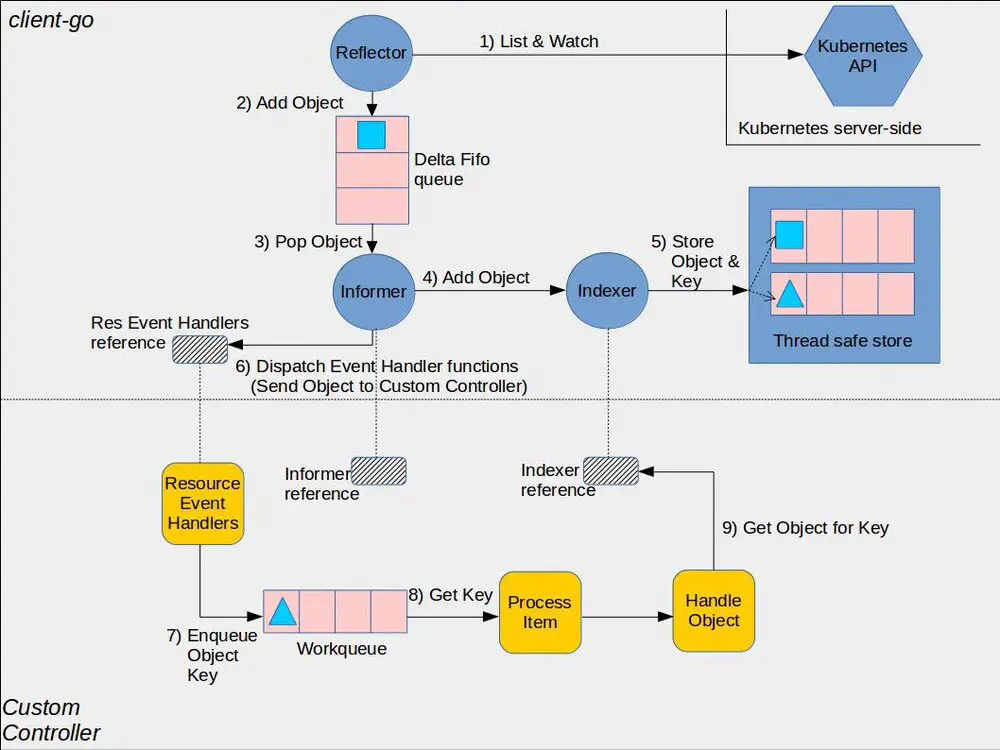
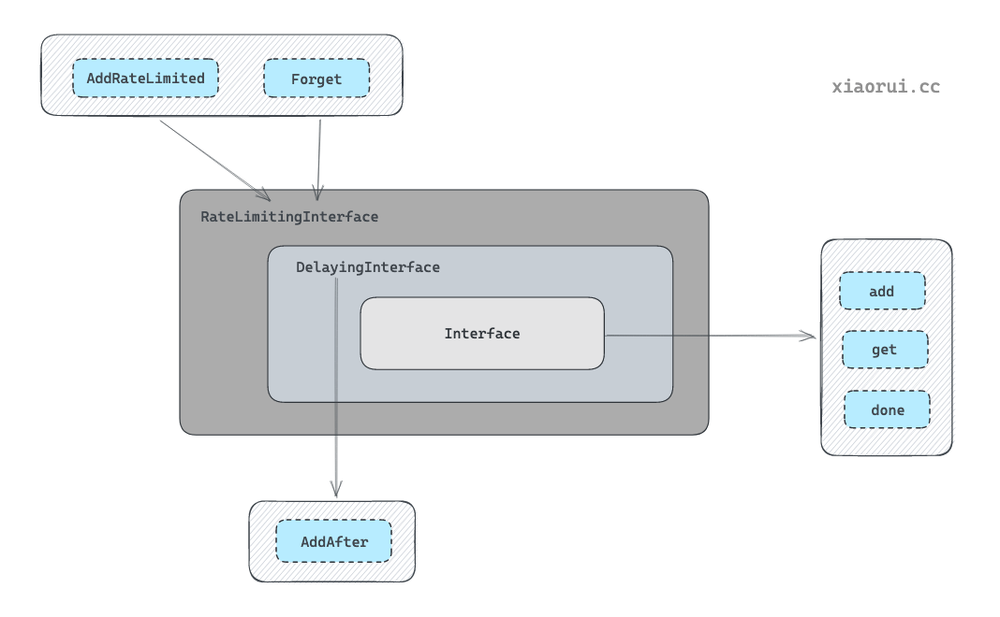

# 架构
作为一个有序、稳定的消息事件


## Shared Informer

### 资源 Informer
每一个 k8s Resource 都实现了 Informer 机制，均有 Informer 和 Lister 方法，以 PodInformer 为例：
```
type PodInformer interface {
	Informer() cache.SharedIndexInformer
	Lister() v1.PodLister
}
```
### Shared Informer 共享机制
Informer 又称为 Shared Informer，表明是可以共享使用的，在使用 client-go 写代码时，若同一资源的 Informer 被实例化太多次，每个 Informer 使用一个 Reflector，会运行过多的相同 ListAndWatch（即图中的第一步），太多重复的序列化和反序列化会导致 k8s API Server 负载过重。

而 Shared Informer 通过对同一类资源 Informer 共享一个 Reflector 可以节约很多资源，这通过 map 数据结构即可实现这样一个共享 Informer 机制

## Refector
Reflector 用于 Watch 指定的 Kubernetes 资源，当 watch 的资源发生变化时，触发变更的事件，并将资源对象存放到本地缓存 DeltaFIFO。

通过 NewReflector 实例化 Reflector 对象，实例化过程必须传入 ListerWatcher 数据接口对象，它拥有 List 和 Watch 方法。Reflector 对象通过 Run 行数启动监控并处理监控事件，在实现中，其核心为 ListAndWatch 函数。

以 Example 的代码为例，我们在最后一步执行了 informer.Run(stopCh)，内部会执行一个 ListAndWatch 方法：

## Feltafifo
DeltaFIFO 拆开理解，FIFO 就是一个队列，拥有队列基本方法（ADD，UPDATE，DELETE，LIST，POP，CLOSE 等），Delta 是一个资源对象存储，保存存储对象的消费类型，比如 Added，Updated，Deleted，Sync 等。
```
type DeltaFIFO struct {
	// lock/cond protects access to 'items' and 'queue'.
	lock sync.RWMutex
	cond sync.Cond

	// We depend on the property that items in the set are in
	// the queue and vice versa, and that all Deltas in this
	// map have at least one Delta.
	items map[string]Deltas
	queue []string

	// ...
}
```

```
// DeltaType is the type of a change (addition, deletion, etc)
type DeltaType string

// Delta is the type stored by a DeltaFIFO. It tells you what change
// happened, and the object's state after* that change.
type Delta struct {
	Type   DeltaType
	Object interface{}
}

// Deltas is a list of one or more 'Delta's to an individual object.
// The oldest delta is at index 0, the newest delta is the last one.
type Deltas []Delta
```
DeltaFIFO 会保留所有关于资源对象（obj）的操作类型，队列中会存在拥有不同操作类型的同一资源对象，使得消费者在处理该资源对象时能够了解资源对象所发生的事情。queue 字段存储资源对象的 key，这个 key 通过 KeyOf 函数计算得到，items 字段通过 map 数据结构的方式存储，value 存储的是对象 Deltas 数组，一个结构示例图如下：
```
        ┌───────┐┌───────┐┌───────┐
queue   │ObjKey1││ObjKey2││ObjKey3│
        └───────┘└───────┘└───────┘

        ┌─────────────────────────────────────────────────────────────┐
itmes   │ObjKey1: [{"Added",Obj1} {"Updated",Obj1}]                   │
        ├─────────────────────────────────────────────────────────────┤
        │ObjKey2: [{"Added",Obj2},{"Deleted",Obj2},{"Sync",Obj2}]     │
        ├─────────────────────────────────────────────────────────────┤
        │ObjKey3: [{"Added",Obj3},{"Updated",Obj3},{"Deleted",Obj3}]  │
        └─────────────────────────────────────────────────────────────┘
```

### DeletedFinalStateUnknown
因为Replace方法可能是reflector发生re-list的时候再次调用，这个时候就会出现knownObjects中存在的对象不在Replace list的情况（比如watch的delete事件丢失了），这个时候是把这些对象筛选出来，封装成DeletedFinalStateUnknown对象以Delete type类型再次加入到deltaFIFO中，这样最终从detaFIFO处理这个DeletedFinalStateUnknown 增量时就可以更新本地缓存并且触发reconcile。 因为这个对象最终的结构确实找不到了，所以只能用knownObjects里面的记录来封装delta，所以叫做FinalStateUnknown

### resync
所谓的resync，其实就是把knownObjects即缓存中的对象全部再通过queueActionLocked(Sync, obj)加到队列
```
func (f *DeltaFIFO) Resync() error {
   f.lock.Lock()
   defer f.lock.Unlock()

   if f.knownObjects == nil {
      return nil
   }

   keys := f.knownObjects.ListKeys()
   // 把local store中的对象都以Sync类型增量的形式重新放回到deltaFIFO
   for _, k := range keys {
      if err := f.syncKeyLocked(k); err != nil {
         return err
      }
   }
   return nil
}

func (f *DeltaFIFO) syncKeyLocked(key string) error {
   obj, exists, err := f.knownObjects.GetByKey(key)

   // If we are doing Resync() and there is already an event queued for that object,
   // we ignore the Resync for it. This is to avoid the race, in which the resync
   // comes with the previous value of object (since queueing an event for the object
   // doesn't trigger changing the underlying store <knownObjects>.
   id, err := f.KeyOf(obj)
   if err != nil {
      return KeyError{obj, err}
   }
   // 如上述注释，在resync时，如果deltaFIFO中该对象还存在其他delta没处理，那么忽略这次的resync
   // 因为调用queueActionLocked是增加delta是通过append的，且处理对象的增量delta时，是从oldest到newdest的
   // 所以如果某个对象还存在增量没处理，再append就可能导致后处理的delta是旧的对象
   if len(f.items[id]) > 0 {
      return nil
   }
   // 可以看到这里跟list一样，增加到deltaFIFO的是一个Sync类型的增量
   if err := f.queueActionLocked(Sync, obj); err != nil {
      return fmt.Errorf("couldn't queue object: %v", err)
   }
   return nil
}
```


## indexer
存储cache，支持索引

## workqueue

Interface

实现了基本的先进先出队列, 跟常规队列相比多了去重功能.

DelayingInterface

在 Interface 的基础上, 实现了延迟队里功能.

RateLimitingInterface

又在 DelayingInterface 的基础上, 实现了 RateLimiter 限频器功能. 当插入元素的次数超过限频器规则时, 则把对象推到延迟队列中处理.


## list && watch
与apiserver保持长链接，一个稳定的索引
### list

```
func shouldDelegateList(opts storage.ListOptions) bool {
    resourceVersion := opts.ResourceVersion
    pred            := opts.Predicate
    pagingEnabled   := DefaultFeatureGate.Enabled(features.APIListChunking)      // 默认是启用的
    hasContinuation := pagingEnabled && len(pred.Continue) > 0                   // Continue 是个 token
    hasLimit        := pagingEnabled && pred.Limit > 0 && resourceVersion != "0" // 只有在 resourceVersion != "0" 的情况下，hasLimit 才有可能为 true

    // 1. 如果未指定 resourceVersion，从底层存储（etcd）拉去数据；
    // 2. 如果有 continuation，也从底层存储拉数据；
    // 3. 只有 resourceVersion != "0" 时，才会将 limit 传给底层存储（etcd），因为 watch cache 不支持 continuation
    return resourceVersion == "" || hasContinuation || hasLimit || opts.ResourceVersionMatch == metav1.ResourceVersionMatchExact
}
```
具体见官方表格  