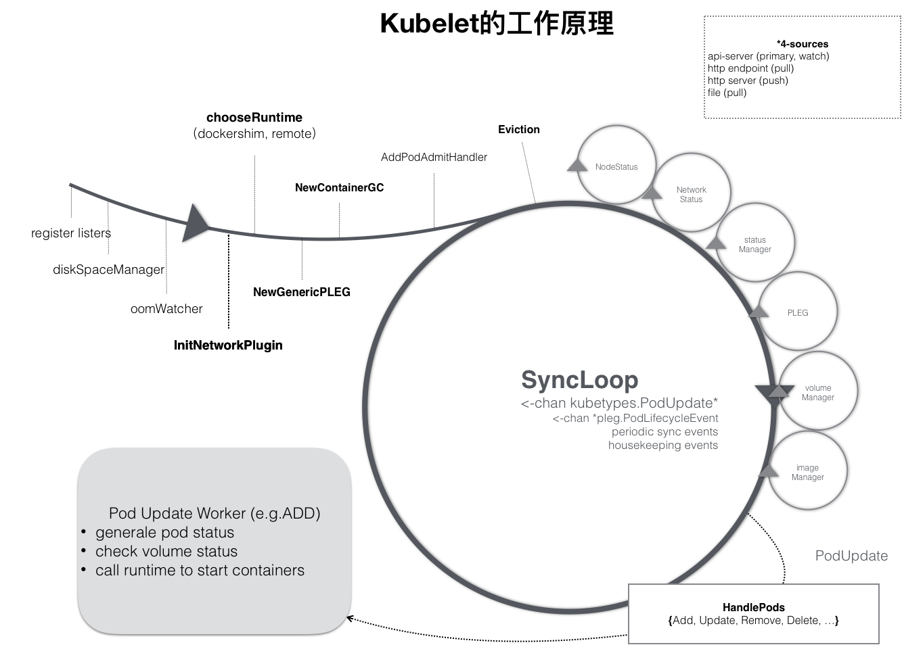

# 整体架构


# 监听Pod变化（syncLoopIteration）
configCh：该信息源由 kubeDeps 对象中的 PodConfig 子模块提供，该模块将同时 watch 3 个不同来源的 pod 信息的变化（file，http，apiserver），一旦某个来源的 pod 信息发生了更新（创建/更新/删除），这个 channel 中就会出现被更新的 pod 信息和更新的具体操作。
syncCh：定时器管道，每隔一秒去同步最新保存的 pod 状态
houseKeepingCh：housekeeping 事件的管道，做 pod 清理工作
plegCh：该信息源由 kubelet 对象中的 pleg 子模块提供，该模块主要用于周期性地向 container runtime 查询当前所有容器的状态，如果状态发生变化，则这个 channel 产生事件。
livenessManager.Updates()：健康检查发现某个 pod 不可用，kubelet 将根据 Pod 的restartPolicy 自动执行正确的操作
```
func (kl *Kubelet) syncLoopIteration(configCh <-chan kubetypes.PodUpdate, handler SyncHandler,
	syncCh <-chan time.Time, housekeepingCh <-chan time.Time, plegCh <-chan *pleg.PodLifecycleEvent) bool {
	select {
	case u, open := <-configCh:
		if !open {
			glog.Errorf("Update channel is closed. Exiting the sync loop.")
			return false
		}

		switch u.Op {
		case kubetypes.ADD:
			...
		case kubetypes.UPDATE:
			...
		case kubetypes.REMOVE:
			...
		case kubetypes.RECONCILE:
			...
		case kubetypes.DELETE:
			...
		case kubetypes.RESTORE:
			...
		case kubetypes.SET:
			...
		}
		...
	case e := <-plegCh:
		...
	case <-syncCh:
		...
	case update := <-kl.livenessManager.Updates():
		...
	case <-housekeepingCh:
		...
	}
	return true
}
```
# 处理新增Pod（HandlePodAddtions）
对于事件中的每个 pod，执行以下操作：
1、把所有的 pod 按照创建日期进行排序，保证最先创建的 pod 会最先被处理
2、把它加入到 podManager 中，podManager 子模块负责管理这台机器上的 pod 的信息，pod 和 mirrorPod 之间的对应关系等等。所有被管理的 pod 都要出现在里面，如果 podManager 中找不到某个 pod，就认为这个 pod 被删除了
3、如果是 mirror pod 调用其单独的方法
4、验证 pod 是否能在该节点运行，如果不可以直接拒绝
5、通过 dispatchWork 把创建 pod 的工作下发给 podWorkers 子模块做异步处理
6、在 probeManager 中添加 pod，如果 pod 中定义了 readiness 和 liveness 健康检查，启动 goroutine 定期进行检测
```
func (kl *Kubelet) HandlePodAdditions(pods []*v1.Pod) {
	start := kl.clock.Now()
	// 对所有 pod 按照日期排序，保证最先创建的 pod 优先被处理
	sort.Sort(sliceutils.PodsByCreationTime(pods))
	for _, pod := range pods {
		if kl.dnsConfigurer != nil && kl.dnsConfigurer.ResolverConfig != "" {
			kl.dnsConfigurer.CheckLimitsForResolvConf()
		}
		existingPods := kl.podManager.GetPods()
		// 把 pod 加入到 podManager 中
		kl.podManager.AddPod(pod)

		// 判断是否是 mirror pod（即 static pod）
		if kubepod.IsMirrorPod(pod) {
			kl.handleMirrorPod(pod, start)
			continue
		}

		if !kl.podIsTerminated(pod) {
			activePods := kl.filterOutTerminatedPods(existingPods)
			// 通过 canAdmitPod 方法校验Pod能否在该计算节点创建(如:磁盘空间)
			// Check if we can admit the pod; if not, reject it.
			if ok, reason, message := kl.canAdmitPod(activePods, pod); !ok {
				kl.rejectPod(pod, reason, message)
				continue
			}
		}
		
		mirrorPod, _ := kl.podManager.GetMirrorPodByPod(pod)
		// 通过 dispatchWork 分发 pod 做异步处理，dispatchWork 主要工作就是把接收到的参数封装成 UpdatePodOptions，调用 UpdatePod 方法.
		kl.dispatchWork(pod, kubetypes.SyncPodCreate, mirrorPod, start)
		// 在 probeManager 中添加 pod，如果 pod 中定义了 readiness 和 liveness 健康检查，启动 goroutine 定期进行检测
		kl.probeManager.AddPod(pod)
	}
}
```

# 下发任务（dispatch）
dispatchWorker 的主要作用是把某个对 Pod 的操作（创建/更新/删除）下发给 podWorkers。
```
func (kl *Kubelet) dispatchWork(pod *v1.Pod, syncType kubetypes.SyncPodType, mirrorPod *v1.Pod, start time.Time) {
	if kl.podIsTerminated(pod) {
		if pod.DeletionTimestamp != nil {
			kl.statusManager.TerminatePod(pod)
		}
		return
	}
	// 落实在 podWorkers 中
	kl.podWorkers.UpdatePod(&UpdatePodOptions{
		Pod:        pod,
		MirrorPod:  mirrorPod,
		UpdateType: syncType,
		OnCompleteFunc: func(err error) {
			if err != nil {
				metrics.PodWorkerLatency.WithLabelValues(syncType.String()).Observe(metrics.SinceInMicroseconds(start))
			}
		},
	})
	if syncType == kubetypes.SyncPodCreate {
		metrics.ContainersPerPodCount.Observe(float64(len(pod.Spec.Containers)))
	}
}
```

# 更新事件的channel
podWorkers 子模块主要的作用就是处理针对每一个的 Pod 的更新事件，比如 Pod 的创建，删除，更新。而 podWorkers 采取的基本思路是：为每一个 Pod 都单独创建一个 goroutine 和更新事件的 channel，goroutine 会阻塞式的等待 channel 中的事件，并且对获取的事件进行处理。而 podWorkers 对象自身则主要负责对更新事件进行下发。
```
func (p *podWorkers) UpdatePod(options *UpdatePodOptions) {
	pod := options.Pod
	uid := pod.UID
	var podUpdates chan UpdatePodOptions
	var exists bool

	p.podLock.Lock()
	defer p.podLock.Unlock()

	// 如果当前 pod 还没有启动过 goroutine ，则启动 goroutine，并且创建 channel
	if podUpdates, exists = p.podUpdates[uid]; !exists {
		// 创建 channel
		podUpdates = make(chan UpdatePodOptions, 1)
		p.podUpdates[uid] = podUpdates

		// 启动 goroutine
		go func() {
			defer runtime.HandleCrash()
			p.managePodLoop(podUpdates)
		}()
	}
	// 下发更新事件
	if !p.isWorking[pod.UID] {
		p.isWorking[pod.UID] = true
		podUpdates <- *options
	} else {
		update, found := p.lastUndeliveredWorkUpdate[pod.UID]
		if !found || update.UpdateType != kubetypes.SyncPodKill {
			p.lastUndeliveredWorkUpdate[pod.UID] = *options
		}
	}
}
```

# 调用syncPodFn方法同步pod（UpdatePod，执行实际的同步操作）
```
func (p *podWorkers) managePodLoop(podUpdates <-chan UpdatePodOptions) {
	var lastSyncTime time.Time
	for update := range podUpdates {
		err := func() error {
			podUID := update.Pod.UID
			status, err := p.podCache.GetNewerThan(podUID, lastSyncTime)
			if err != nil {
				...
			}
			err = p.syncPodFn(syncPodOptions{
				mirrorPod:      update.MirrorPod,
				pod:            update.Pod,
				podStatus:      status,
				killPodOptions: update.KillPodOptions,
				updateType:     update.UpdateType,
			})
			lastSyncTime = time.Now()
			return err
		}()
		if update.OnCompleteFunc != nil {
			update.OnCompleteFunc(err)
		}
		if err != nil {
			...
		}
		p.wrapUp(update.Pod.UID, err)
	}
}
```


# Pod启动流程
## 准备
在这个方法中，主要完成以下几件事情：
- 如果是删除 pod，立即执行并返回
- 同步 podStatus 到 kubelet.statusManager
- 检查 pod 是否能运行在本节点，主要是权限检查（是否能使用主机网络模式，是否可以以 privileged 权限运行等）。如果没有权限，就删除本地旧的 pod 并返回错误信息
- 创建 containerManagar 对象，并且创建 pod level cgroup，更新 Qos level cgroup
- 如果是 static Pod，就创建或者更新对应的 mirrorPod
- 创建 pod 的数据目录，存放 volume 和 plugin 信息,如果定义了 pv，等待所有的 volume mount 完成（volumeManager 会在后台做这些事情）,如果有 image secrets，去 apiserver 获取对应的 secrets 数据
- 然后调用 kubelet.volumeManager 组件，等待它将 pod 所需要的所有外挂的 volume 都准备好。
- 调用 container runtime 的 SyncPod 方法，去实现真正的容器创建逻辑
```
func (kl *Kubelet) syncPod(o syncPodOptions) error {
	// pull out the required options
	pod := o.pod
	mirrorPod := o.mirrorPod
	podStatus := o.podStatus
	updateType := o.updateType

	// 是否为 删除 pod
	if updateType == kubetypes.SyncPodKill {
		...
	}
    ...
	// 检查 pod 是否能运行在本节点
	runnable := kl.canRunPod(pod)
	if !runnable.Admit {
		...
	}

	// 更新 pod 状态
	kl.statusManager.SetPodStatus(pod, apiPodStatus)

	// 如果 pod 非 running 状态则直接 kill 掉
	if !runnable.Admit || pod.DeletionTimestamp != nil || apiPodStatus.Phase == v1.PodFailed {
		...
	}

	// 加载网络插件
	if rs := kl.runtimeState.networkErrors(); len(rs) != 0 && !kubecontainer.IsHostNetworkPod(pod) {
		...
	}

	pcm := kl.containerManager.NewPodContainerManager()
	if !kl.podIsTerminated(pod) {
		...
		// 创建并更新 pod 的 cgroups
		if !(podKilled && pod.Spec.RestartPolicy == v1.RestartPolicyNever) {
			if !pcm.Exists(pod) {
				...
			}
		}
	}

	// 为 static pod 创建对应的 mirror pod
	if kubepod.IsStaticPod(pod) {
		...
	}

	// 创建数据目录
	if err := kl.makePodDataDirs(pod); err != nil {
		...
	}

	// 挂载 volume
	if !kl.podIsTerminated(pod) {
		if err := kl.volumeManager.WaitForAttachAndMount(pod); err != nil {
			...
		}
	}

	// 获取 secret 信息
	pullSecrets := kl.getPullSecretsForPod(pod)

	// 调用 containerRuntime 的 SyncPod 方法开始创建容器
	result := kl.containerRuntime.SyncPod(pod, apiPodStatus, podStatus, pullSecrets, kl.backOff)
	kl.reasonCache.Update(pod.UID, result)
	if err := result.Error(); err != nil {
		...
	}

	return nil
}
```
## 运行
containerRuntime（pkg/kubelet/kuberuntime）子模块的 SyncPod 函数才是真正完成 pod 内容器实体的创建。
syncPod 主要执行以下几个操作：
1、计算 sandbox 和 container 是否发生变化
2、创建 sandbox 容器
- CRI：创建沙箱容器的运行时环境
- CNI：挂载沙箱容器网络，包括分配IP、创建路由
- CSI：调用存储系统进行数据挂载（提前把应用容器需要的挂载挂进来）
3、启动 init 容器
4、启动业务容器
```
func (m *kubeGenericRuntimeManager) SyncPod(pod *v1.Pod, _ v1.PodStatus, podStatus *kubecontainer.PodStatus, pullSecrets []v1.Secret, backOff *flowcontrol.Backoff) (result kubecontainer.PodSyncResult) {
	// 1、计算 sandbox 和 container 是否发生变化
	podContainerChanges := m.computePodActions(pod, podStatus)
	if podContainerChanges.CreateSandbox {
		ref, err := ref.GetReference(legacyscheme.Scheme, pod)
		if err != nil {
			glog.Errorf("Couldn't make a ref to pod %q: '%v'", format.Pod(pod), err)
		}
		...
	}

	// 2、kill 掉 sandbox 已经改变的 pod
	if podContainerChanges.KillPod {
		...
	} else {
		// 3、kill 掉非 running 状态的 containers
		...
		for containerID, containerInfo := range podContainerChanges.ContainersToKill {
			...
			if err := m.killContainer(pod, containerID, containerInfo.name, containerInfo.message, nil); err != nil {
				...
			}
		}
	}

	m.pruneInitContainersBeforeStart(pod, podStatus)
	podIP := ""
	if podStatus != nil {
		podIP = podStatus.IP
	}

	// 4、创建 sandbox 
	podSandboxID := podContainerChanges.SandboxID
	if podContainerChanges.CreateSandbox {
		podSandboxID, msg, err = m.createPodSandbox(pod, podContainerChanges.Attempt)
		if err != nil {
			...
		}
		...
		podSandboxStatus, err := m.runtimeService.PodSandboxStatus(podSandboxID)
		if err != nil {
			...
		}
		// 如果 pod 网络是 host 模式，容器也相同；其他情况下，容器会使用 None 网络模式，让 kubelet 的网络插件自己进行网络配置
		if !kubecontainer.IsHostNetworkPod(pod) {
			podIP = m.determinePodSandboxIP(pod.Namespace, pod.Name, podSandboxStatus)
			glog.V(4).Infof("Determined the ip %q for pod %q after sandbox changed", podIP, format.Pod(pod))
		}
	}

	configPodSandboxResult := kubecontainer.NewSyncResult(kubecontainer.ConfigPodSandbox, podSandboxID)
	result.AddSyncResult(configPodSandboxResult)
	// 获取 PodSandbox 的配置(如:metadata,clusterDNS,容器的端口映射等)
	podSandboxConfig, err := m.generatePodSandboxConfig(pod, podContainerChanges.Attempt)
	...

	// 5、启动 init container
	if container := podContainerChanges.NextInitContainerToStart; container != nil {
		...
		if msg, err := m.startContainer(podSandboxID, podSandboxConfig, container, pod, podStatus, pullSecrets, podIP, kubecontainer.ContainerTypeInit); err != nil {
			...
		}
	}

	// 6、启动业务容器
	for _, idx := range podContainerChanges.ContainersToStart {
		...
		if msg, err := m.startContainer(podSandboxID, podSandboxConfig, container, pod, podStatus, pullSecrets, podIP, kubecontainer.ContainerTypeRegular); err != nil {
			...
		}
	}
	
	return
}
```

kubeGenericRuntimeManager.computePodActions 检查 Pod Spec 是否发生变更，并且返回 PodActions，记录为了达到期望状态需要执行的变更内容
```
pkg/kubelet/kuberuntime/kuberuntime_manager.go:451

// computePodActions checks whether the pod spec has changed and returns the changes if true.
func (m *kubeGenericRuntimeManager) computePodActions(pod *v1.Pod, podStatus *kubecontainer.PodStatus) podActions {
    glog.V(5).Infof("Syncing Pod %q: %+v", format.Pod(pod), pod)

    createPodSandbox, attempt, sandboxID := m.podSandboxChanged(pod, podStatus)
    changes := podActions{
        KillPod:           createPodSandbox,
        CreateSandbox:     createPodSandbox,
        SandboxID:         sandboxID,
        Attempt:           attempt,
        ContainersToStart: []int{},
        ContainersToKill:  make(map[kubecontainer.ContainerID]containerToKillInfo),
    }

    // If we need to (re-)create the pod sandbox, everything will need to be
    // killed and recreated, and init containers should be purged.
    if createPodSandbox {
        if !shouldRestartOnFailure(pod) && attempt != 0 {
            // Should not restart the pod, just return.
            return changes
        }
        if len(pod.Spec.InitContainers) != 0 {
            // Pod has init containers, return the first one.
            changes.NextInitContainerToStart = &pod.Spec.InitContainers[0]
            return changes
        }
        // Start all containers by default but exclude the ones that succeeded if
        // RestartPolicy is OnFailure.
        for idx, c := range pod.Spec.Containers {
            if containerSucceeded(&c, podStatus) && pod.Spec.RestartPolicy == v1.RestartPolicyOnFailure {
                continue
            }
            changes.ContainersToStart = append(changes.ContainersToStart, idx)
        }
        return changes
    }
    // Check initialization progress.
    initLastStatus, next, done := findNextInitContainerToRun(pod, podStatus)
    if !done {
        if next != nil {
            initFailed := initLastStatus != nil && isContainerFailed(initLastStatus)
            if initFailed && !shouldRestartOnFailure(pod) {
                changes.KillPod = true
            } else {
                changes.NextInitContainerToStart = next
            }
        }
        // Initialization failed or still in progress. Skip inspecting non-init
        // containers.
        return changes
    }

    // Number of running containers to keep.
    keepCount := 0
    // check the status of containers.
    for idx, container := range pod.Spec.Containers {
        containerStatus := podStatus.FindContainerStatusByName(container.Name)

        // Call internal container post-stop lifecycle hook for any non-running container so that any
        // allocated cpus are released immediately. If the container is restarted, cpus will be re-allocated
        // to it.
        if containerStatus != nil && containerStatus.State != kubecontainer.ContainerStateRunning {
            if err := m.internalLifecycle.PostStopContainer(containerStatus.ID.ID); err != nil {
                glog.Errorf("internal container post-stop lifecycle hook failed for container %v in pod %v with error %v",
                    container.Name, pod.Name, err)
            }
        }
        // If container does not exist, or is not running, check whether we
        // need to restart it.
        if containerStatus == nil || containerStatus.State != kubecontainer.ContainerStateRunning {
            if kubecontainer.ShouldContainerBeRestarted(&container, pod, podStatus) {
                message := fmt.Sprintf("Container %+v is dead, but RestartPolicy says that we should restart it.", container)
                glog.V(3).Infof(message)
                changes.ContainersToStart = append(changes.ContainersToStart, idx)
            }
            continue
        }
        // The container is running, but kill the container if any of the following condition is met.
        reason := ""
        restart := shouldRestartOnFailure(pod)
        if expectedHash, actualHash, changed := containerChanged(&container, containerStatus); changed {
            reason = fmt.Sprintf("Container spec hash changed (%d vs %d).", actualHash, expectedHash)
            // Restart regardless of the restart policy because the container
            // spec changed.
            restart = true
        } else if liveness, found := m.livenessManager.Get(containerStatus.ID); found && liveness == proberesults.Failure {
            // If the container failed the liveness probe, we should kill it.
            reason = "Container failed liveness probe."
        } else {
            // Keep the container.
            keepCount += 1
            continue
        }
        // We need to kill the container, but if we also want to restart the
        // container afterwards, make the intent clear in the message. Also do
        // not kill the entire pod since we expect container to be running eventually.
        message := reason
        if restart {
            message = fmt.Sprintf("%s. Container will be killed and recreated.", message)
            changes.ContainersToStart = append(changes.ContainersToStart, idx)
        }
        changes.ContainersToKill[containerStatus.ID] = containerToKillInfo{
            name:      containerStatus.Name,
            container: &pod.Spec.Containers[idx],
            message:   message,
        }
        glog.V(2).Infof("Container %q (%q) of pod %s: %s", container.Name, containerStatus.ID, format.Pod(pod), message)
    }
    if keepCount == 0 && len(changes.ContainersToStart) == 0 {
        changes.KillPod = true
    }
    return changes
}
```
- computePodActions 会检查 Pod Sandbox 是否发生变更、各个 Container（包括 InitContainer）的状态等因素来决定是否要重建整个 Pod。
- 遍历 Pod 内所有 Containers：
  - 如果容器还没启动，则会根据 Container 的重启策略决定是否将 Container 添加到待启动容器列表中(PodActions.ContainersToStart)；
  - 如果容器的 Spec 发生变更(比较 Hash 值），则无论重启策略是什么，都要根据新的 Spec 重建容器，将 Container 添加到待启动容器列表中
  - (PodActions.ContainersToStart)；
  - 如果 Container Spec 没有变更，liveness probe 也是成功的，则该 Container 将保持不动，否则会将容器将入到待 Kill 列表中（PodActions.ContainersToKill）；

因此，computePodActions 的关键是的计算出了待启动的和待 Kill 的容器列表。

## 启动容器
1、拉取镜像
2、生成业务容器的配置信息
3、调用 docker api 创建容器
4、启动容器
5、执行 post start hook

