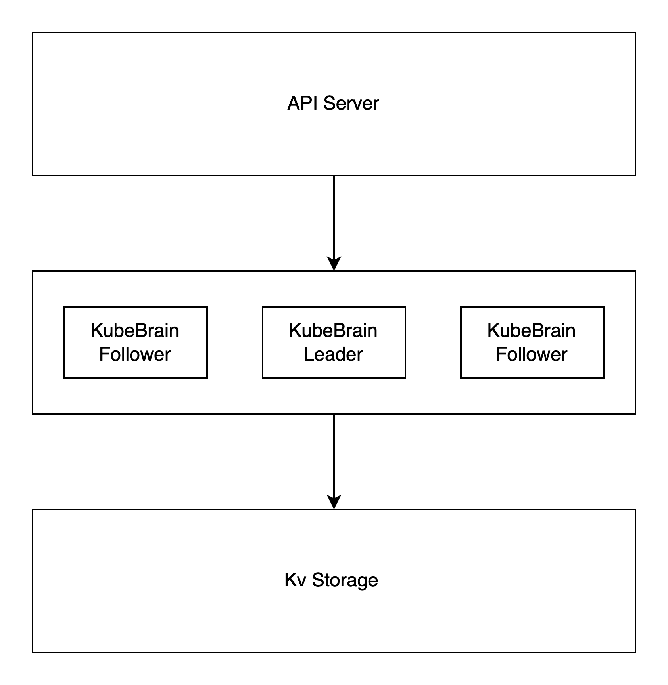

# 概要
由于原生k8s采用etcd作为存储

# ETCD

# 当前问题
etcd性能瓶颈以及当前接口需求

# kine
起源于k3s项目，用于边缘计算项目，用于轻量化k8s架构，所以性能上应该不是很高，打规模场景下应该会存在性能问题，github上没有找到性能测试的数据。

# kubebrain
字节开源的项目，受到kine项目研发，做了比较全面精细化的设计，能够支持较大集群规模。

项目总体分成几个部分
endpoints: 监听端口对外暴露服务
server: RPC和HTTP逻辑封装
backend: 元数据存储相关的逻辑封装
scanner：封装范围查找和垃圾回收相关的逻辑
election: 基于存储引擎提供的接口实现ResourceLock
writer: 负责写入数据
tso: 抽象出来的逻辑时钟组件，目前依赖于存储引擎的实现进行初始化，后续会解耦
coder: 进行Raw Key和Internal Key的相互转换
watch hub: 负责事件的生成、缓存和分发
retry queue: 异步重试队列，对于少量的返回非确定性错误的操作，通过异步重试修正保证最终一致性
KV Storage Interface: 抽象出的KV存储引擎接口
KV Storage Adaptor: KV存储引擎对于存储接口的实现，内置badger和TiKv的实现