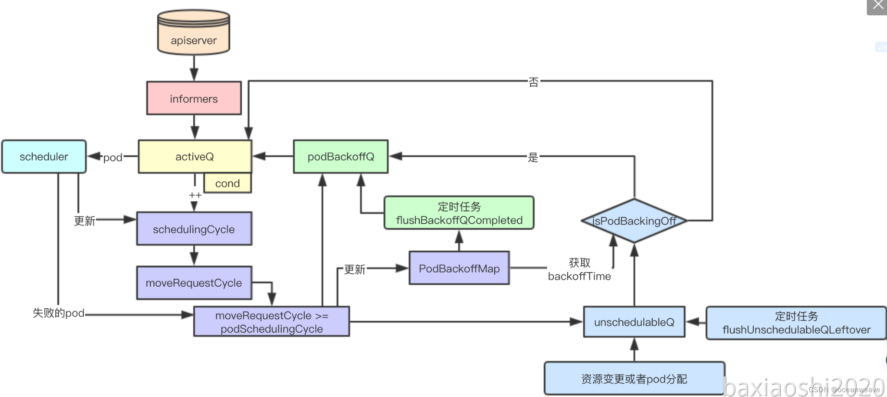
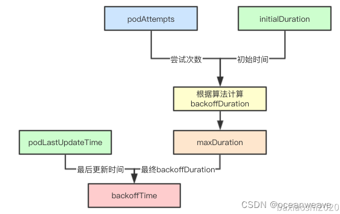
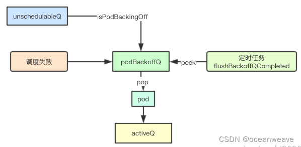
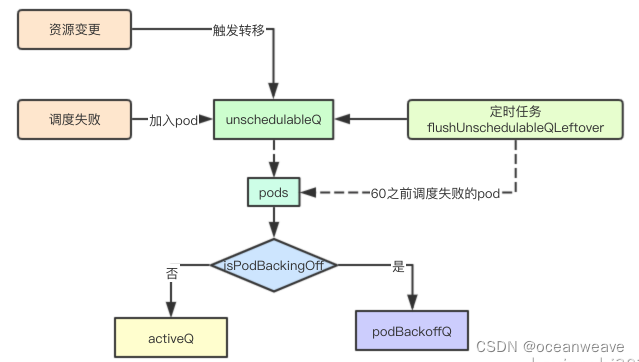

# 流程
## PreEnqueue
## QueueSort
## Prefilter
## Filter
## PostFilter
## PreScore
## Score
## NormizeScore
## Reserve
## Permit

## PreBinding
绑定前的一些操作，例如pvc等的创建等
## Binding
多个操作插件有一个成功后续的就不回执行
## PostBinding
绑定失败后的回退操作

# 框架

## 数据结构
### PriorityQueue
### activeQ
### backoffQ
### unschedulerQ

## 并发活动队列
add&&pop接口
会阻塞
## PodBackoffMap

## schedulingCycle && moveRequestCycle
### moveRequestCycle
- 集群资源发生变化
- pod被成功调度
调度成功+1
### podSchedulingCycle
每次调度+1

## activeQ
scheduler fail
如果schedulingCycle == moveRequestCycle，放入backoff，否则放入unschedulerQ
## backoffQ

## unschedulerQ

### 抢占机制

# Refence
