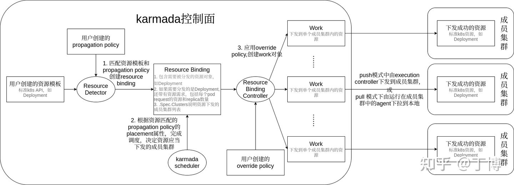
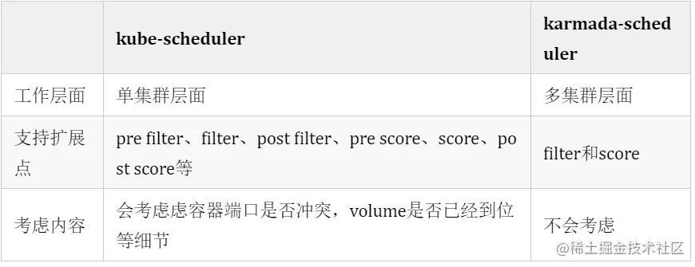

# 介绍
karmada是一个云原生多集群、多云编排工具，

# 组件
```
NAMESPACE            NAME                                                 READY   STATUS    RESTARTS   AGE
karmada-system       etcd-0                                               1/1     Running   0          98m
karmada-system       karmada-apiserver-75b5dc6fb7-l6hdv                   1/1     Running   0          98m
karmada-system       karmada-controller-manager-7d66968445-nnnpp          1/1     Running   0          98m
karmada-system       karmada-kube-controller-manager-5456fd756d-sf9xk     1/1     Running   0          98m
karmada-system       karmada-scheduler-7c8d678979-bgq4f                   1/1     Running   0          98m
karmada-system       karmada-webhook-5bfd9fb89d-msqnw                     1/1     Running   0          98m
kube-system          coredns-f9fd979d6-4bc2l                              1/1     Running   0          99m
kube-system          coredns-f9fd979d6-s7jc6                              1/1     Running   0          99m
kube-system          etcd-karmada-host-control-plane                      1/1     Running   0          99m
kube-system          kindnet-cq6kv                                        1/1     Running   0          99m
kube-system          kube-apiserver-karmada-host-control-plane            1/1     Running   0          99m
kube-system          kube-controller-manager-karmada-host-control-plane   1/1     Running   0          99m
kube-system          kube-proxy-ld9t8                                     1/1     Running   0          99m
kube-system          kube-scheduler-karmada-host-control-plane            1/1     Running   0          99m
local-path-storage   local-path-provisioner-78776bfc44-d9fvv              1/1     Running   0          99m
```
karmada-host: context对应的控制面运行在kube-system namespace中，用来运行管理karmada控制面，是个由kind启动的标准的k8s管理节点。
karmada-apiserver: context对应的控制面运行在karmada-system namespace中，是karmada控制面，也就是karmada readme中提到的host集群。它由local-up-karmada.sh脚本部署到karmada-host集群中。该控制面重用了k8s的两个组件：kube-apiserver和kube-controllermanager以及etcd，其他3个为karmada组件，包括kamada-controller-manager、karmada-scheduler、karmada-webhook
前一个k8s集群只是为了支撑karmada控制面的运行。所有后续集群联邦相关的操作，包括用karmadactl发出的member集群管理请求，以及用kubectl发出的工作负载管理请求都发往karmada控制面。这些请求中创建的API资源也保存在karmada控制面自身的etcd中（对应上面列表中的etcd-0 pod）。

需要注意的是，虽然karmada控制面重用了部分k8s组件，被重用的kube-controller-mamager通过启动flag限制其只运行namespace、garbagecollector、serviceaccount-token、serviceaccount这几个controller，所以当用户把Deployment等k8s标准资源提交给karmada apiserver时，它们只是被记录在karmada控制面的etcd中，并在后续同步到member集群中，这些Deployment资源并不会在karmada控制面管理的集群中发生reconcile（如创建pod）

# 编排流程
作为后来者的karmada吸取了kubefed“非原生API”方面的教训，将kubefed中定义在同一个API资源对象中的“资源模板”、“placement”、“overrides”拆开成3个如下的单独对象。在karmada中，用户需要分别创建资源模板（resource template）、多云调度策略（propagation policy）和多云差异化配置策略（override policy）3个对象：
## 模板
首先我们需要定义资源模板对象。为什么称为模板？是因为在每个集群中实际部署的Deployment对象都以它为模板创建，但又允许各不相同，详见后续对override policy的描述。
```
apiVersion: apps/v1
kind: Deployment
metadata:
  name: nginx
  namespace: default
  labels:
    app: nginx
spec:
  replicas: 1
  selector:
    matchLabels:
      app: nginx
  template:
    metadata:
      labels:
        app: nginx
    spec:
      containers:
      - image: nginx
        name: nginx
```

## 传播策略
其次我们需要定义多云调度策略对象（propagation policy），指定将上述nginx deployment部署到member1和member2两个由karmada管理的member集群中。在这个propagation policy对象中我们应注意以下几点：

.spec.resourceSelectors指定了需要部署到member集群中的资源：名叫nginx的deployment
.spec.placement指定了nginx需要部署到member1和member2两个member集群中
.spec.dependentOverrides，表示要karmada控制面等下面的差异化配置（override policy）创建之后再将应用部署到member1和member2集群。

```
apiVersion: policy.karmada.io/v1alpha1
kind: OverridePolicy
metadata:
  name: nginx-override
  namespace: default
spec:
  resourceSelectors:
    - apiVersion: apps/v1
      kind: Deployment
      name: nginx
  targetCluster:
    clusterNames:
      - member2
  overriders:
    plaintext:
    - path: "/spec/replicas"
      operator: replace
      value: 2
```


## 编排调度
与k8s中的kube-controller-manager类似，karmada中的karmada-controller-manager组件基于sigs.k8s.io/controller-runtime实现，在单独的goroutine中运行了一系列controller。这些controller配合karmada-scheduler，处理由用户提交的k8s原生API资源（比如前面例子中的Deployment）或CRD资源、以及propagation policy、override policy等karmada自定义API资源对象，实现多云环境下的应用资源编排
resource detector：监听propagation policy和k8s原生API资源对象（包括CRD资源）的变化，实现两者的绑定。1. 绑定的结果是产生ResourceBinding
2. propagation policy controller：仅有少量检测逻辑：检测propagation policy依赖的override policy是否已经创建，见前面nginx例子中的propagation policy对象的dependentOverrides属性。但无论依赖的override policy是否已经创建，propagation policy controller都不会有后续的绑定propagation policy和k8s原生API资源对象（包括CRD资源）的动作。因此可以说propagation policy controller无实际作用。真正的绑定逻辑存在resource detector的Reconcile方法中。因此我们后续不再讨论propagation policy controller
3. resource binding controller：把resource binding转换为work
4. execution controller：把work中包含的k8s原生API资源（或CRD资源）同步到push模式的member集群中（pull模式的member集群会用agent拉取work到本地）
下图描述了karmada中API资源的转化处理流程，以及上述controller在其中扮演的角色。下面按照karmada各组件在该流程中发挥作用的顺序依次描述其流程逻辑。


### resouce detector的处理流程
resource detector由karmada controller manager负责启动（调用其Start方法）。resource detector负责绑定用户创建的k8s原生API资源对象（包括CRD资源）和propagation policy。该模块的输入是使用list/watch机制监控到的这两类资源的变更事件，而输出是绑定完成的resource binding对象。
```
apiVersion: work.karmada.io/v1alpha1
kind: ResourceBinding
metadata:
labels:
propagationpolicy.karmada.io/name: nginx-propagation
propagationpolicy.karmada.io/namespace: default
name: nginx-deployment
namespace: default
ownerReferences:
- apiVersion: apps/v1
blockOwnerDeletion: true
controller: true
kind: Deployment
name: nginx
uid: 80672628-e8c9-462b-933b-037b51d79e59
spec:
resource:
apiVersion: apps/v1
kind: Deployment
name: nginx
namespace: default
replicas: 1
resourcePerReplicas:
  cpu: "0"
  memory: "0"
```

### 调度流程
scheduler根据上一步resource detector的输出结果resource binding，通过调度算法决定k8s原生API资源对象（包括CRD资源）的调度结果，即应该调度到哪些member集群中。

scheduler的输入是使用list/watch机制监控的resource binding、propagation policy的变更事件，而输出是为resource binding加上调度结果.spec.clusters。

当scheduler的worker方法逐一处理内部队列中的resouce binding的更新事件时（这些事件由scheduler定义的不同list/watch handler加入内部队列中），这些resource binding对象可能处于以下几种状态，这些不同的状态决定了scheduler下一步处理流程：

1. 首次调度（FirstSchedule）：这个阶段的resource binding刚由resource detector的绑定工作创建出来。从未经过karmada scheduler的调度处理。这类resource binding对象的特征是.spec.clusters为空
2. 调和调度（ReconcileSchedule）：当用户更新了propagation policy的placement，为了使得系统的实际运行状态与用户的期望一致，karmada scheduler不得不将之前已经调度过的k8s原生API资源对象（包括CRD资源）重新调度到新的成员集群中（从这个角度讲，下面的扩缩容调度也是一种调和调度，调和是在k8s中普遍使用的概念，因此“调和调度”这个名字范围太广，含义不明确）。这类resource binding对象的特征是之前已经通过karmada scheduler的调度，即.spec.clusters不为空，且上一次调度中绑定的propagation policy的placement当前发生了变化。
3. 扩缩容调度（ScaleSchedule）：当propagation policy包含的replica scheduling strategy与集群联邦中实际运行的replica数量不一致时，需要重新调度之前已经完成调度的k8s原生API资源对象（包括CRD资源）
故障恢复调度（FailoverSchedule）：当上次调度结果中的成员集群发生故障，也就是resource binding的.spec.clusters包含的成员集群状态不全都是就绪（ready），karmada scheduler需要重新调度应用，以恢复集群故障带来的应用故障
4. 无需调度（AvoidSchedule）：当上次调度结果中的成员集群状态均为就绪（ready），也就是resource binding的.spec.clusters包含的成员集群状态全都是就绪（ready），则无需做任何调度工作，只是在日志中记录告警信息：Don’t need to schedule binding。

这里重点分析首次调度的处理流程，该流程由scheduler的scheduleOne方法定义：

1. 获取resource bindings涉及的propagation policy的placement。由于上一步骤中resource detector为resource binding加上了绑定成功的propagation policy的name和namespace，在这里我们可以找到对应的propagation policy，并获取其placement属性，如前面nginx例子中的placement指定将nginx调度到member1和member2集群中
2. 根据placement和调度算法完成调度
3. 将调度结果（SuggestedClusters）写到resource binding的.spec.cluster中
4. 将序列化后的placement写到resource binding的annotation中，annotation的key为policy.karmada.io/applied-placement

以前面的nginx deployment为例，执行kubectl get rb nginx-deployment，可以看到完成上述调度流程的resource binding对象如下，注意其中由当前步骤中scheduler添加的.metadata.annotations和.spec.clusters：

```
apiVersion: work.karmada.io/v1alpha1
kind: ResourceBinding
metadata:
  annotations:
    policy.karmada.io/applied-placement: '{"clusterAffinity":{"clusterNames":["member1","member2"]}}'
  labels:
    propagationpolicy.karmada.io/name: nginx-propagation
    propagationpolicy.karmada.io/namespace: default
  name: nginx-deployment
  namespace: default
  ownerReferences:
  - apiVersion: apps/v1
    blockOwnerDeletion: true
    controller: true
    kind: Deployment
    name: nginx
    uid: 80672628-e8c9-462b-933b-037b51d79e59
spec:
  clusters:
  - name: member2
  - name: member1
  resource:
    apiVersion: apps/v1
    kind: Deployment
    name: nginx
    namespace: default
    replicas: 1
    resourcePerReplicas:
      cpu: "0"
      memory: "0"
```

上面的resource binding对象还需要转变为member1和member2两个member集群中具体的deployment对象，并且如果用户定义了多云差异化配置对象（override policy），我们还需要应用这些override policy。这是一个一对多的转换，该转换工作由resource binding controller配合override manager完成.

### resource binding controller的处理流程
在上面的例子中，经过scheduler调度的resource binding包含了需要下发到member集群的deployment对象以及下发的目标集群member1和member2。resource binding controller还需将这个resource binding转化为两个work（karmada定义的CRD），分别对应member1和member2。

执行kubectl get work -A，可以得到resource binding controller生成的work对象：
```
NAMESPACE            NAME               AGE
karmada-es-member1   nginx-687f7fb96f   19m
karmada-es-member2   nginx-687f7fb96f   19m
```
可以看到一个resource binding对象转化成了两个work对象，且两个work对象同名（nginx-687f7fb96f）。每个work对象创建在单独的namespace中（karmada-es-member1和karmada-es-member2），两个namespace分别对应目的地集群member1和member2。
执行kubectl get works nginx-687f7fb96f -n karmada-es-member2 -o yaml,可以看到由resource binding controller的ensureWork方法创建的work对象的更多信息：
```
apiVersion: work.karmada.io/v1alpha1
kind: Work
metadata:
  annotations:
    policy.karmada.io/applied-overrides: '[{"policyName":"nginx-override","overriders":{"plaintext":[{"path":"/spec/replicas","operator":"replace","value":2}]}}]'
  creationTimestamp: "2021-09-07T08:17:33Z"
  finalizers:
  - karmada.io/execution-controller
  generation: 1
  labels:
    resourcebinding.karmada.io/name: nginx-deployment
    resourcebinding.karmada.io/namespace: default
  name: nginx-687f7fb96f
  namespace: karmada-es-member2
spec:
  workload:
    manifests:
    - apiVersion: apps/v1
      kind: Deployment
      metadata:
        annotations:
          kubectl.kubernetes.io/last-applied-configuration: |
            {"apiVersion":"apps/v1","kind":"Deployment","metadata":{"annotations":{},"labels":{"app":"nginx"},"name":"nginx","namespace":"default"},"spec":{"replicas":1,"selector":{"matchLabels":{"app":"nginx"}},"template":{"metadata":{"labels":{"app":"nginx"}},"spec":{"containers":[{"image":"nginx","name":"nginx"}]}}}}
        labels:
          app: nginx
          propagationpolicy.karmada.io/name: nginx-propagation
          propagationpolicy.karmada.io/namespace: default
          resourcebinding.karmada.io/name: nginx-deployment
          resourcebinding.karmada.io/namespace: default
          work.karmada.io/name: nginx-687f7fb96f
          work.karmada.io/namespace: karmada-es-member2
        name: nginx
        namespace: default
      spec:
        replicas: 2
        selector:
          matchLabels:
            app: nginx
        template:
          metadata:
            labels:
              app: nginx
          spec:
            containers:
            - image: nginx
              name: nginx
```
对于该work对象说明如下：
1. .metadata.annotations说明部署到member2集群中的deployment应用了nginx-override这个override policy，把replica数量改为2
2. work加上了两个label，表示work由哪个resource binding转化而来
3. .spec.workload.manifests中嵌入了需要下发到member2集群中的deployment
4. 嵌入的deployment的label记录了karmada的整个处理流程，包括绑定了哪个propagation policy对象，生成了哪个resource binding对象，最终转化为哪个work对象

至此karmada控制面关于应用下发的逻辑已经完成。后续对push和pull模式的member集群，分别由运行在karmada控制面中的execution controller和运行在member集群中的agent实现work到k8s原生API资源对象（包括CRD资源）的转换，并在member集群中运行起来。

# 调度


karmada scheduler 在调度每个 k8s 原生 API 资源对象（包含 CRD 资源）时，会逐个调用各扩展点上的插件：
1.filter 扩展点上的调度算法插件将不满足 propagation policy 的成员集群过滤掉 karmada scheduler 对每个考察中的成员集群调用每个插件的 Filter 方法，该方法都能返回一个 Result 对象表示该插件的调度结果，其中的 code 代表待下发资源是否能调度到某个成员集群上，reason 用来解释这个结果，err 包含调度算法插件执行过程中遇到的错误.
最终按照第二步的评分高低选择成员集群作为调度结果。目前 karmada 的调度算法插件：
- APIInstalled: 用于检查资源的 API(CRD)是否安装在目标集群中。
- ClusterAffinity: 用于检查资源选择器是否与集群标签匹配。
- SpreadConstraint: 用于检查 Cluster.Spec 中的 spread 属性即 Provider/Zone/Region 字段。
- TaintToleration: 用于检查传播策略是否容忍集群的污点。
- ClusterLocality 是一个评分插件，为目标集群进行评分。
score 扩展点上的调度算法插件为每个经过上一步过滤的集群计算评分 karmada scheduler 对每个经过上一步过滤的成员集群调用每个插件的 Score 方法，该方法都能返回一个 int64 类型的评分结果。


这种着重说一下调度功能，调度主要涉及三个组件estimator、scheduler、descheduler

## 触发时机
可以看到这里实现了三种场景的调度：

- 分发资源时选择目标集群的规则变了

- 副本数变了，即扩缩容调度

- 故障恢复调度，当被调度的成员集群状态不正常时会触发重新调度

## estimator
用于评估每个集群的资源，karmada scheduler-estimator 评估了以下资源：
- cpu
- memory
- ephemeral-storage
- 其他标量资源：（1）扩展资源，例如：requests.nvidia.com/gpu: 4（2）kubernetes.io/下原生资源（3）hugepages- 资源（4）attachable-volumes- 资源

## descheduler
重调度功能，定时检测集群调度后资源不足无法成功启动的情况，调度策略为动态划分（dynamic division）时才会生效，karmada-descheduler 将每隔一段时间检测一次所有部署，默认情况下每 2 分钟检测一次
每个周期中，它会通过调用 karmada-scheduler-estimator 找出部署在目标调度集群中有多少不可调度的副本，然后更新 ResourceBinding 资源的 Clusters[i].Replicas 字段，并根据当前情况触发 karmada-scheduler 执行“Scale Schedule”

## workload rebalance
1. 集群故障恢复调度
2. 应用故障恢复调度
3. 聚合调度

## 调度策略
描述在多集群中有哪些调度策略
### dulipcated
复制功能，每个集群部署的副本数目相同

### divided
#### Wighted
静态划分策略，按照比例在集群中划分不同的策略，例如cluster1:cluster2=1:2

#### Aggregated
动态策略，也分两种，一种是精良部署在一个集群中，这里需要用到estimator来评估集群资源，但不能保证一定满足需求，所以会用到descheduler来触发重调度

### 其他
例如按照可用区、机房等策略调度

# 资源检索
## proxy
可基于AA机制，访问到子集群中的资源
## search
可list-watch子集群中的资源，同步到控制面中，会有一个search模块

# 容灾多活
## 故障转移
1. 集群故障
可迁移工作负载在其他集群上
2. 工作负载故障


# 流量治理
## 多集群网络
基于Submariner 实现 Karmada 成员集群彼此打通
## 多集群服务发现
可以发现其他子集群的服务节点，通过ccm等组件，中枢收集所有子集群服务信息，并向子集群同步
## 服务治理
在流量路由时，可以基于flomesh或者ebpf等流量工具进行路由

# 联邦调度

支持不同类型的workload并且设置progationpolicy即可，比较好支持
联邦集群中提交任务crd，分发到子集群后进行执行
## 支持配额等优先级调度
可以参考voclano-global项目，联邦调度，但目前看主要是逻辑上的，不会下发到底层子集群做实际物理隔离

# Reference
