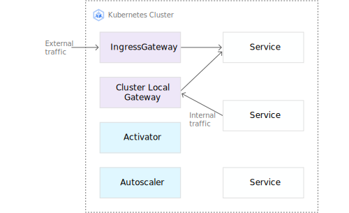
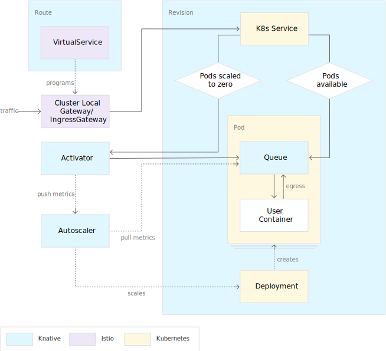
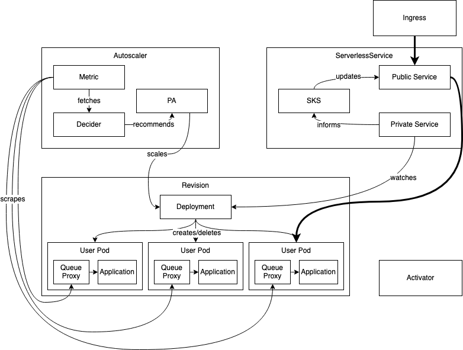
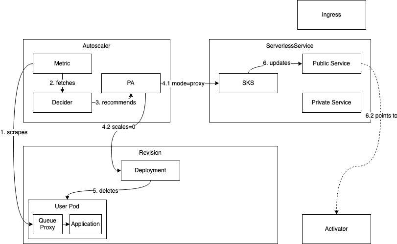
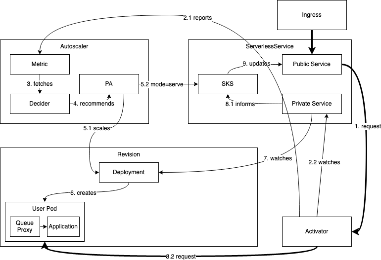

# 组件架构图



下图是上图的扩展，深入显示用户流量的请求路径，下文还对此进行了详细说明



流量路由借助了部分istio的功能，这里不想洗描述

### queue proxy

队列代理是一个sidecar容器，与每个用户容器中的用户容器一起部署。发送到应用程序实例的每个请求都首先通过队列代理，因此其名称为“代理”。

队列代理的主要目的是测量并限制用户应用程序的并发性。如果修订将并发限制定义为5，则队列代理可确保一次到达应用程序实例的请求不超过5个。如果发送给它的请求更多，它将在本地将它们排队，因此是其名称中的“队列”。队列代理还测量传入的请求负载，并在单独的端口上报告平均并发和每秒请求数。

### autoscale

Autoscaler是一个独立的Pod，包含三个主要组件：

1. **PodAutoscaler reconciler**：协调器
2. **Collector**：收集指标，通过采集queue-proxy指标
3. **Decider**：计算

PodAutoscaler协调程序可确保正确获取对PodAutoscalers的任何更改（请参阅API部分），并将其反映在Decider，Collector或两者中。

Collector负责从应用程序实例上的队列代理收集度量。为此，它会刮擦其内部指标端点并对其求和，以得到代表整个系统的指标。为了实现可伸缩性，仅会抓取所有应用程序实例的一个样本，并将接收到的指标外推到整个集群。

Decider获得所有可用指标，并决定应将应用程序部署扩展到多少个Pod。基本上，要做的事情就是`want = concurrencyInSystem/targetConcurrencyPerInstance`。

除此之外，它还会针对修订版的最大缩放比例和最小实例数和最大实例数设置值进行调整。它还计算当前部署中还剩下多少突发容量，从而确定是否可以从数据路径中删除Activator

### activator

Activator是全局共享的部署，具有很高的可伸缩性。其主要目的是缓冲请求并向autoscaler报告指标。

Activator主要涉及从零到零的规模扩展以及容量感知负载平衡。当修订版本缩放到零实例时，Activator将被放置到数据路径中，而不是修订版本的实例中。如果请求将达到此修订版，则Activator将缓冲这些请求，并使用指标戳autoscaler并保留请求，直到出现应用程序实例。在这种情况下，Activator会立即将其缓冲的请求转发到新实例，同时小心避免使应用程序的现有实例过载。Activator在这里有效地充当负载平衡器。当它们可用时，它将负载分配到所有Pod上，并且不会在并发设置方面使它们过载。在系统认为合适的情况下，将Activator放置在数据路径上或从数据路径上取下，以使其充当如上所述的负载平衡器。如果当前部署具有足够的空间以使其不太容易过载，则将Activator从数据路径中删除，以将网络开销降至最低。

与队列代理不同，激活器通过Websocket连接主动将指标发送到autoscaler，以最大程度地减小从零开始的延迟

# API

### ServerlessServices (SKS)

**API:** `serverlessservices.networking.internal.knative.dev`

`ServerlessServices` 是 `KPA` 产生的，一个 `KPA` 生成一个 `SKS`，`SKS` 是对 k8s service 之上的一个抽象，

主要是用来控制数据流是直接流向服务 `revision`（实例数不为零） 还是经过 `Activator`（实例数为 0）。

对于每个 `revision`，会对应生成两个 k8s service ，一个`public service`，一个 `private service`.

`private service` 是标准的 k8s service，通过 label selector 来筛选对应的 deploy 产生的 pod，即 svc 对应的 endpoints 由 k8s 自动管控。

`public service` 是不受 k8s 管控的，它没有 label selector，不会像 `private service` 一样 自动生成 endpoints。`public service` 对应的 endpoints由 Knative `SKS reconciler` 来控制。

```
SKS` 有两种模式：`proxy` 和 `serve
```

- `serve` 模式下 `public service` 后端 endpoints 跟 `private service`一样， 所有流量都会直接指向 `revision` 对应的 pod。
- `proxy` 模式下 `public service` 后端 endpoints 指向的是 系统中 `Activator` 对应的 pod，所有流量都会流经 `Activator`

# 数据流

### 稳定状态下的扩所容



1. 请求通过 `ingress` 路由到 `public service` ，此时 `public service` 对应的 endpoints 是 revision 对应的 pod

2. Autoscaler会定期通过 `queue-proxy` 获取 `revision` 活跃实例的指标，并不断调整 revision 实例。请求打到系统时， `Autoscaler` 会根据当前最新的请求指标确定扩缩容比例。

3. SKS模式是 `serve`, 它会监控 `private service` 的状态，保持 `public service` 的 endpoints 与 `private service` 一致


### 缩容到0



**缩容到零过程的工作流程如下：**


1. `AutoScaler` 通过 `queue-proxy` 获取 `revision` 实例的请求指标
2. 一旦系统中某个 `revision` 不再接收到请求（此时 `Activator` 和 `queue-proxy` 收到的请求数都为 0）
3. `AutoScaler` 会通过 `Decider` 确定出当前所需的实例数为 0，通过 `PodAutoscaler` 修改 revision 对应 Deployment 的 实例数
4. 在系统删掉 `revision` 最后一个 Pod 之前，会先将 `Activator` 加到 数据流路径中（请求先到 `Activator`）。`Autoscaler` 触发 `SKS` 变为 `proxy` 模式，此时 `SKS` 的 `public service` 后端的 endpoints 变为 `Activator` 的 IP，所有的流量都直接导到 `Activator`
5. 此时，如果在冷却窗口时间内依然没有流量进来，那么最后一个 Pod 才会真正缩容到零

### 冷启动



1. 当 `revision` 缩容到零之后，此时如果有请求进来，则系统需要扩容。因为 `SKS` 在 `proxy` 模式，流量会直接请求到 `Activator` 。`Activator` 会统计请求量并将 指标主动上报到 `Autoscaler`， 同时 `Activator` 会缓存请求，并 watch `SKS` 的 `private service`， 直到 `private service` 对应的 endpoints 产生。

2. `Autoscaler` 收到 `Activator` 发送的指标后，会立即启动扩容的逻辑。这个过程的得出的结论是至少一个 Pod 要被创造出来，`AutoScaler` 会修改 `revision` 对应 `Deployment` 的副本数为为 N（N>0）,`AutoScaler` 同时会将 `SKS` 的状态置为 `serve` 模式，流量会直接到导到 `revision` 对应的 pod 上。

3. `Activator` 最终会监测到 `private service` 对应的 endpoints 的产生，并对 endpoints 进行健康检查。健康检查通过后，`Activator` 会将之前缓存的请求转发到健康的实例上

# 网关接入

