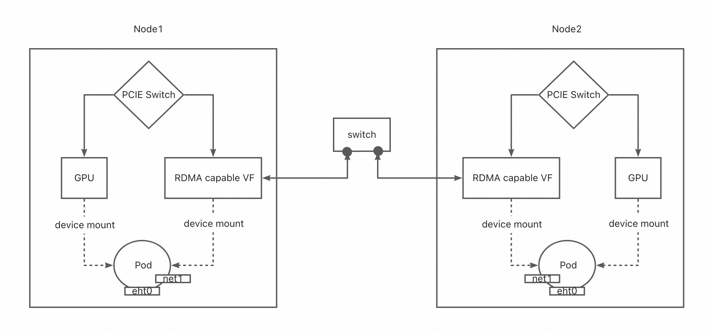

# GPU && RDMA联合调度

拓扑调度策略
samePCIE -> sameNuma -> sameNode

## multus-CNI

挂载多网卡，rdma作为第二张网卡挂载到pod中

## SR-IOV
网卡虚拟机制，具备隔离功能，生成对应的pf/vf

## 通信协议
NCCL：一般是GPU时用的通信协议
MPI：一般是CPU时用的通信协议


# 使用
```
apiVersion: v1
kind: Pod
metadata:
  name: pod-vf01
  namespace: kubeflow
  annotations:
    # this NAD is already written previously
    k8s.v1.cni.cncf.io/networks: sriov-attach-k8s-node1-ens11f0np0-kubeflow-conf
    scheduling.koordinator.sh/device-joint-allocate: |-
      {
        "deviceTypes": ["gpu","rdma"]
      }
    scheduling.koordinator.sh/device-allocate-hint: |-
      {
       "rdma": {
         "vfSelector": {} //apply VF
       }
      }
  labels:
    selector-type: pod
spec:
  nodeSelector:
    koo: node1     //Directional scheduling to 1 node
  schedulerName: koord-scheduler //Uses the koordlet scheduling plug-in
  containers:
  - name: container-vf
    image: nvcr.io/nvidia/pytorch:24.04-py3
    securityContext:
      capabilities:
        add: [ "IPC_LOCK" ]
    imagePullPolicy: IfNotPresent
    command: [ "/bin/bash", "-c", "--" ]
    args: [ "while true; do sleep 300000; done;" ]
    volumeMounts:
    - mountPath: /dev/shm
      name: shm
    resources:
      requests:
        koordinator.sh/gpu: 100//apply a GPU
        koordinator.sh/rdma: 100//apply a VF
      limits:
        koordinator.sh/gpu: 100
        koordinator.sh/rdma: 100
  volumes:
  - name: shm
    emptyDir:
      medium: Memory
      sizeLimit: "10Gi"
```

