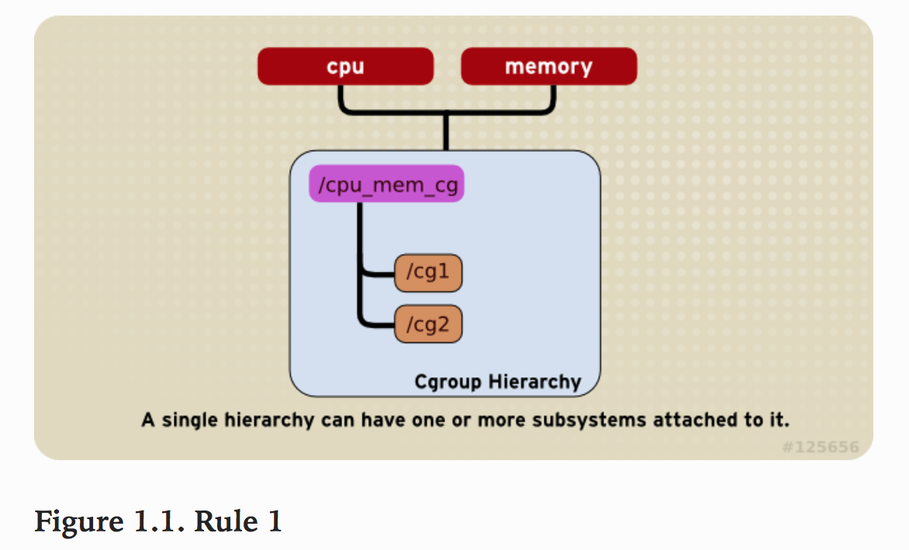
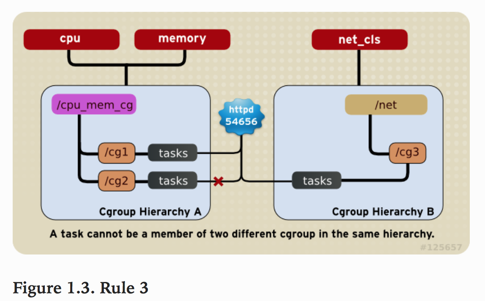
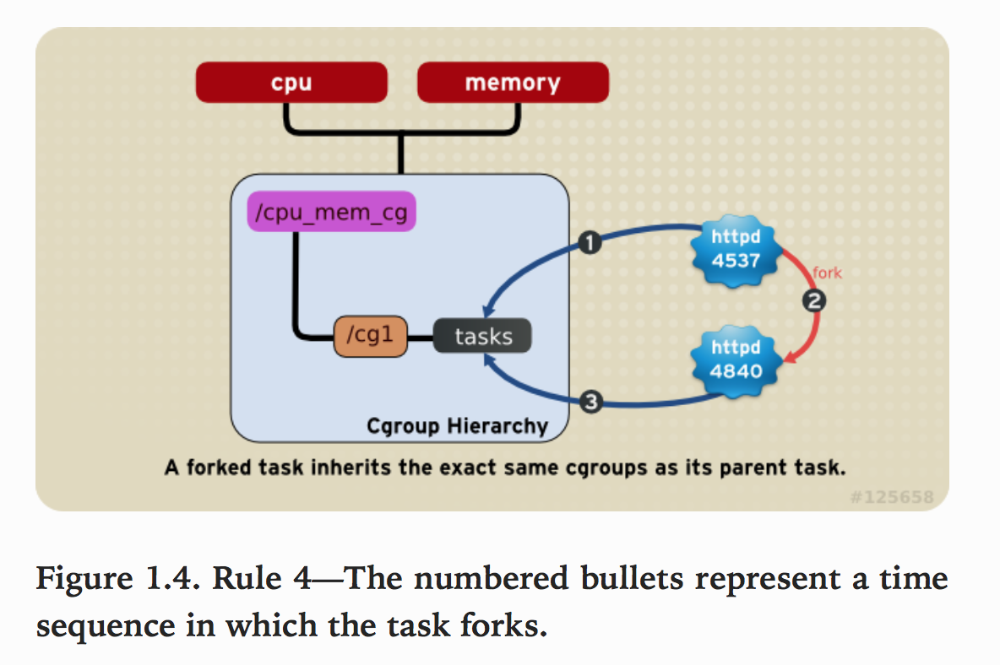
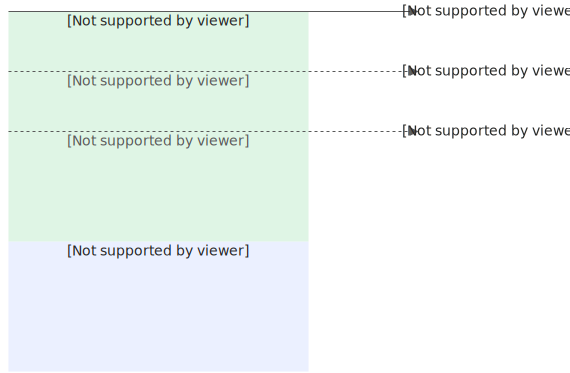
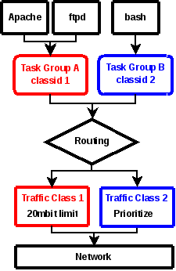
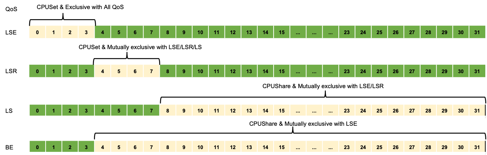

# Cgroup
Cgroups 是 control groups 的缩写，是Linux内核提供的一种可以限制，记录，隔离进程组(process groups)所使用物理资源的机制。最初有google工程师提出，后来被整合进Linux的内核。因此，Cgroups为容器实现虚拟化提供了基本保证，是构建Docker,LXC等一系列虚拟化管理工具的基石。

## 作用

- 资源限制(Resource limiting): Cgroups可以对进程组使用的资源总额进行限制。如对特定的进程进行内存使用上限限制，当超出上限时，会触发OOM。
- 优先级分配(Prioritization):通过分配的CPU时间片数量及硬盘IO带宽大小，实际上就相当于控制了进程运行的优先级。
- 资源统计（Accounting）: Cgroups可以统计系统的资源使用量，如CPU使用时长、内存用量等等，这个功能非常适用于计费。
- 进程控制（Control）：Cgroups可以对进程组执行挂起、恢复等操作。

## 组成

Cgroups主要由task,cgroup,subsystem及hierarchy构成。下面分别介绍下各自的概念。

- task: 在Cgroups中，task就是系统的一个进程。
- cgroup: Cgroups中的资源控制都以cgroup为单位实现的。cgroup表示按照某种资源控制标准划分而成的任务组，包含一个或多个子系统。一个任务可以加入某个cgroup，也可以从某个cgroup迁移到另外一个cgroup。
- subsystem: Cgroups中的subsystem就是一个资源调度控制器（Resource Controller）。比如CPU子系统可以控制CPU时间分配，内存子系统可以限制cgroup内存使用量。
- hierarchy: hierarchy由一系列cgroup以一个树状结构排列而成，每个hierarchy通过绑定对应的subsystem进行资源调度。hierarchy中的cgroup节点可以包含零或多个子节点，子节点继承父节点的属性。整个系统可以有多个hierarchy。

## 关系以及约束

Subsystems, Hierarchies,Control Group和Tasks之间有许多的规则

### 规则1

- 同一个hierarchy能够附加一个或多个subsystem。

如下图将cpu和memory等subsystems(或者任意多个subsystems)附加到同一个hierarchy。



### 规则2

- 一个subsystem只能附加到一个hierarchy上。

如下图`cpu` subsystem已经附加到了`hierarchy A`,并且`memory` subsystem已经附加到了`hierarchy B`。因此`cpu` subsystem不能在附加到`hierarchy B`

### 规则3

系统每次新建一个hierarchy时，该系统上的所有task默认构成了这个新建的hierarchy的初始化cgroup，这个cgroup也称为root cgroup。对于你创建的每个hierarchy，task只能存在于其中一个cgroup中，即一个task不能存在于同一个hierarchy的不同cgroup中，但是一个task可以存在在不同hierarchy中的多个cgroup中。如果操作时把一个task添加到同一个hierarchy中的另一个cgroup中，则会从第一个cgroup中移除

如下图,`cpu`和`memory` subsystem被附加到`cpu_mem_cg`的hierarchy。而`net_cls` subsystem被附加到`net_cls` hierarchy。并且httpd进程被同时加到了`cpu_mem_cg` hierarchy的`cg1` cgroup中和`net` hierarchy的`cg3` cgroup中。并通过两个hierarchy的subsystem分别对httpd进程进行cpu,memory及网络带宽的限制。



### 规则4

系统中的任何一个task(Linux中的进程)fork自己创建一个子task(子进程)时，子task会自动的继承父task cgroup的关系，在同一个cgroup中，但是子task可以根据需要移到其它不同的cgroup中。父子task之间是相互独立不依赖的。

如下图,httpd进程在`cpu_and_mem` hierarchy的`/cg1` cgroup中并把PID 4537写到该cgroup的tasks中。之后httpd(PID=4537)进程fork一个子进程httpd(PID=4840)与其父进程在同一个hierarchy的统一个cgroup中，但是由于父task和子task之间的关系独立不依赖的，所以子task可以移到其它的cgroup中。



## 子系统

子系统主要是针对cgroup能够限制资源的介绍

- blkio: `blkio` 子系统控制并监控`cgroup`中的task对块设备的I/O的访问。如:限制访问及带宽等。
- cpu: 主要限制进程的cpu使用率。
- cpuacct: 可以统计cgroup中进程的cpu使用报告。
- cpuset: 可以为cgroup中的进程分配独立的cpu和内存节点。
- memory: 自动生成cgroup中task使用的内存资源报告，并对该cgroup的task进行内存使用限制。
- devices: 可以控制进程能否访问某些设备。
- net_cls: 使用等级标识符(clssid)标记网络数据包，可允许Linux流量控制程序(tc)识别从具体cgroup中生成的数据包。
- freezer: 可以挂起挂起或回复cgroup中的进程。
- ns: 可以使不同cgroup中的进程使用不同的namespace。

### CPU

| cpu.cfs_period_us | 执行检测的周期，默认是100ms                                  |
| ----------------  | ----------------------------------------------------------- |
| cpu.cfs_quota_us  | 在一个检测周期内，容器能使用cpu的最大时间，该值就是硬限，默认是-1，即不设置硬限 |
| cpu.shares        | 顾名思义，shares=分享。它的工作原理非常类似于进程的nice值。shares就代表软限。 |
| cpu.state         | 容器的状态：一共运行了多少个周期；一共被throttle了多少次；一共被throttle了多少时间 |
| cpu.rt_period_us  | 执行检测的周期，默认是1s                                     |
| cpu.rt_runtime_us | 在一个检测周期内，能使用的cpu最大时间，只作用于rt任务        |

基于cpu完全公平调度（cfs），常用的为cpu.cfs_period_us、cpu.cfs_quota_us、cpu.shares

### CPUACCT

| cpuacct.usage_all    | 系统运行到现在，当前 cgroup 下的进程在每个核心下，用户态和内核态，分别使用的 cpu 时间，单位为纳秒 |
| -------------------- | ------------------------------------------------------------ |
| cpuacct.usage        | 系统运行到现在，当前 cgroup 下的进程所使用的 cpu 时间，单位为纳秒 |
| cpuacct.usage_percpu | 系统运行到现在，当前 cgroup 下的进程在每个核心下，分别使用的 cpu 时间，单位为纳秒 |

### CPUSET

| cpuset.cpus | 当前 cgroup 下的进程可以使用的 cpu 核心的范围，例如 `0-5` |
| ----------- | --------------------------------------------------------- |

### Memory

```
root@DESKTOP-9K4GB6E:/sys/fs/cgroup/memory# cd /sys/fs/cgroup/memory
root@DESKTOP-9K4GB6E:/sys/fs/cgroup/memory# mkdir test
root@DESKTOP-9K4GB6E:/sys/fs/cgroup/memory# ls test/
cgroup.clone_children           memory.kmem.tcp.max_usage_in_bytes  memory.oom_control
cgroup.event_control            memory.kmem.tcp.usage_in_bytes      memory.pressure_level
cgroup.procs                    memory.kmem.usage_in_bytes          memory.soft_limit_in_bytes
memory.failcnt                  memory.limit_in_bytes               memory.stat
memory.force_empty              memory.max_usage_in_bytes           memory.swappiness
memory.kmem.failcnt             memory.memsw.failcnt                memory.usage_in_bytes
memory.kmem.limit_in_bytes      memory.memsw.limit_in_bytes         memory.use_hierarchy
memory.kmem.max_usage_in_bytes  memory.memsw.max_usage_in_bytes     notify_on_release
memory.kmem.tcp.failcnt         memory.memsw.usage_in_bytes         tasks
memory.kmem.tcp.limit_in_bytes  memory.move_charge_at_immigrate
```

| cgroup.event_control            | 用于eventfd的接口                                            |
| ------------------------------- | ------------------------------------------------------------ |
| memory.usage_in_bytes           | 显示当前已用的内存                                           |
| memory.limit_in_bytes           | 设置/显示当前限制的内存额度                                  |
| memory.failcnt                  | 显示内存使用量达到限制值的次数                               |
| memory.max_usage_in_bytes       | 显示内存使用量达到限制值的次数                               |
| memory.soft_limit_in_bytes      | 设置/显示当前限制的内存软额度                                |
| memory.stat                     | 显示当前cgroup的内存使用情况                                 |
| memory.use_hierarchy            | 设置/显示是否将子cgroup的内存使用情况统计到当前cgroup里面    |
| memory.force_empty              | 触发系统立即尽可能的回收当前cgroup中可以回收的内存           |
| memory.pressure_level           | 设置内存压力的通知事件，配合cgroup.event_control一起使用     |
| memory.swappiness               | 设置和显示当前的swappiness                                   |
| memory.move_charge_at_immigrate | 设置当进程移动到其他cgroup中时，它所占用的内存是否也随着移动过去 |
| memory.oom_control              | 设置/显示oom controls相关的配置                              |
| memory.numa_stat                | 显示numa相关的内存                                           |

# QOS

## CPU

为LS、BE类型的Pod配置对应的CPU [Group Identity](https://help.aliyun.com/zh/alinux/user-guide/group-identity-feature#task-2129392)的优先级。Group Identity可以为每一个CPU cgroup设置身份标识，系统内核在调度包含具有身份标识的任务时，会根据不同的优先级做相应处理。

### Group Identity

Alibaba Cloud Linux 2（内核版本`4.19.91-24.al7`开始）和Alibaba Cloud Linux 3（内核版本`5.10.46-7.al8` 开始）支持Group Identity功能 ，您可以通过该功能为每一个CPU cgroup设置不同的身份标识，以区分不同CPU cgroup中进程任务的优先级。

为CPU cgroup新增了配置调度优先级的接口，且不同优先级的任务具有以下特点。

## Memory

在Kubernetes集群，为了确保工作负载Pod能够高效、安全地运行，Kubernetes在资源使用层面引入了资源请求Request和资源限制Limit模型，容器内存情况如下图所示。

- 内存Request（requests.memory）：作用于调度阶段，以确保为Pod找到一个具有足够资源的合适节点。
- 内存Limit（requests.memory）：在单个节点层面进行约束，限制Pod内存使用总量，对应cgroup文件参数memory.limit_in_bytes，表示内存使用上限。



容器的内存QoS支持多个cgroup参数配置。

- memory.limit_in_bytes：内存使用上限。
- memory.high：内存限流阈值，内核会尽量回收内存，避免内存超过该值。
- memory.wmark_high：内存后台异步回收阈值（`wmarkRatio`），异步回收当前可以回收的内存，以确保当前内存使用量处于安全水位。
- memory.min：内存使用锁定阈值，可配置绝对锁定阈值（`minLimitPercent`）和相对锁定阈值（`lowLimitPercent`）。

需要说明的是Kubernetes在社区1.22版本中提供的容器内存QoS（[Memory QoS](https://kubernetes.io/docs/concepts/workloads/pods/pod-qos/#memory-qos-with-cgroup-v2)）特性，仅支持cgroup v2接口，需要在kubelet上手动配置开启，ack-koordinator组件结合不同Alibaba Cloud Linux内核版本提供了容器内存QoS保障的能力，支持依据Pod参数自动配置内存子系统（Memcg），为容器开启[Memcg QoS](https://help.aliyun.com/zh/alinux/user-guide/memcg-qos-function-ensures-system-stability-and-response-speed?spm=a2c4g.11186623.0.0.5d9134f02y4VJ5#concept-2482889)、[Memcg后台异步回收](https://help.aliyun.com/zh/alinux/user-guide/memcg-backend-asynchronous-reclaim#task-2487938)、[Memcg全局最低水位线分级](https://help.aliyun.com/zh/alinux/user-guide/memcg-global-minimum-watermark-rating#task-2492619)等能力

## network
目前看有两种类型的网络带宽限制
### cgroup

使用cgroup控制网络资源的基本思想是将cgroup与已经存在的能提供分类和调度网络数据包功能的网络数据包分类器和调度框架连接起来。

为了达到这一的目的，创建了一种新的cgroup子系统net_cls,该子系统可以让cgroup可以分辨数据包流量是从哪个cgroup中流出的。这是通过给cgroup分配一个classid实现的，classid可以被数据包分类器cls_cgroup使用，从而将数据包过滤到classid匹配的流量类型中，如下图1.所示


为了尽可能保持架构的简单和非侵入性，当数据包在网络栈中传递的时候，没有将classid存储在数据包中。数据包分类器使用数据包的进程上下文信息（process context information）来查找classid。这样做的缺点是：这种方法是适合在进程上下文中离开网络栈的数据包，例如，这种方法不适合内核生成的数据包（ACKs，ICMP replies等等）或者不适合于数据包在经过数据包分类器之前就进行了排队和重调度的数据包。

流量分类(traffic class)可以以树的形式来组织，也可以包含任何数量的队列规则(qdisc)来实现优先级、带宽限制或公平队列。流量分类必须分配到网络接口(network interface)，因此，如果一个cgroup发送数据到多个网络接口，就需要为每一个网络接口维护一个流量类型

### 网络插件
另外一种思路时基于网络插件实现网络带宽限制，例如koordinator使用terway网络插件进行带宽限制
目前看网络插件都是基于ebpf这些内核模块做流量带宽限制


# CPU Burst
动态调整cfs_quota

# Suppress
## CPU Suppress

根据压制策略动态调整cfs_quota或者cpuset

# Evict
## CPU Evict
基于CPU饱和度的驱逐策略

## Memory Evict
基于内存用量的驱逐策略

# 干扰检测
若您使用CPI Collector，请确保您的机器支持获取Cycles、Instructions这两个Kernel PMU（Performance Monitoring Unit）事件
```
$ perf list
List of pre-defined events (to be used in -e):

  branch-instructions OR branches                    [Hardware event]
  branch-misses                                      [Hardware event]
  bus-cycles                                         [Hardware event]
  ...

  cpu-cycles OR cpu/cpu-cycles/                      [Kernel PMU event]
  ...
  instructions OR cpu/instructions/                  [Kernel PMU event]
```


# LLC&MBA

基于内核RDT技术实现

## RDT

RDT技术全称 Resource Director Technology，RDT技术提供了LLC（Last Level Cache）以及MB（Memory Bandwidth）内存带宽的分配和监控能力。

RDT的主要功能有以下几个：

1. CAT（Cache Allocation Technology）：分配和隔离LLC资源
2. CMT（Cache Monitor Technology）：监控LLC的使用情况
3. MBA（Memory Bandwidth Allocation）：[内存带宽](https://zhida.zhihu.com/search?content_id=231916783&content_type=Article&match_order=2&q=内存带宽&zhida_source=entity)分配和隔离
4. MBM（Memory Bandwidth Monitor）：内存带宽监控
5. CDP（Code & Data Prioritization）：细化的Code-Cache和Data-Cache的分配

在混合部署场景下，[cgroup](https://zhida.zhihu.com/search?content_id=231916783&content_type=Article&match_order=1&q=cgroup&zhida_source=entity)提供了粗粒度的CPU、内存、IO等资源的隔离和分配，但是从软件层面无法对LLC和内存带宽等共享资源进行隔离，离线业务可以通过争抢LLC和内存带宽来干扰在线业务。RDT从硬件层面提供了细粒度的LLC资源的分配和监控能力，在混部场景运用广泛


# NUMA
## Node
表示一个CPU分组，可以有多个CPU组成，每个Node都有自己的本地资源，包括内存、IO等。
每个Node之间通过互联模块（QPI）进行通信，因此每个Node除了可以访问自己的本地内存之外，还可以访问远端内存，只不过性能会差一些

## Socket
Socket是物理上的概念，表示一颗物理CPU的分装，是主板上的CPU插槽
Node是逻辑上的概念，一个Numa Node可以有一个或者多个Socket

## Core
Core 就是 Socket 里独立的一组程序执行单元，称之为物理核

## Thread
有了物理核，自然就有逻辑核，Thread 就是逻辑核。更专业的说法应该称之为超线程

所以，几个概念从大到小依次排序是：
Node > Socket > Core -> Processor


# 调度
## kubelet CPU manager
### 应用等级
Quaranteed：request == limit
Burstable: request != limit
BestEffort: 无request和limit
### 资源管理
Node Capacity：Node的硬件资源总量
kube-reserved：给k8s系统进程预留的资源(包括kubelet、container runtime、node problem detector等，但不会给以pod形式起的k8s系统进程预留资源)
system-reserved：给linux系统守护进程预留的资源
### CPU管理
CPU资源池（capcity）：all-（--kube-reserved 或 --system-reserved）
绑核策略
cpu-manager-policy：none
不绑核，共享CPU资源池
cpu-manager-policy：static
可绑核，使用CPU资源池或者--reserved-cpus指定，会优先使用--reserved-cpus指定的列表

## koordinator CPU manager
针对混部场景下，需要对延迟敏感工作负载的Qos进行微调，以满足混部性能的要求，增强kubelet CPU编排功能

### 资源池
CPU Shared Pool:Burstable以及LSE\LSR类型使用之外的资源池
statically exclusive CPUs：Quarantee并且资源为整数类型以及LSE/LSR使用的一组独占CPU
BE Shared Pool:BestEffort以及BE应用的Pod可以运行的CPU池

### CPU管理策略
对于BestEffort和BE应用
- 优先使用kubelet预留的资源
- koordlet 可以使用节点中的所有 CPU，但不包括由具有整数 CPU 的 K8s Guaranteed 和 Koordinator LSE Pod 分配的 CPU
对于Burstable和LS应用
- 当 koordlet 启动时，计算 CPU Shared Pool 并将共享池应用到节点中的所有 Burstable 和 LS Pod，即更新它们的 cpu cgroups, 设置 cpuset。在创建或销毁 LSE/LSR Pod 时执行相同的逻辑
- koordlet 会忽略 kubelet 预留的 CPU，将其替换为 Koordinator 定义的 CPU Shared Pool
对于Guaranteed
- 如果 Pod 的 annotations 中有 koord-scheduler 更新的 scheduling.koordinator.sh/resource-status，在 Sandbox/Container 创建阶段，则会替换 kubelet CRI 请求中的 CPUSet。
- kubelet 有时会调用 CRI 中定义的 Update 方法来更新容器 cgroup 以设置新的 CPU，因此 koordlet 和 koord-runtime-proxy 需要 Hook 该方法
自动调整CPU Shared Pool大小
- koordlet 会根据 Pod 创建/销毁等变化自动调整 CPU Shared Pool 的大小。如果 CPU Shared Pool 发生变化，koordlet 应该更新所有使用共享池的 LS/K8s Burstable Pod 的 cgroups
- 如果 Pod 的 annotationsscheduling.koordinator.sh/resource-status 中指定了对应的 CPU Shared Pool，koordlet 在配置 cgroup 时只需要绑定对应共享池的 CPU 即可

### CPU编排原则
1. LSE/LSR Pod 的 Request 和 Limit 必须相等，CPU 值必须是 1000 的整数倍。
2. LSE Pod 分配的 CPU 是完全独占的，不得共享。如果节点是超线程架构，只保证逻辑核心维度是隔离的，但是可以
过 CPUBindPolicyFullPCPUs 策略获得更好的隔离。
3. LSR Pod 分配的 CPU 只能与 BE Pod 共享。
4. LS Pod 绑定了与 LSE/LSR Pod 独占之外的共享 CPU 池。
5. BE Pod 绑定使用节点中除 LSE Pod 独占之外的所有 CPU 。
6. 如果 kubelet 的 CPU 管理器策略为 static 策略，则已经运行的 K8s Guaranteed Pods 等价于 Koordinator LSR。
7. 如果 kubelet 的 CPU 管理器策略为 none 策略，则已经运行的 K8s Guaranteed Pods 等价于 Koordinator LS。
8. 新创建但未指定 Koordinator QoS 的 K8s Guaranteed Pod 等价于 Koordinator LS。

### CPU调度编排
CPUBindPolicy定义了CPU绑定策略。
Default:不执行任何绑定策略
FullPCPUS：一种binpack策略，用于分配完成的物理内核，可以有效避免扰邻问题
SpreadByPCPUs：一种打散策略，如果启用了超线程，使用该策略时，调度器将在物理内核之间均匀的分配逻辑CPU。
ConstrainedBurst（没有特别理解）：主要帮助 K8s Burstable/Koordinator LS Pod 获得更好性能的特殊策略。使用该策略时，koord-scheduler 会根据 Pod 限制过滤掉具有合适 CPU 共享池的 NUMA 节点的节点

CPUExclusivePolicy定了CPU独占策略，可以帮助解决扰邻问题
CPUExclusivePolicyDefault：不执行任何策略
CPUExclusivePolicyPCPULevel： 在分配逻辑CPU时，尽量避免已经被同一个独占策略申请的物理核。是对CPUBindPolicySpreadByPCPUs策略的补充。
CPUExclusivePolicyNUMANodeLevel：在分配逻辑 CPU 时，尽量避免 NUMA 节点已经被相同的独占策略申请。如果没有满足策略的 NUMA 节点，则降级为CPUExclusivePolicyPCPULevel策略

### Numa调度编排

#### Numa分配策略
标签 node.koordinator.sh/numa-allocate-strategy 表示在调度时如何选择满意的 NUMA 节点。下面是具体的值定义：

MostAllocated 表示从可用资源最少的 NUMA 节点分配。
LeastAllocated 表示从可用资源最多的 NUMA 节点分配。
DistributeEvenly 表示在 NUMA 节点上平均分配 CPU。

#### NUMA 拓扑对齐策略
标签 node.koordinator.sh/numa-topology-alignment-policy 表示如何根据 NUMA 拓扑对齐资源分配。策略语义遵循 K8s 社区。相当于 NodeResourceTopology 中的 TopologyPolicies 字段，拓扑策略 SingleNUMANodePodLevel 和 SingleNUMANodeContainerLevel 映射到 SingleNUMANode 策略。

None 是默认策略，不执行任何拓扑对齐。
BestEffort 表示优先选择拓扑对齐的 NUMA Node，如果没有，则继续为 Pods 分配资源。
Restricted 表示每个 Pod 在 NUMA 节点上请求的资源是拓扑对齐的，如果不是，koord-scheduler 会在调度时跳过该节点。
SingleNUMANode 表示一个 Pod 请求的所有资源都必须在同一个 NUMA 节点上，如果不是，koord-scheduler 调度时会跳过该节点。
如果节点的 Label 中没有 node.koordinator.sh/numa-topology-alignment-policy，并且 NodeResourceTopology中的TopologyPolicies=None，则按照 koord-scheduler 配置的策略执行。

如果同时定义了 Node 中的 node.koordinator.sh/numa-topology-alignment-policy 和 NodeResourceTopology 中的 TopologyPolicies=None，则首先使用 node.koordinator.sh/numa-topology-alignment-policy


