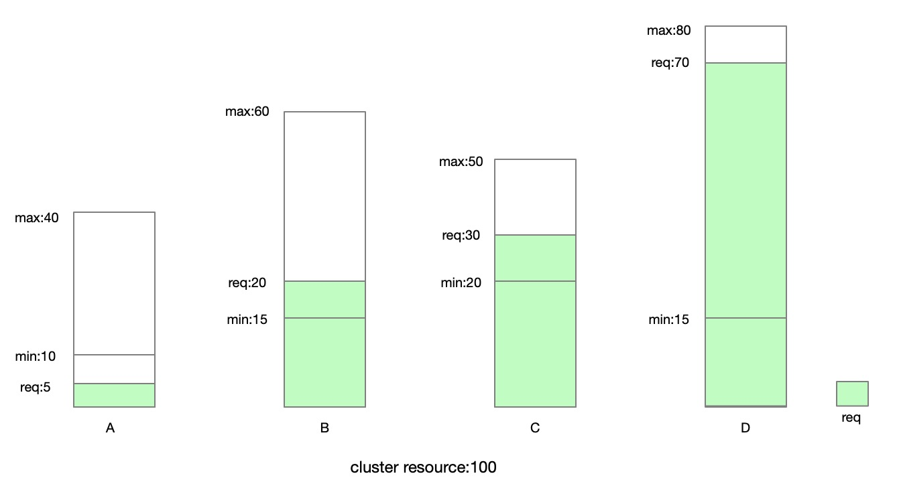
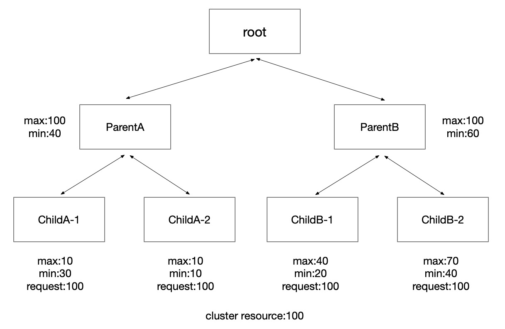

# 租户
## 租户模型
min：最少能够使用，能够保证的
max：最大能够使用，会涉及到超卖
runtime：当前能够使用到的配额
request：当前已经使用分配的

## 超卖模式

超卖计算模式
```
remain = total - sum(request)
if request > runtime {
    runtime += remain*max/sum(max)
    if runtime > requets {
        runtime = request
        remain = remain + runtime - request
    }
}
```

# 多租户
## 树状结构

## 规则
1. 所有子节点的min相加不超过父min
2. 父节点的max可以小于子节点的max
3. 任务只能运行在最底层节点
## 计算配额
计算所有节点的request从下到上（子节点min之和、max之和的最小值）
计算所有节点的runtime从上倒下，按照从上到下的顺序计算
借用配额时只能借用同一父节点下的相邻租户的配额
## 抢占驱逐
当需要拿回当前自身租户借出的配额时，系统会有定时计算超过使用自身runtime，当used超过runtime时，会回收超过配额的pod，如果pod被申请不可回收驱逐，则会保证使用资源部超过min，也就是不超卖

# 运行时
## 配额计算
- 监听配额组和pod的创建事件来计算每个租户节点可使用的配额（runtime），有个问题是一定会在pod调度之前计算完成吗（to be confirmed）
- 定时计算每个配额的request、runtime等信息
- 监控每个配额的使用量是否超过used
## 配额回收

## 集群资源变化
集群资源变化时，需要缩减部分租户的配额

# scheduler
## prefilter
计算request>runtime，调度失败

## postfilter
当资源超卖，调度失败，当需要回收资源时，修改了selectVictimsOnNode，选取驱逐同租户内优先级低


