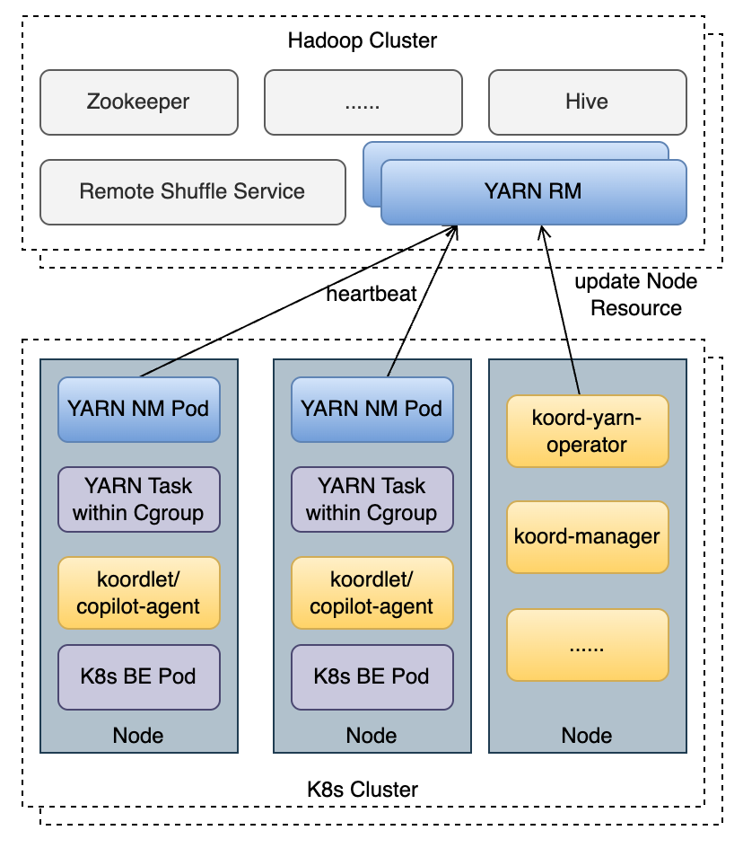
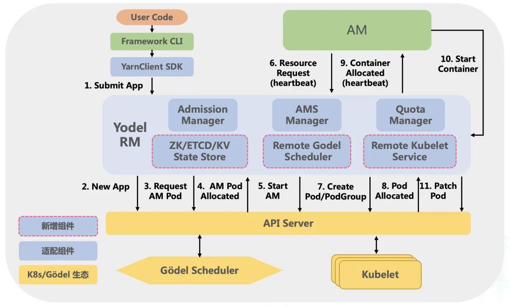
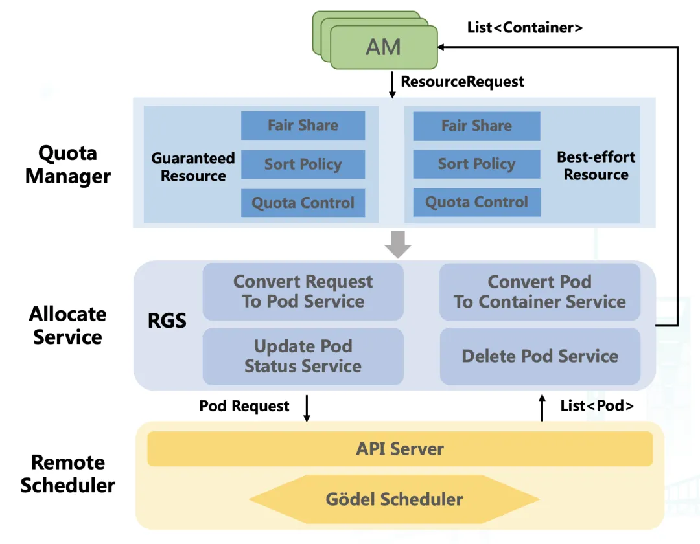
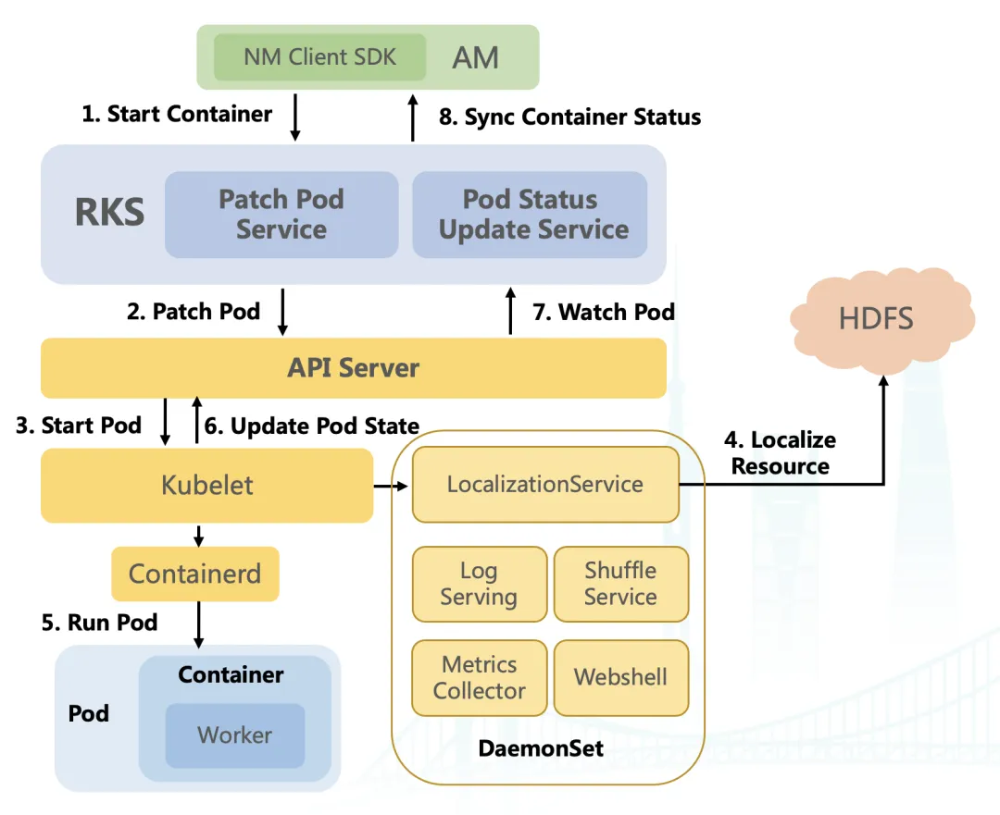

针对当前混部场景下，探索yarn在k8s中的运行方式。
# yarn

1. client向RM提交应用程序，其中包括启动该应用的ApplicationMaster的必须信息，例如ApplicationMaster程序、启动ApplicationMaster的命令、用户程序等。
2. ResourceManager启动一个container用于运行ApplicationMaster。
3. 启动中的ApplicationMaster向ResourceManager注册自己，启动成功后与RM保持心跳。
4. ApplicationMaster向ResourceManager发送请求，申请相应数目的container。
5. ResourceManager返回ApplicationMaster的申请的containers信息。申请成功的container，由ApplicationMaster进行初始化。container的启动信息初始化后，AM与对应的NodeManager通信，要求NM启动container。AM与NM保持心跳，从而对NM上运行的任务进行监控和管理。
6. container运行期间，ApplicationMaster对container进行监控。container通过RPC协议向对应的AM汇报自己的进度和状态等信息。
7. 应用运行期间，client直接与AM通信获取应用的状态、进度更新等信息。
8. 应用运行结束后，ApplicationMaster向ResourceManager注销自己，并允许属于它的container被收回。

# yarn on k8s

yarn on k8s为koordinator推荐的一种k8s实现方式，特点是对原生yarn无侵入，采用双调度器模式，设计原则如下：

- 离线作业的提交入口依然为YARN保持不变。
- 基于Hadoop YARN开源版本，原则上不对YARN做侵入式改造。
- Koordinator提供的混部资源，既可被K8s Pod使用，也可被YARN task使用，不同类型的离线应用可在同一节点内共存。
- 单机QoS策略由Koordlet统一管理，并兼容YARN Task的运行时

## 调度
yarn on k8s采用双调度器模式，k8s想yarn同步可用的batch资源，yarn会将使用分配的资源同步给k8s，k8s更新到节点的可用batch资源，具体过程如下：

1.koord-manager计算原始Batch总量`origin_batch_total`，并将其记录在K8s的node annotation中

2.koord-yarn-operator从YARN RM收集YARN节点已经分配的资源量`yarn_requested`，并将其记录在K8s的node annotation中

3.在koord-manager更新K8s的Batch资源总量时，排除YARN已经分配的资源量：`k8s_batch_total = origin_batch_total – yarn_requested`

4.yarn-operator向YARN RM更新资源时，排除K8s已经分配的资源量：`yarn_batch_total = origin_batch_total – k8s_batch_requested`

## 节点运行时管理

NM已DaemonSet形式部署，YARN与NM的资源管理相互独立，按照自身开销申请Batch混部资源

为了能够通过cgroup管理YARN任务的资源使用，koordinator要求YARN NM开启[LinuxContainerExecutor](https://apache.github.io/hadoop/hadoop-yarn/hadoop-yarn-site/NodeManagerCgroups.html) 模式，为了和其他K8s Pod一样，统一在besteffort分组下管理

## 单机Qos策略适配

需要在koordlet内部增加一个sidecar，用于采集task任务的信息，针对一些Qos操作，例如驱逐操作，也需要适配。

# 统一调度

出自字节方案，将yarn融入到k8s调度之中

相比之前的架构多了三个组件，也只说明了调度相关的功能，没有说明如何保障单机侧的Qos

### RGS（Remote Godel Scheduler）

用于运行任务container与pod之间的转换

主要包括四个子服务，Convert Reqeust To Pod Service 负责将任务的资源请求转化为 Pod 对象并写入 API Server；Convert Pod To Container Service 负责将已经调度的 Pod 转化为 Container 并返回给 AM；Update Pod Status Service 负责及时更新 Pod 状态并持久化至 API Server ；Delete Pod Service 负责在容器或任务结束时，及时删除 API Server 中的相关对象

### RKS

用于启动运行task任务

接下来介绍 RKS 服务**。**RKS 部署在 Yodel RM 内部，实现了 YARN NM 的所有接口，把 NM 的 Container 管理能力平滑下沉到 Kubelet**。**它主要由两部分组成：

- Patch Pod Service：主要负责收到 AM 拉起请求后，将容器启动所需的信息丰富到 Pod 对象中，这些信息包括：容器的 ENV 、 HDFS 自研列表、启动命令等；
- Pod Status Update Service：该服务会及时从 API Server  Watch Pod 的最新状态，并将状态返回给对应 AM。

此外，为了补齐 NM 上的运行体验，底层以 daemonset 方式部署了一些其他服务。这些 daemonset 补齐了 NM 的能力，使得离线作业只需要升级 hadoop 依赖，不用做太多改动，就能让容器运行在 Kubelet 上。这些服务包括：

- LocalizationService：用于下载 Pod 所需的 HDFS 资源；

- Log Serving：用于方便用户查看 Pod 日志；

- Shuffle Service：主要有 Spark Shuffle Service 及 MR Shuffle Service，这些 Shuffle Service 是从 NM 的进程解耦出来的，单独部署用于提供计算框架的 Shuffle 服务；

- Metrics Collector：用于收集离线 Pod 运行时的各维度监控信息；

- Webshell：方便用户通过 Web 端进入到容器的 Shell，方便排查问题。

此种方案对yarn有很多改造，包括YARN以及NM，需要对yarn和k8s有较深的理解，并且改造成本也较大，应该只有头部互联网大厂才有能力实施这样的方案。
