# 混部方案
针对当前业务，确定具体接入方案

# 应用等级划分
LSE：支付级别（重宝A类）
LSR：一般重要应用（B类）
LS：电商新消费类（C类）
BE：离线业务

# Qos
```
apiVersion: v1
kind: ConfigMap
metadata:
  name: slo-controller-config
  namespace: koordinator-system
data:
  # colocation-config is the configuration for colocation.
  # Related features: Dynamic resource over-commitment, Load-aware scheduling, Load-aware descheduling.
  # - enable: whether to enable the colocation. If false, the reclaimed resources of the node allocatable (e.g. `kubernetes.io/batch-cpu`) will be removed.
  # - metricAggregateDurationSeconds: the aggregated duration of node metrics reporting.
  # - metricReportIntervalSeconds: the reporting interval of the node metrics.
  # - metricAggregatePolicy: policies of reporting node metrics in different durations.
  # - cpuReclaimThresholdPercent: the reclaim threshold for calculating the reclaimed cpu resource. Basically, the reclaimed resource cannot reclaim the unused resources which are exceeding the threshold.
  # - memoryReclaimThresholdPercent: the reclaim threshold for calculating the reclaimed memory resource. Basically, the reclaimed resource cannot reclaim the unused resources which are exceeding the threshold.
  # - memoryCalculatePolicy: the policy for calculating the reclaimable memory resource. If set to `request`, only unallocated memory resource of high-priority pods are reclaimable, and no allocated memory can be reclaimed.
  # - degradeTimeMinutes: the threshold duration to degrade the colocation for which the node metrics has not been updated.
  # - updateTimeThresholdSeconds: the threshold duration to force updating the reclaimed resources with the latest calculated result.
  # - resourceDiffThreshold: the threshold to update the reclaimed resources than which the calculated reclaimed resources is different from the current.
  # - nodeConfigs: the node-level configurations which matches the nodes via the node selector and overrides the cluster configuration.
  colocation-config: |
    {
      "enable": false,
      "metricAggregateDurationSeconds": 300,
      "metricReportIntervalSeconds": 60,
      "metricAggregatePolicy": {
        "durations": [
          "5m",
          "10m",
          "15m"
        ]
      },
      "cpuReclaimThresholdPercent": 60,
      "memoryReclaimThresholdPercent": 65,
      "memoryCalculatePolicy": "usage",
      "degradeTimeMinutes": 15,
      "updateTimeThresholdSeconds": 300,
      "resourceDiffThreshold": 0.1,
      "nodeConfigs": [
        {
          "name": "anolis",
          "nodeSelector": {
            "matchLabels": {
              "kubernetes.io/kernel": "anolis"
            }
          },
          "updateTimeThresholdSeconds": 360,
          "resourceDiffThreshold": 0.2
        }
      ]
    }
  # The configuration for threshold-based strategies.
  # Related features: BECPUSuppress, BEMemoryEvict, BECPUEvict.
  # - clusterStrategy: the cluster-level configuration.
  # - nodeStrategies: the node-level configurations which matches the nodes via the node selector and overrides the cluster configuration.
  # - enable: whether to enable the threshold-based strategies or not. If false, all threshold-based strategies are disabled. If set to true, CPU Suppress and Memory Evict are enabled by default.
  # - cpuSuppressThresholdPercent: the node cpu utilization threshold to suppress BE pods' usage.
  # - cpuSuppressPolicy: the policy of cpu suppression. If set to `cpuset`, the BE pods' `cpuset.cpus` will be reconciled when suppression. If set to `cfsQuota`, the BE pods' `cpu.cfs_quota_us` will be reconciled.
  # - memoryEvictThresholdPercent: the node memory utilization threshold to evict BE pods.
  # - memoryEvictLowerPercent: the node memory utilization threshold to stop the memory eviction. By default, `lowerPercent = thresholdPercent - 2`.
  # - cpuEvictBESatisfactionLowerPercent: the cpu satisfaction threshold to start the cpu eviction (also require to meet the BE util threshold).
  # - cpuEvictBEUsageThresholdPercent: the BE utilization (BEUsage / BERealLimit) threshold to start the cpu eviction (also require to meet the cpu satisfaction threshold).
  # - cpuEvictBESatisfactionUpperPercent: the cpu satisfaction threshold to stop the cpu eviction.
  # - cpuEvictTimeWindowSeconds: the time window of the cpu metrics for the cpu eviction.
  resource-threshold-config: |
    {
      "clusterStrategy": {
        "enable": false,
        "cpuSuppressThresholdPercent": 65,
        "cpuSuppressPolicy": "cpuset",
        "memoryEvictThresholdPercent": 70,
        "memoryEvictLowerPercent": 65,
        "cpuEvictBESatisfactionUpperPercent": 90,
        "cpuEvictBESatisfactionLowerPercent": 60,
        "cpuEvictBEUsageThresholdPercent": 90
      },
      "nodeStrategies": [
        {
          "name": "anolis",
          "nodeSelector": {
            "matchLabels": {
              "kubernetes.io/kernel": "anolis"
            }
          },
          "cpuEvictBEUsageThresholdPercent": 80
        }
      ]
    }
  # The configuration for QoS-based features.
  # Related features: CPUQoS (GroupIdentity), MemoryQoS (CgroupReconcile), ResctrlQoS.
  # - clusterStrategy: the cluster-level configuration.
  # - nodeStrategies: the node-level configurations which matches the nodes via the node selector and overrides the cluster configuration.
  # - lsrClass/lsClass/beClass: the configuration for pods of QoS LSR/LS/BE respectively. 
  # - cpuQOS: the configuration of CPU QoS.
  #   - enable: whether to enable CPU QoS. If set to `false`, the related cgroup configs will be reset to the system default.
  #   - groupIdentity: the priority level of the Group Identity ([-1, 2]). `2` means the highest priority, while `-1` means the lowest priority. Anolis OS required.
  # - memoryQOS: the configuration of Memory QoS.
  #   - enable: whether to enable Memory QoS. If set to `false`, the related cgroup configs will be reset to the system default.
  #   - minLimitPercent: the scale percentage for setting the `memory.min` based on the container's request. It enables the memory protection from the Linux memory reclaim.
  #   - lowLimitPercent: the scale percentage for setting the `memory.low` based on the container's request. It enables the memory soft protection from the Linux memory reclaim.
  #   - throttlingPercent: the scale percentage for setting the `memory.high` based on the container's limit. It enables the memory throttling in cgroup level.
  #   - wmarkRatio: the ratio of container-level asynchronous memory reclaim based on the container's limit. Anolis OS required.
  #   - wmarkScalePermill: the per-mill of container memory to reclaim in once asynchronous memory reclaim. Anolis OS required.
  #   - wmarkMinAdj: the adjustment percentage of global memory min watermark. It affects the reclaim priority when the node memory free is quite a few. Anolis OS required.
  # - resctrlQOS: the configuration of Resctrl (Intel RDT) QoS.
  #   - enable: whether to enable Resctrl QoS.
  #   - catRangeStartPercent: the starting percentage of the L3 Cache way partitioning. L3 CAT required.
  #   - catRangeEndPercent: the ending percentage of the L3 Cache way partitioning. L3 CAT required.
  #   - mbaPercent: the allocation percentage of the memory bandwidth. MBA required.
  resource-qos-config: |
    {
      "clusterStrategy": {
        "lsrClass": {
          "cpuQOS": {
            "enable": false,
            "groupIdentity": 2
          },
          "memoryQOS": {
            "enable": false,
            "minLimitPercent": 0,
            "lowLimitPercent": 0,
            "throttlingPercent": 0,
            "wmarkRatio": 95,
            "wmarkScalePermill": 20,
            "wmarkMinAdj": -25,
            "priorityEnable": 0,
            "priority": 0,
            "oomKillGroup": 0
          },
          "resctrlQOS": {
            "enable": false,
            "catRangeStartPercent": 0,
            "catRangeEndPercent": 100,
            "mbaPercent": 100
          }
        },
        "lsClass": {
          "cpuQOS": {
            "enable": false,
            "groupIdentity": 2
          },
          "memoryQOS": {
            "enable": false,
            "minLimitPercent": 0,
            "lowLimitPercent": 0,
            "throttlingPercent": 0,
            "wmarkRatio": 95,
            "wmarkScalePermill": 20,
            "wmarkMinAdj": -25,
            "priorityEnable": 0,
            "priority": 0,
            "oomKillGroup": 0
          },
          "resctrlQOS": {
            "enable": false,
            "catRangeStartPercent": 0,
            "catRangeEndPercent": 100,
            "mbaPercent": 100
          }
        },
        "beClass": {
          "cpuQOS": {
            "enable": false,
            "groupIdentity": -1
          },
          "memoryQOS": {
            "enable": false,
            "minLimitPercent": 0,
            "lowLimitPercent": 0,
            "throttlingPercent": 0,
            "wmarkRatio": 95,
            "wmarkScalePermill": 20,
            "wmarkMinAdj": 50,
            "priorityEnable": 0,
            "priority": 0,
            "oomKillGroup": 0
          },
          "resctrlQOS": {
            "enable": false,
            "catRangeStartPercent": 0,
            "catRangeEndPercent": 30,
            "mbaPercent": 100
          }
        }
      },
      "nodeStrategies": [
        {
          "name": "anolis",
          "nodeSelector": {
            "matchLabels": {
              "kubernetes.io/kernel": "anolis"
            }
          },
          "beClass": {
            "memoryQOS": {
              "wmarkRatio": 90
            }
          }
        }
      ]
    }
  # The configuration for the CPU Burst.
  # Related features: CPUBurst.
  # - clusterStrategy: the cluster-level configuration.
  # - nodeStrategies: the node-level configurations which matches the nodes via the node selector and overrides the cluster configuration.
  # - policy: the policy of CPU Burst. If set to `none`, the CPU Burst is disabled. If set to `auto`, the CPU Burst is fully enabled. If set to `cpuBurstOnly`, only the Linux CFS Burst feature is enabled.
  # - cpuBurstPercent: the percentage of Linux CFS Burst. It affects the value of `cpu.cfs_burst_us` of pod/container cgroups. It specifies the percentage to which the CPU limit can be increased by CPU Burst.
  # - cfsQuotaBurstPercent: the percentage of cfs quota burst. It affects the scaled ratio of `cpu.cfs_quota_us` of pod/container cgroups. It specifies the maximum percentage to which the value of cfs_quota in the cgroup parameters can be increased.
  # - cfsQuotaBurstPeriodSeconds: the maximum period of once cfs quota burst. It indicates that the time period in which the container can run with an increased CFS quota is unlimited.
  # - sharePoolThresholdPercent: the threshold of share pool utilization. If the share pool utilization is too high, CPU Burst will be stopped and reset to avoid machine overload.
  cpu-burst-config: |
    {
      "clusterStrategy": {
        "policy": "none",
        "cpuBurstPercent": 1000,
        "cfsQuotaBurstPercent": 300,
        "cfsQuotaBurstPeriodSeconds": -1,
        "sharePoolThresholdPercent": 50
      },
      "nodeStrategies": [
        {
          "name": "anolis",
          "nodeSelector": {
            "matchLabels": {
              "kubernetes.io/kernel": "anolis"
            }
          },
          "policy": "cfsQuotaBurstOnly",
          "cfsQuotaBurstPercent": 400
        }
      ]
    }
  # The configuration for system-level settings.
  # Related features: SystemConfig.
  # - clusterStrategy: the cluster-level configuration.
  # - nodeStrategies: the node-level configurations which matches the nodes via the node selector and overrides the cluster configuration.
  # - minFreeKbytesFactor: the factor for calculating the global minimum memory free watermark `/proc/sys/vm/min_free_kbytes`. `min_free_kbytes = minFreeKbytesFactor * nodeTotalMemory / 10000`.
  # - watermarkScaleFactor: the reclaim factor `/proc/sys/vm/watermark_scale_factor` in once global memory reclaim.
  # - memcgReapBackGround: whether to enable the reaper for orphan memory cgroups.
  system-config: |-
    {
      "clusterStrategy": {
        "minFreeKbytesFactor": 100,
        "watermarkScaleFactor": 150,
        "memcgReapBackGround": 0
      }
      "nodeStrategies": [
        {
          "name": "anolis",
          "nodeSelector": {
            "matchLabels": {
              "kubernetes.io/kernel": "anolis"
            }
          },
          "minFreeKbytesFactor": 100,
          "watermarkScaleFactor": 150
        }
      ]
    }
  # The configuration for host application settings.
  # - name: name of the host application.
  # - qos: QoS class of the application.
  # - cgroupPath: cgroup path of the application, the directory equals to `${base}/${parentDir}/${relativePath}`.
  # - cgroupPath.base: cgroup base dir of the application, the format is various across cgroup drivers.
  # - cgroupPath.parentDir: cgroup parent path under base dir. By default it is "host-latency-sensitive/" for LS and "host-latency-sensitive/" for BE.
  # - cgroupPath.relativePath: cgroup relative path under parent dir.
  host-application-config: |
    {
      "applications": [
        {
          "name": "nginx",
          "qos": "LS",
          "cgroupPath": {
            "base": "CgroupRoot",
            "parentDir": "host-latency-sensitive/",
            "relativePath": "nginx/"
          }
        }
      ]
    }
```
cpu： group identity，cpu编排
memory： mcg，oom优先级
mba：
lba：

# burst


# Suppress
CPU压制

# Evict
CPU满足度驱逐
内存用量驱逐

# 监控指标
## 干扰检测
Performance Collector 由多个 feature-gate 进行控制，Koordinator 目前提供以下几个指标采集器：

CPICollector：用于控制 CPI 指标采集器。CPI：Cycles Per Instruction。指令在计算机中执行所需要的平均时钟周期数。CPI 采集器基于 Cycles 和 Instructions 这两个 Kernel PMU（Performance Monitoring Unit）事件以及 perf_event_open(2) 系统调用实现。
PSICollector：用于控制 PSI 指标采集器。PSI：Pressure Stall Information。表示容器在采集时间间隔内，因为等待 cpu、内存、IO 资源分配而阻塞的任务数。使用 PSI 采集器前，需要在 Anolis OS 中开启 PSI 功能，您可以参考文档获取开启方法。
## CPU受限

## mba、l3使用指标
字节跳动在优化混布集群的性能过程中应用了英特尔® RDT 和英特尔® PRM。PRM 是一套软件包，可将不同优先级任务混布到一个节点或一个集群。RDT 是一个由多个组件功能组成的框架，用于监控及分配高速缓存和内存带宽，可以跟踪和控制平台上同时运行的多个应用、容器或虚拟机正在使用的共享资源，以确保复杂环境中关键工作负载的性能。
回归模型旨在为在线工作负载建立 CPI 和 MPKI 模型。该模型利用混布离线工作负载的周期数和 CPU 总利用率来为 CPI 和 MPKI 建模。

CPI=f(CPU_cycles,O_ine_workload_utilization)
MPKI=f(CPU_cycles,O_ine_workload_utilization)
其中 f(*,*) 表示高斯分布。

# 大数据接入方案
大数据接入方案，需要主要大数据业务的一些特点，例如shuffle
## yarn on k8s
参考社区即可，k8s、yarn双调度器并存
### 技术方案
按照开源社区适配操作即可
此方案时会将原有大数据机器合并到一个集群中，原有大数据保持接入方式不变

## spark operator && flink operator
对于一些operator模式接入的引擎，可采用联邦集群模式调度，将任务分发到子集群中
### 技术方案

基于当前多集群资源调度，需要一些适配操作。
#### sparkApplication
```
apiVersion: sparkoperator.k8s.io/v1beta2
kind: SparkApplication
metadata:
  name: spark-pi
  namespace: default     # 需要确保命名空间在spark.jobNamespaces指定的命名空间列表中。
spec:
  type: Scala
  mode: cluster
  image: registry-cn-hangzhou.ack.aliyuncs.com/ack-demo/spark:3.5.4
  imagePullPolicy: IfNotPresent
  mainClass: org.apache.spark.examples.SparkPi
  mainApplicationFile: local:///opt/spark/examples/jars/spark-examples_2.12-3.5.4.jar
  arguments:
  - "1000"
  sparkVersion: 3.5.4
  driver:
    cores: 1
    memory: 512m
    priorityClassName: low-priority
    serviceAccount: spark-operator-spark   # 如果您自定义了ServiceAccount名称，则需要进行相应修改。
  executor:
    instances: 1
    cores: 1
    memory: 512m
    priorityClassName: low-priority
  restartPolicy:
    type: Never
```
### 适配
1. batch资源同步
2. webhook机制，修改SparkApplication申请资源为batch资源
3. gang调度，需要修改为SparkApplication模板，适配不同调度器即可
4. 调度策略（租户配额等，可参考vocalno-global）

# AI接入方案
AI业务中一些训练任务能否混部，也是可以的，但需要做好checkpoint，不然被中断后又要重新训练
## 技术方案
相对大数据接入方案简单一点，相关训练框架都已operator化，按照联邦调度方案接入即可
PytorchJob
```
```

## 资源同步申请
1. batch资源同步、GPU资源同步
2. webhook机制，修改PytorchJob申请资源为batch资源

## 调度策略
1. gang调度，需要修改为PytorchJob模板，适配不同调度器即可
2. 调度策略（租户配额等，可参考vocalno-global）
3. GPU等device调度