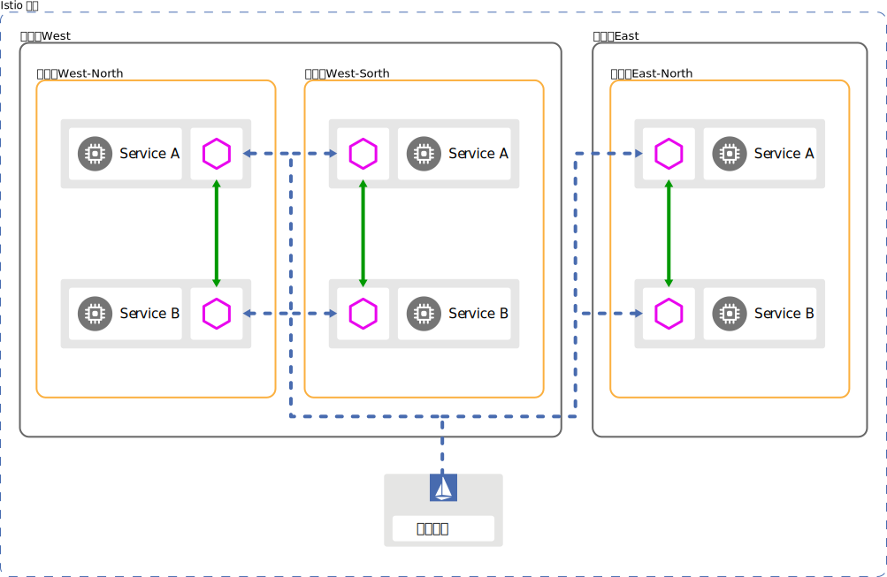
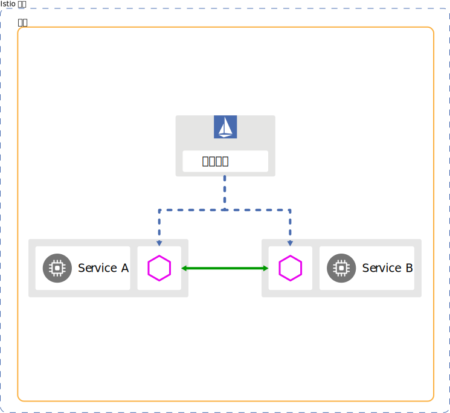
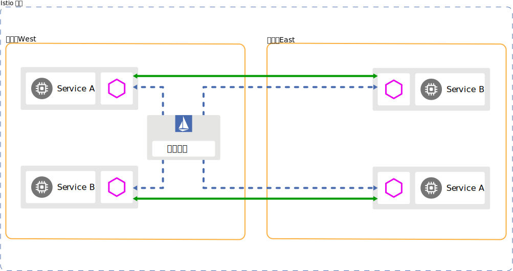
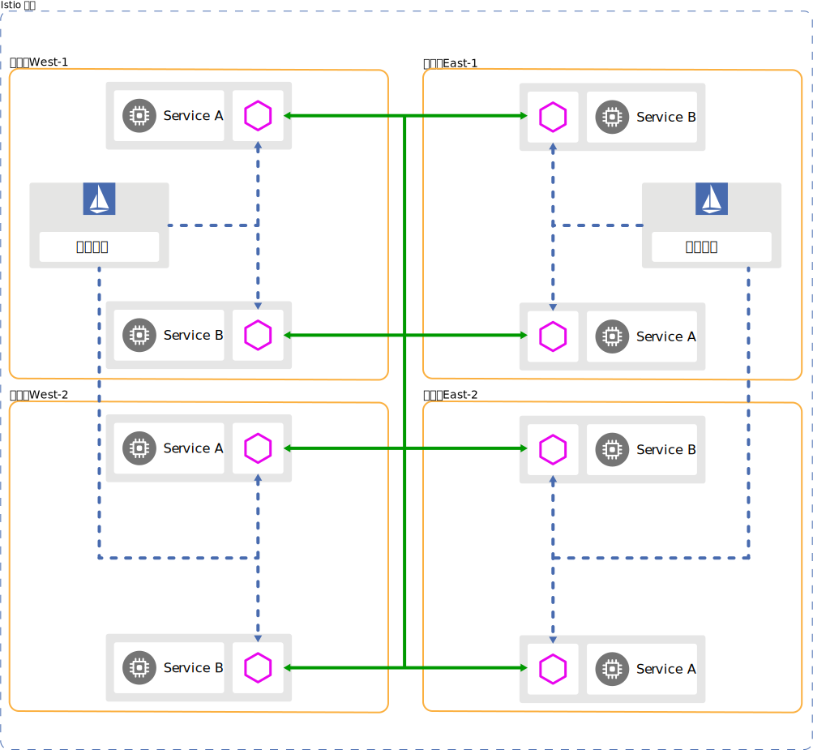
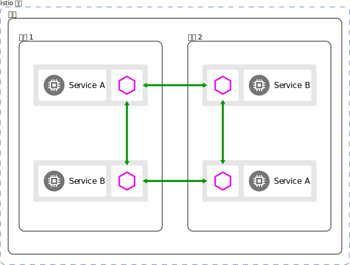
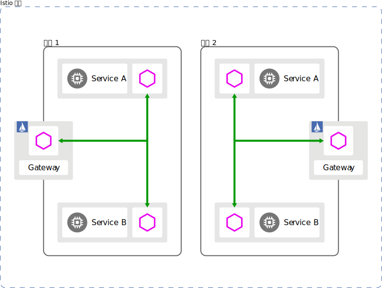
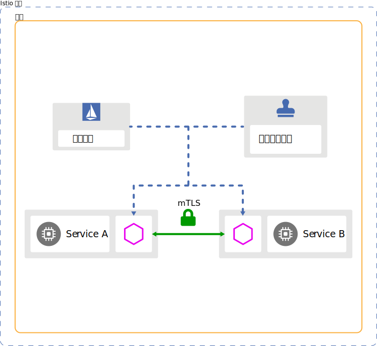
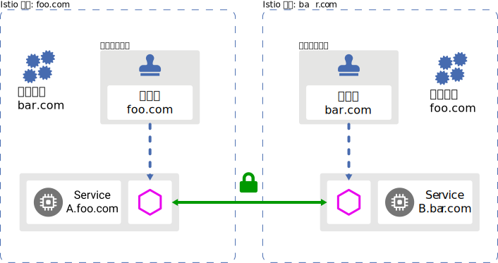

# 集群模型
# 多集群
您可以将单网格配置为包括多集群。 在单网格中使用多集群部署， 与单集群部署相比，多集群具备以下更多能力：
- 故障隔离和故障转移：当 cluster-1 下线，业务将转移至 cluster-2。
- 位置感知路由和故障转移：将请求发送到最近的服务。
- 多种控制平面模型：支持不同级别的可用性。
- 团队或项目隔离：每个团队仅运行自己的集群

## 多集群DNS
为确保 DNS 查找成功，您必须将 Kubernetes Service 部署到使用该 Service 的每个集群
Service需要包括所用集群中的Endpoints
路由时按照本集群优先等网络拓扑进行负载均衡
相关项目
- submaril
- admiral

# 控制面
## 单控制面

## 多控制面
### 主从

### 多主

# 网格模型
# 单网络

在最简单的情况下，服务网格在单个完全连接的网络上运行。 在单网络模型中， 工作负载实例都可以直接相互访问， 而无需 Istio 网关。

单网络模型允许 Istio 以统一的方式在网格上配置服务使用者， 从而能够直接处理工作负载实例。

最简单的 Istio 部署是单网格。网格内，服务名称是唯一的。例如， 在命名空间 foo 中只能存在一个名为 mysvc 的服务。 此外，工作负载实例具有相同的标识，因为服务帐户名称在命名空间中也是唯一的， 就像服务名称一样。

单网格可以跨越一个或多个集群和一个或多个网络。 在网格内部，命名空间用于多租户。

## 多网络

您可以配置单个服务网格跨多个网络，这样的配置称为多网络。

相比单网络，多网络模型提供了以下更多功能：
- 服务端点范围的 IP 或 VIP 重叠
- 跨越管理边界
- 容错能力
- 网络地址扩展
- 符合网络分段要求的标准

在此模型中，不同网络中的工作负载实例只能通过一个或多个 Istio 网关相互访问。 Istio 使用分区服务发现为消费者提供服务端点的不同视图。 该视图取决于消费者的网络。

通过网格联邦可以实现多网格部署。

与单网格相比，多网格具备以下更多功能：
- 组织边界：业务范围
- 服务名称或命名空间复用：比如 default 的使用
- 加强隔离：将测试工作负载与生产工作负载隔离

您可以使用网格联邦启用网格间通信。 联合时，每个网格可以公开一组服务和身份，它们可以被所有参与的网格都可以识别。

# 身份和信任模型

在服务网格中创建工作负载实例时，Istio 会为工作负载分配一个身份标识。

证书颁发机构（CA）创建并签名身份标识的证书，以用于验证网格中的使用者身份， 您可以使用其公钥来验证消息发送者的身份。 信任包（trust bundle） 是一组在 Istio 网格使用的所有 CA 公钥的集合。 使用信任包任何人都可以验证来自该网格的任何消息发送者。

## 网格内信任
在单一 Istio 网格中，Istio 确保每个工作负载实例都有一个表示自己身份的适当证书， 以及用于识别网格及网格联邦中所有身份信息的信任包。 CA 只为这些身份标识创建和签名证书。该模型允许网格中的工作负载实例通信时相互认证。

## 网格间信任

如果网格中的服务需要另一个网格中的服务，则必须在两个网格之间联合身份和信任。 要在不同网格之间联合身份和信任，必须交换网格的信任包。 您可以使用像 SPIFFE 信任域联邦 之类的协议手动或自动交换信任包，将信任包导入网格后，即可为这些身份配置本地策略。

