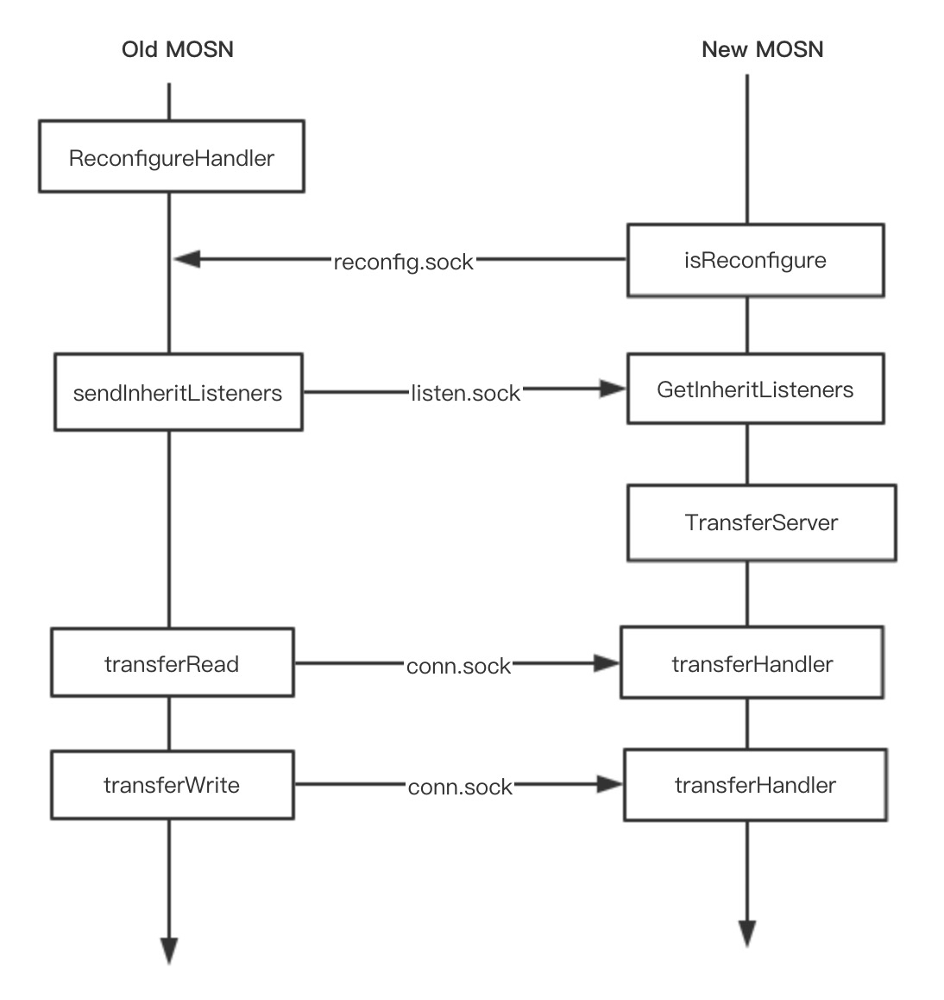

# 转发流程

# protocol

# connect pool

# 协程池

# stream
目前看很多地方都用到了stream对象，这里对stream重点详细说明下

# 运维
基于sidecarset进行运维

## 平滑升级

reconfig机制，先迁移套接字，再迁移链接
reconfig.sock：用于表示当前是否存在老的mosn
listen.sock：监听的套接字
conn.sock：用于迁移连接

1. 老的 MOSN 在启动最后阶段会启动一个协程运行 ReconfigureHandler() 函数监听一个 Domain Socket（reconfig.sock）, 该接口的作用是让新的 MOSN 来感知是否存在老的 MOSN
2. 触发平滑升级流程的两种方式最终都是启动一个新的 MOSN 进程，然后调用GetInheritListeners()，通过 isReconfigure() 函数来判断本机是否存在一个老的 MOSN（就是判断是否存在 reconfig.sock 监听），如果存在一个老的 MOSN，就进入迁移流程，反之就是正常的启动流程
3. 迁移流程，继承老MOSN的套接字，并产生新的Listen FD，这是与老的MOSN有了新的套接字
4. 在 Listen FD 迁移之后，New MOSN 通过配置启动，然后在最后启动一个协程运行TransferServer()，将监听一个新的 DomainSocket（conn.sock），用于后续接收 Old MOSN 的长连接迁移。迁移的函数是 transferHandler()
5. Old MOSN 将通过 transferRead() 和 transferWrite() 进入最后的长链接迁移流程，下面主要分析这块内容。
### 长连接迁移流程
 把 TCP1 的 FD 和连接的状态数据发送给 New MOSN
3. New MOSN 接受 FD 和请求数据创建新的 Conection 结构，然后把 Connection id 传给 MOSN，New MOSN 此时就拥有了 TCP1 的一个拷贝。
4. New MOSN 通过 LB 选取一个新的 Server，建立 TCP3 连接，转发请求到 Server
5. Server 回复响应到 New MOSN
6. New MOSN 通过 MOSN 传递来的 TCP1 的拷贝，回复响应到 Client

# reference
https://mosn.io/docs/products/structure/core-concept/
https://mosn.io/blog/posts/mosn_workflow/
https://mosn.io/blog/code/mosn-connection-pool/