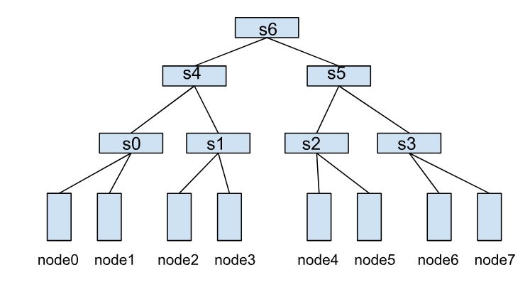

# 多集群
## 背景
随着企业业务的快速增长，单一Kubernetes集群往往无法满足大规模AI训练和推理任务的需求。用户通常需要管理多个Kubernetes集群，以实现工作负载的统一分发、部署和管理。目前，业界的多集群编排系统（如Karmada）主要针对微服务场景，提供了高可用性和容灾部署能力。然而，在AI作业调度方面，Karmada的能力仍然有限，缺乏对Volcano Job的支持，也无法满足队列管理、多租户公平调度和作业优先级调度等需求。

为了解决多集群环境下AI作业的调度与管理问题，Volcano社区孵化了Volcano Global子项目。该项目基于Karmada，扩展了Volcano在单集群中的强大调度能力，为多集群AI作业提供了统一的调度平台，支持跨集群的任务分发、资源管理和优先级控制。

## 功能
Volcano Global在Karmada的基础上，提供了以下增强功能，满足多集群AI作业调度的复杂需求：

支持Volcano Job的跨集群调度 用户可以在多集群环境中部署和调度Volcano Job，充分利用多个集群的资源，提升任务执行效率。
队列优先级调度 支持跨集群的队列优先级管理，确保高优先级队列的任务能够优先获得资源。
作业优先级调度与排队 在多集群环境中，支持作业级别的优先级调度和排队机制，确保关键任务能够及时执行。
多租户公平调度 提供跨集群的多租户公平调度能力，确保不同租户之间的资源分配公平合理，避免资源争用。

## 架构


# 网络拓扑调度
## API网络拓扑
一个HyperNode表示一个网络拓扑性能域，通常映射到一个交换机或者Tor。多个HyperNode通过层级连接，形成树状结构。例如，下图展示了由多个HyperNode构成的网络拓扑：

- 叶子HyperNode（s0、s1、s2、s3）：子节点类型为集群中的真实节点。
- 非叶子HyperNode（s4、s5、s6）：子节点类型为其他HyperNode。
在这种结构中，节点间的通信效率取决于它们之间的HyperNode层级跨度。例如：

node0和node1同属于s0，通信效率最高。
node1和node2需要跨两层HyperNode（s0→s4→s1），通信效率较低。
node0和node4需要跨三层HyperNode（s0→s4→s6），通信效率最差。

## 基于网络拓扑的感知调度策略
Volcano Job和PodGroup可以通过networkTopology字段设置作业的拓扑约束，支持以下配置：
- mode：支持hard和soft两种模式。
  - hard：硬约束，作业内的任务必须部署在同一个4HyperNode内。
  - soft：软约束，尽可能将作业部署在同一个HyperNode下。
- highestTierAllowed：与hard模式配合使用，表示作业允许跨到哪层HyperNode部署。

例如，以下配置表示作业只能部署在2层及以下的HyperNode内，如s4和s5，以及更低层的tier: s4和s5的子节点s0，s1，s2，s3，否则作业将处于Pending状态：
```
spec:
  networkTopology:
    mode: hard
    highestTierAllowed: 2
```
通过这种调度策略，用户可以精确控制作业的网络拓扑约束，确保作业在满足条件的最佳性能域运行，从而显著提升训练效率