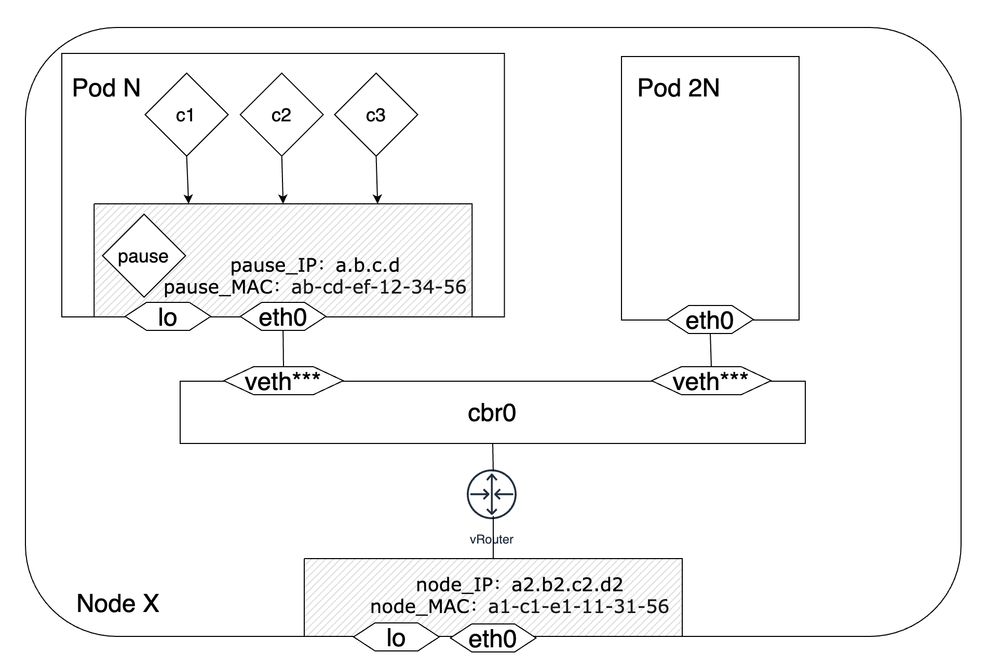
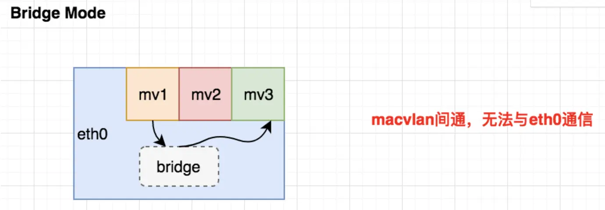
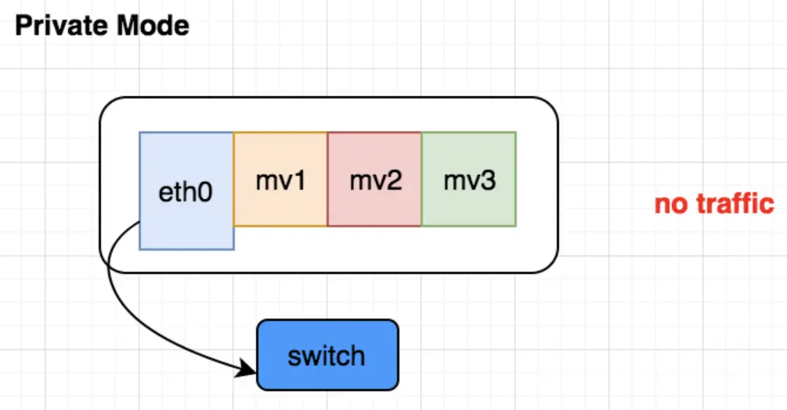
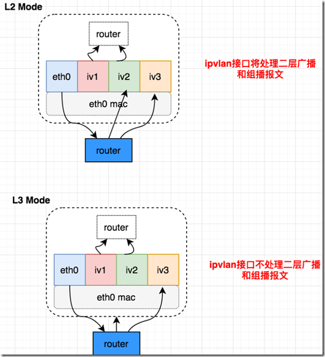

# k8s网络模型

# network plugin（CNI）
## flannel
### host-gw
在每个宿主机上维护所有容器路由信息，充当路由器角色
节点需要二层可通
### vxlan
overlay网路，会增加一个虚拟网络设备tunnel用于封包解包，封包的目的地址为目的pod所在的宿主机
由于有相关组件保存了每个容器和节点的关系，不需要宿主机进行填充mac地址，宿主机之间三层可达就行

## calico
### IPIP

### bgp
也是路由转发模式，与hostgw原理基本相同，区别是采用了bgp这种路由广播协议，bpg在构建大规模网络时会用到
小集群时可采用mesh互联模式，大规模时需要采用reflector（RR）模式
也需要二层互通，如果处在不同子网，可以采用IPIP这种overlay进行通信

## macvlan
网络虚拟化技术，一个网卡可以虚拟化出多个虚拟网卡，网卡之间隔离
工作模式
### bridge
等于macvlan接口挂到一个bridge上，macvlan之间通，但无法与eth0通信。
等于是在macvlan之间创建了一个arp表，但对外部透明。

### vpea
所有接口的流量都需要到外部switch才能够到达其他接口。等于是需要一个外部的路由器创建arp表来进行路由。

### private
接口只接受发送给自己MAC地址的报文。

## ipvlan
和macvlan基本相同，都是一个网卡虚拟出多个子接口，不同的是所有子接口的mac地址相同

### L2工作模式
和 macvlan bridge 模式工作原理很相似，父接口作为交换机来转发子接口的数据。同一个网络的子接口可以通过父接口来转发数据，而如果想发送到其他网络，报文则会通过父接口的路由转发出去

### L3工作模式
ipvlan 有点像路由器的功能，它在各个虚拟网络和主机网络之间进行不同网络报文的路由转发工作。只要父接口相同，即使虚拟机/容器不在同一个网络，也可以互相 ping 通对方，因为 ipvlan 会在中间做报文的转发工作